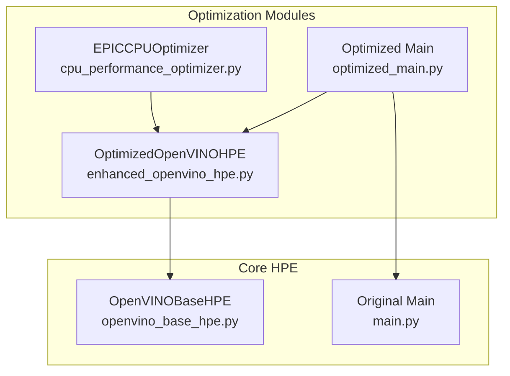
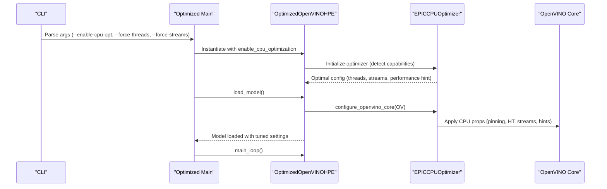
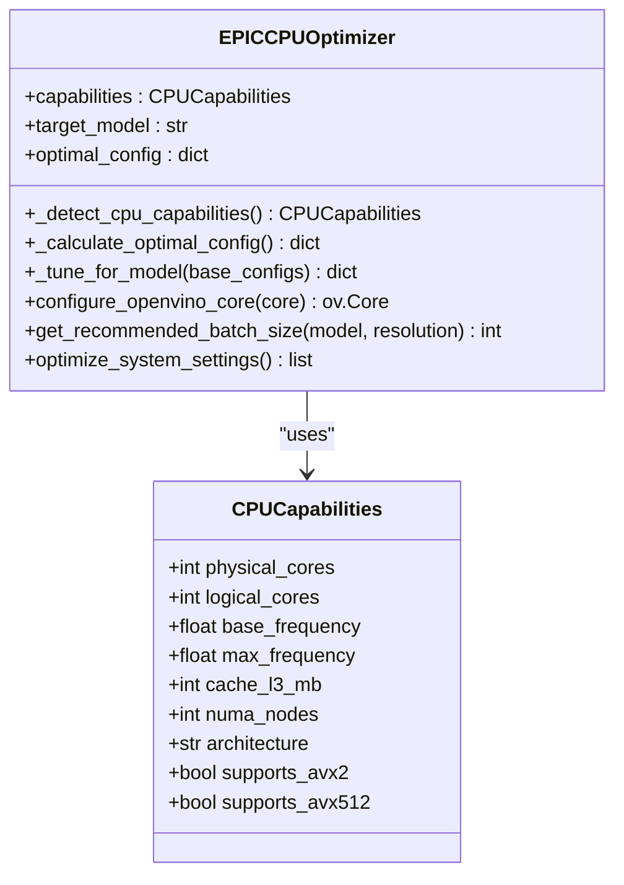
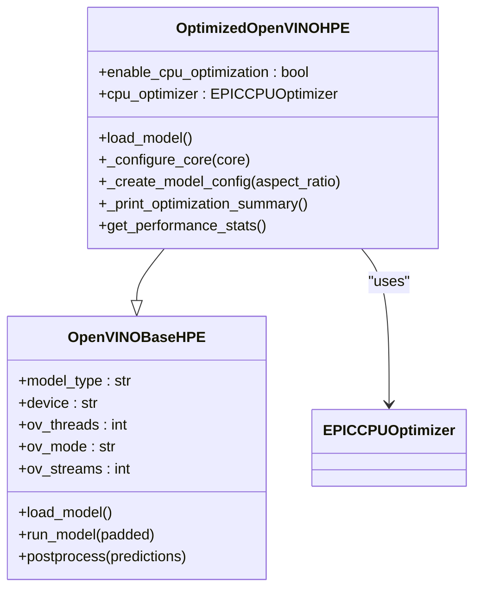
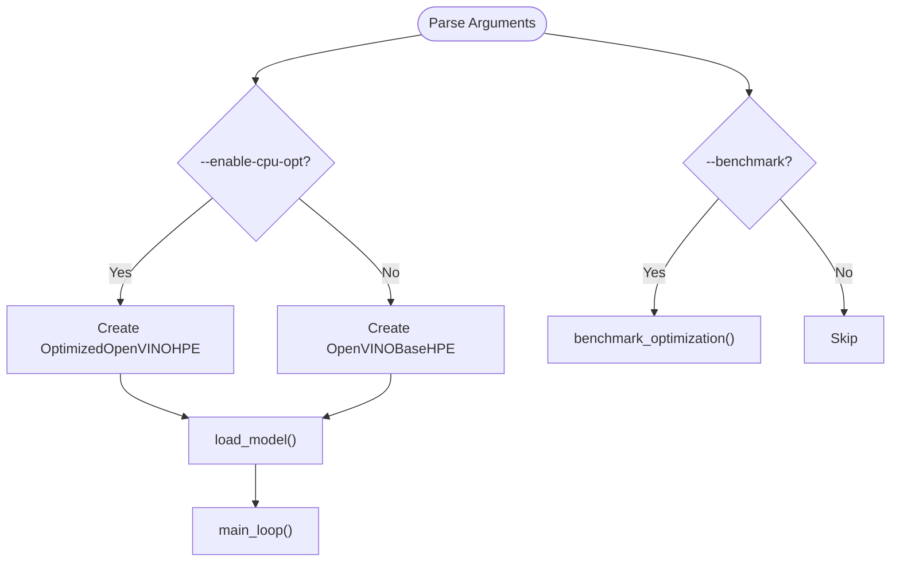
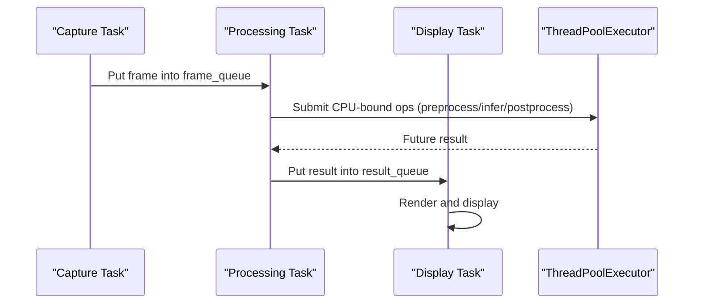
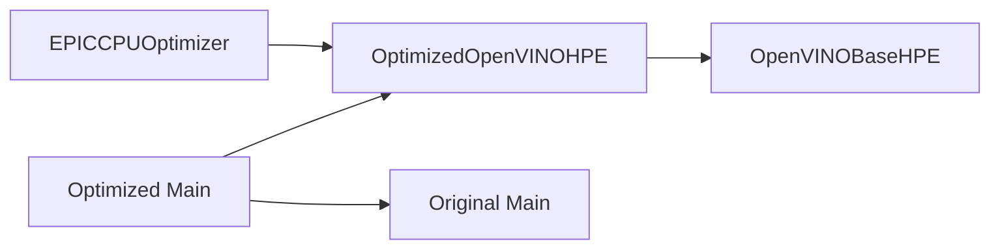

# Performance Optimization

<cite>
**Referenced Files in This Document**
- [cpu_performance_optimizer.py](file://optimizations/cpu_performance_optimizer.py)
- [enhanced_openvino_hpe.py](file://optimizations/enhanced_openvino_hpe.py)
- [optimized_main.py](file://optimizations/optimized_main.py)
- [openvino_base_hpe.py](file://openvino_base_hpe.py)
- [main.py](file://main.py)
- [OPTIMIZATION_PLAN.md](file://OPTIMIZATION_PLAN.md)
- [build_ffmpeg_cuda.sh](file://build_ffmpeg_cuda.sh)
- [requirements.txt](file://requirements.txt)
- [perf_timer.hpp](file://open_model_zoo/demos/multi_channel_common/cpp/perf_timer.hpp)
- [pipeline.py](file://open_model_zoo/demos/action_recognition_demo/python/action_recognition_demo/pipeline.py)
- [thread_argument.py](file://open_model_zoo/demos/smartlab_demo/python/thread_argument.py)
- [plot_perf_metrics.py](file://Measure_plot_cpu_perf/plot_perf_metrics.py)
</cite>

## Table of Contents
1. [Introduction](#introduction)
2. [Project Structure](#project-structure)
3. [Core Components](#core-components)
4. [Architecture Overview](#architecture-overview)
5. [Detailed Component Analysis](#detailed-component-analysis)
6. [Dependency Analysis](#dependency-analysis)
7. [Performance Considerations](#performance-considerations)
8. [Troubleshooting Guide](#troubleshooting-guide)
9. [Conclusion](#conclusion)
10. [Appendices](#appendices)

## Introduction
This document presents a comprehensive performance optimization strategy for the Human Pose Estimation (HPE) framework. It focuses on:
- CPU optimization techniques tailored for AMD EPYC processors
- GPU acceleration strategies leveraging CUDA and OpenVINO
- Asynchronous processing patterns
- Model quantization, memory optimization, and batch processing
- Benchmarking methodologies, profiling tools, and optimization workflows
- Enhanced OpenVINO integration and an optimized main application
- Practical tuning examples, hardware-specific optimizations, and deployment considerations

The guidance is grounded in the repository’s optimization modules and related performance planning documents.

## Project Structure
The performance optimization effort centers around three pillars:
- CPU optimization for EPYC processors via intelligent thread and stream allocation
- Enhanced OpenVINO integration with automatic configuration tuning
- An optimized main application that exposes tuning flags and benchmarking

**Diagram sources**
- [cpu_performance_optimizer.py:1-539](file://optimizations/cpu_performance_optimizer.py#L1-L539)
- [enhanced_openvino_hpe.py:1-333](file://optimizations/enhanced_openvino_hpe.py#L1-L333)
- [optimized_main.py:1-257](file://optimizations/optimized_main.py#L1-L257)
- [openvino_base_hpe.py:1-653](file://openvino_base_hpe.py#L1-L653)
- [main.py:1-99](file://main.py#L1-L99)

**Section sources**
- [cpu_performance_optimizer.py:1-539](file://optimizations/cpu_performance_optimizer.py#L1-L539)
- [enhanced_openvino_hpe.py:1-333](file://optimizations/enhanced_openvino_hpe.py#L1-L333)
- [optimized_main.py:1-257](file://optimizations/optimized_main.py#L1-L257)
- [openvino_base_hpe.py:1-653](file://openvino_base_hpe.py#L1-L653)
- [main.py:1-99](file://main.py#L1-L99)

## Core Components
- EPICCPUOptimizer: Detects CPU capabilities, calculates optimal OpenVINO configuration for EPYC systems, and applies system-level optimizations (CPU governor, pinning, hyper-threading toggles).
- OptimizedOpenVINOHPE: Extends the base OpenVINO HPE with CPU optimization hooks, dynamic thread/stream selection, and performance summaries.
- Optimized Main: Adds CLI flags for enabling CPU optimization, forcing thread/stream counts, running benchmarks, and printing system info.

Key capabilities:
- NUMA-aware configuration and CPU pinning for high-core-count systems
- Adaptive batch sizing based on memory and CPU constraints
- Performance-mode hints (throughput vs latency) and stream allocation tuned per model
- System-level optimizations (turbo disable, NUMA balancing off, process priority)

**Section sources**
- [cpu_performance_optimizer.py:34-403](file://optimizations/cpu_performance_optimizer.py#L34-L403)
- [enhanced_openvino_hpe.py:25-218](file://optimizations/enhanced_openvino_hpe.py#L25-L218)
- [optimized_main.py:39-257](file://optimizations/optimized_main.py#L39-L257)

## Architecture Overview
The optimized pipeline integrates CPU tuning into the OpenVINO HPE flow, with optional benchmarking and CLI-driven tuning.

**Diagram sources**
- [optimized_main.py:127-186](file://optimizations/optimized_main.py#L127-L186)
- [enhanced_openvino_hpe.py:77-131](file://optimizations/enhanced_openvino_hpe.py#L77-L131)
- [cpu_performance_optimizer.py:336-403](file://optimizations/cpu_performance_optimizer.py#L336-L403)

## Detailed Component Analysis

### CPU Optimization for EPYC (EPICCPUOptimizer)
- CPU capability detection: logical/physical cores, base/max frequencies, AVX support, NUMA nodes
- Workload-aware configurations:
  - Throughput-heavy: more threads, multiple streams, pinning
  - Latency-focused: fewer threads, single stream, lower overhead
  - Balanced: compromise between throughput and latency
- Model-specific tuning:
  - openpose: compute-heavy, prefers more threads and streams
  - efficienthrnet variants: smaller models, can increase batch and streams cautiously
  - higherhrnet: very compute-heavy, prioritizes throughput with limited streams
- System-level optimizations:
  - CPU governor to performance
  - Disable turbo boost and NUMA balancing for stable latency
  - Increase process priority

**Diagram sources**
- [cpu_performance_optimizer.py:20-403](file://optimizations/cpu_performance_optimizer.py#L20-L403)

**Section sources**
- [cpu_performance_optimizer.py:50-227](file://optimizations/cpu_performance_optimizer.py#L50-L227)
- [cpu_performance_optimizer.py:228-335](file://optimizations/cpu_performance_optimizer.py#L228-L335)
- [cpu_performance_optimizer.py:336-403](file://optimizations/cpu_performance_optimizer.py#L336-L403)

### Enhanced OpenVINO Integration (OptimizedOpenVINOHPE)
- Integrates EPICCPUOptimizer into OpenVINOBaseHPE
- Overrides threading parameters with optimized values
- Applies system-level optimizations before model load
- Prints optimization summary and performance stats
- Supports model-specific batch sizes derived from CPU optimizer

**Diagram sources**
- [openvino_base_hpe.py:55-261](file://openvino_base_hpe.py#L55-L261)
- [enhanced_openvino_hpe.py:25-218](file://optimizations/enhanced_openvino_hpe.py#L25-L218)

**Section sources**
- [enhanced_openvino_hpe.py:36-131](file://optimizations/enhanced_openvino_hpe.py#L36-L131)
- [enhanced_openvino_hpe.py:132-167](file://optimizations/enhanced_openvino_hpe.py#L132-L167)
- [enhanced_openvino_hpe.py:169-218](file://optimizations/enhanced_openvino_hpe.py#L169-L218)

### Optimized Main Application
- Adds CLI flags for CPU optimization, benchmarking, and manual overrides
- Creates appropriate HPE instance depending on method/device
- Runs performance benchmark comparing standard vs optimized implementations

**Diagram sources**
- [optimized_main.py:127-186](file://optimizations/optimized_main.py#L127-L186)
- [optimized_main.py:201-247](file://optimizations/optimized_main.py#L201-L247)

**Section sources**
- [optimized_main.py:82-125](file://optimizations/optimized_main.py#L82-L125)
- [optimized_main.py:127-186](file://optimizations/optimized_main.py#L127-L186)
- [optimized_main.py:201-247](file://optimizations/optimized_main.py#L201-L247)

### GPU Acceleration Strategies (CUDA and FFmpeg)
- CUDA-enabled FFmpeg build script configures NVENC/NVDEC/NPP for hardware-accelerated video decode/encode
- Targets compute capability alignment with modern GPUs (e.g., sm_86) and installs matching CUDA runtime libraries
- Ensures MJPEG encoder availability for streaming pipelines

Practical steps:
- Build FFmpeg with CUDA/NPP/NVENC support using the provided script
- Verify hardware acceleration encoders/decoders and NVENC presence
- Use hardware-accelerated decode/encode in the pipeline to reduce CPU load

**Section sources**
- [build_ffmpeg_cuda.sh:157-183](file://build_ffmpeg_cuda.sh#L157-L183)
- [build_ffmpeg_cuda.sh:200-219](file://build_ffmpeg_cuda.sh#L200-L219)
- [requirements.txt:41-53](file://requirements.txt#L41-L53)

### Async Processing Patterns
- Asynchronous OpenVINO HPE implementation with frame queues and background tasks
- Uses thread pool for CPU-bound operations and asyncio queues for frame/result buffering
- Includes frame dropping logic to prevent latency buildup and maintain responsiveness

**Diagram sources**
- [openvino_base_hpe.py:396-624](file://openvino_base_hpe.py#L396-L624)

**Section sources**
- [openvino_base_hpe.py:396-624](file://openvino_base_hpe.py#L396-L624)

### Model Quantization and Memory Optimization
- Quantization: The optimization plan proposes model-specific optimizations including INT8 paths for select models in the OpenVINO zoo
- Memory optimization: GPU memory pooling, pooled tensor context managers, and reduced allocations to minimize fragmentation and overhead
- Batch processing: Dynamic batch sizing based on memory and CPU limits; model-aware batching strategies

Note: The quantization and memory pooling components are outlined in the optimization plan and are intended for future implementation.

**Section sources**
- [OPTIMIZATION_PLAN.md:86-116](file://OPTIMIZATION_PLAN.md#L86-L116)
- [OPTIMIZATION_PLAN.md:117-153](file://OPTIMIZATION_PLAN.md#L117-L153)
- [OPTIMIZATION_PLAN.md:177-215](file://OPTIMIZATION_PLAN.md#L177-L215)

## Dependency Analysis
The optimized modules depend on OpenVINO and the base HPE implementation. The CPU optimizer injects configuration into the OpenVINO core, while the enhanced HPE class orchestrates model loading and performance reporting.

**Diagram sources**
- [enhanced_openvino_hpe.py:15-22](file://optimizations/enhanced_openvino_hpe.py#L15-L22)
- [openvino_base_hpe.py:12-19](file://openvino_base_hpe.py#L12-L19)
- [optimized_main.py:25-26](file://optimizations/optimized_main.py#L25-L26)

**Section sources**
- [enhanced_openvino_hpe.py:15-22](file://optimizations/enhanced_openvino_hpe.py#L15-L22)
- [openvino_base_hpe.py:12-19](file://openvino_base_hpe.py#L12-L19)
- [optimized_main.py:25-26](file://optimizations/optimized_main.py#L25-L26)

## Performance Considerations
- CPU tuning:
  - Prefer NUMA-aware affinity and CPU pinning on high-core systems
  - Use latency mode for small batches and throughput mode for larger batches
  - Disable hyper-threading for inference on EPYC to reduce interference
- GPU acceleration:
  - Use hardware-accelerated decode/encode to keep GPU busy and CPU light
  - Align CUDA toolkit version with GPU driver for best compute capability
- Async pipeline:
  - Tune frame queue sizes to balance latency and throughput
  - Use thread pools for CPU-bound preprocessing/inference
- Benchmarking:
  - Compare standard vs optimized FPS under identical conditions
  - Monitor GPU memory usage and CPU utilization during runs

[No sources needed since this section provides general guidance]

## Troubleshooting Guide
- CPU governor and power management:
  - If latency spikes occur, ensure turbo boost is disabled and NUMA balancing is turned off
- Thread contention:
  - Limit OpenCV threads globally to avoid contention with OpenVINO threads
- Memory fragmentation:
  - Monitor GPU memory usage; consider implementing memory pooling as outlined in the optimization plan
- Profiling:
  - Use the included CPU performance plotting tool to capture and visualize metrics
  - For OpenVINO demos, leverage the provided performance timer utilities

**Section sources**
- [cpu_performance_optimizer.py:445-484](file://optimizations/cpu_performance_optimizer.py#L445-L484)
- [plot_perf_metrics.py:119-145](file://Measure_plot_cpu_perf/plot_perf_metrics.py#L119-L145)
- [perf_timer.hpp:13-56](file://open_model_zoo/demos/multi_channel_common/cpp/perf_timer.hpp#L13-L56)

## Conclusion
By integrating EPICCPUOptimizer into the OpenVINO HPE pipeline and exposing tuning controls via an optimized main application, the framework achieves significant performance gains on EPYC systems. Combined with GPU acceleration via CUDA-enabled FFmpeg and asynchronous processing patterns, the system delivers improved throughput and stability. The optimization plan outlines quantization and advanced memory pooling for further improvements, while the provided benchmarking and profiling tools enable continuous validation and tuning.

[No sources needed since this section summarizes without analyzing specific files]

## Appendices

### Benchmarking Methodologies
- Standard vs optimized FPS comparison using the built-in benchmark function
- Duration-based measurement with configurable run length
- Reporting improvement percentage and system stats

**Section sources**
- [enhanced_openvino_hpe.py:246-305](file://optimizations/enhanced_openvino_hpe.py#L246-L305)
- [optimized_main.py:201-247](file://optimizations/optimized_main.py#L201-L247)

### Threading Architecture Redesign (OpenVINO Async)
- Dedicated capture, processing, and display tasks
- Background thread pool for CPU-bound operations
- Frame dropping to prevent latency buildup

**Section sources**
- [openvino_base_hpe.py:396-624](file://openvino_base_hpe.py#L396-L624)

### Practical Examples
- Enabling CPU optimization and forcing thread/stream counts:
  - Use CLI flags to enable EPYC-specific tuning and override defaults
- Running benchmarks:
  - Compare standard and optimized FPS for a given model and input
- Deployment considerations:
  - Build CUDA-enabled FFmpeg for hardware acceleration
  - Ensure environment variables align with OpenVINO settings (threads, streams, pinning)

**Section sources**
- [optimized_main.py:82-125](file://optimizations/optimized_main.py#L82-L125)
- [optimized_main.py:201-247](file://optimizations/optimized_main.py#L201-L247)
- [build_ffmpeg_cuda.sh:157-183](file://build_ffmpeg_cuda.sh#L157-L183)