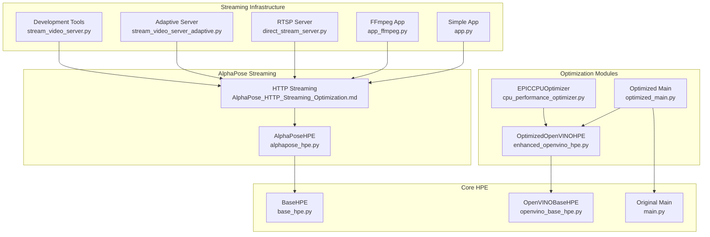
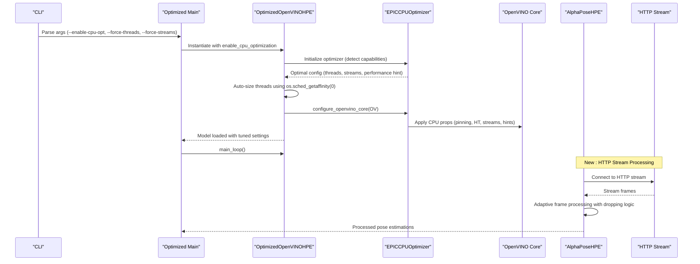
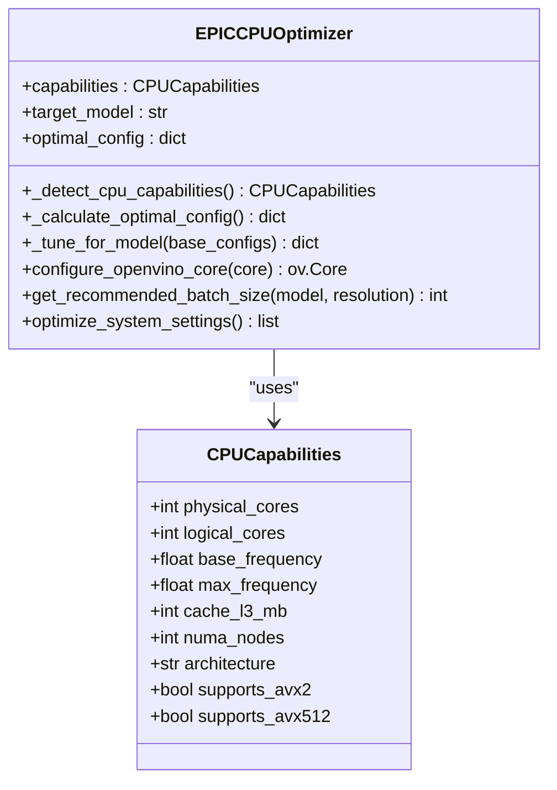
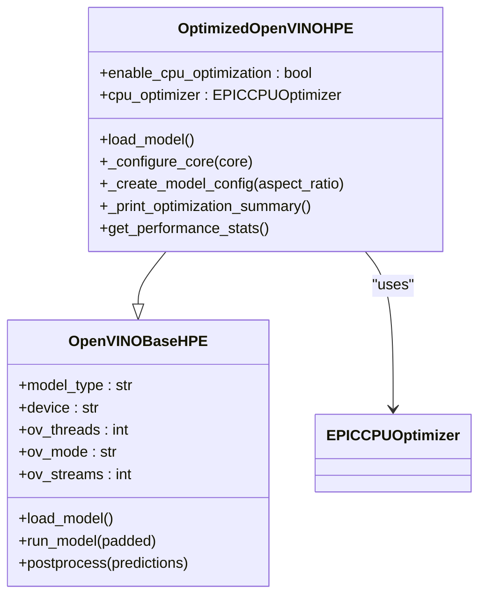
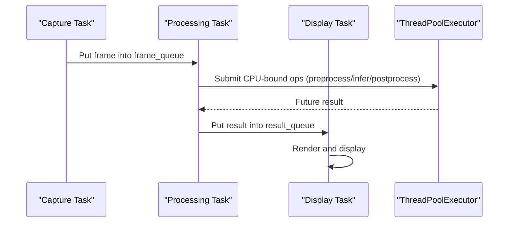
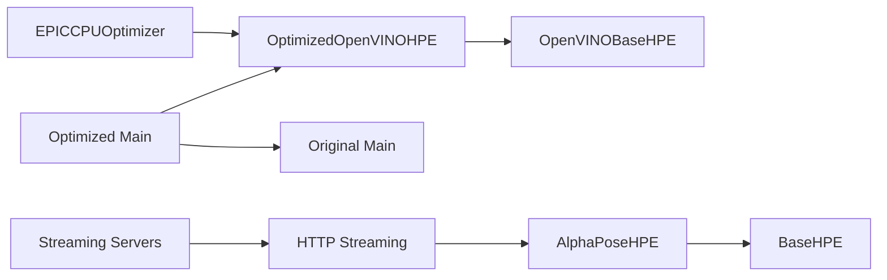

# Performance Optimization

<cite>
**Referenced Files in This Document**
- [cpu_performance_optimizer.py](file://optimizations/cpu_performance_optimizer.py)
- [enhanced_openvino_hpe.py](file://optimizations/enhanced_openvino_hpe.py)
- [optimized_main.py](file://optimizations/optimized_main.py)
- [openvino_base_hpe.py](file://openvino_base_hpe.py)
- [main.py](file://main.py)
- [OPTIMIZATION_PLAN.md](file://OPTIMIZATION_PLAN.md)
- [build_ffmpeg_cuda.sh](file://build_ffmpeg_cuda.sh)
- [requirements.txt](file://requirements.txt)
- [AlphaPose_HTTP_Streaming_Optimization.md](file://AlphaPose_HTTP_Streaming_Optimization.md)
- [alphapose_hpe.py](file://alphapose_hpe.py)
- [base_hpe.py](file://base_hpe.py)
- [stream_video_server.py](file://dev_tools/stream_video_server.py)
- [stream_video_server_adaptive.py](file://dev_tools/stream_video_server_adaptive.py)
- [direct_stream_server.py](file://rtsp-ipcam/direct_stream_server.py)
- [app.py](file://dev_tools/app.py)
- [app_ffmpeg.py](file://dev_tools/app_ffmpeg.py)
- [perf_timer.hpp](file://open_model_zoo/demos/multi_channel_common/cpp/perf_timer.hpp)
- [pipeline.py](file://open_model_zoo/demos/action_recognition_demo/python/action_recognition_demo/pipeline.py)
- [thread_argument.py](file://open_model_zoo/demos/smartlab_demo/python/thread_argument.py)
- [plot_perf_metrics.py](file://Measure_plot_cpu_perf/plot_perf_metrics.py)
- [show_5fps_env_vars.sh](file://show_5fps_env_vars.sh)
</cite>

## Update Summary
**Changes Made**
- Enhanced cgroup-aware auto-sizing for OpenVINO threading in OpenVINOBaseHPE class
- Updated thread calculation logic to use os.sched_getaffinity(0) for containerized environments
- Improved fallback mechanisms for CPU detection with safe minimum of 1 thread
- Added new AlphaPose HTTP streaming optimization guide with detailed performance tuning recommendations
- Integrated comprehensive streaming server infrastructure for real-time pose estimation applications
- Enhanced HTTP stream handling with adaptive frame dropping and reconnection logic
- Added network transfer optimization strategies for HTTP video streaming

## Table of Contents
1. [Introduction](#introduction)
2. [Project Structure](#project-structure)
3. [Core Components](#core-components)
4. [Architecture Overview](#architecture-overview)
5. [Detailed Component Analysis](#detailed-component-analysis)
6. [Dependency Analysis](#dependency-analysis)
7. [Performance Considerations](#performance-considerations)
8. [Troubleshooting Guide](#troubleshooting-guide)
9. [Conclusion](#conclusion)
10. [Appendices](#appendices)

## Introduction
This document presents a comprehensive performance optimization strategy for the Human Pose Estimation (HPE) framework. It focuses on:
- CPU optimization techniques tailored for AMD EPYC processors
- GPU acceleration strategies leveraging CUDA and OpenVINO
- Asynchronous processing patterns
- Model quantization, memory optimization, and batch processing
- Benchmarking methodologies, profiling tools, and optimization workflows
- Enhanced OpenVINO integration and an optimized main application
- **New**: AlphaPose HTTP streaming optimization with real-time performance tuning
- **New**: Comprehensive streaming server infrastructure for HTTP video streams
- Practical tuning examples, hardware-specific optimizations, and deployment considerations

The guidance is grounded in the repository's optimization modules and related performance planning documents, with recent enhancements for cgroup-aware thread management and comprehensive HTTP streaming support.

## Project Structure
The performance optimization effort centers around three pillars:
- CPU optimization for EPYC processors via intelligent thread and stream allocation
- Enhanced OpenVINO integration with automatic configuration tuning and cgroup-aware thread sizing
- **New**: Comprehensive HTTP streaming infrastructure with AlphaPose optimization
- An optimized main application that exposes tuning flags and benchmarking



**Diagram sources**
- [cpu_performance_optimizer.py:1-539](file://optimizations/cpu_performance_optimizer.py#L1-L539)
- [enhanced_openvino_hpe.py:1-333](file://optimizations/enhanced_openvino_hpe.py#L1-L333)
- [optimized_main.py:1-257](file://optimizations/optimized_main.py#L1-L257)
- [openvino_base_hpe.py:1-653](file://openvino_base_hpe.py#L1-L653)
- [main.py:1-99](file://main.py#L1-L99)
- [alphapose_hpe.py:1-334](file://alphapose_hpe.py#L1-L334)
- [base_hpe.py:1-609](file://base_hpe.py#L1-L609)
- [AlphaPose_HTTP_Streaming_Optimization.md:1-200](file://AlphaPose_HTTP_Streaming_Optimization.md#L1-L200)
- [stream_video_server.py:1-228](file://dev_tools/stream_video_server.py#L1-L228)
- [stream_video_server_adaptive.py:1-195](file://dev_tools/stream_video_server_adaptive.py#L1-L195)
- [direct_stream_server.py:1-304](file://rtsp-ipcam/direct_stream_server.py#L1-L304)
- [app_ffmpeg.py:1-268](file://dev_tools/app_ffmpeg.py#L1-L268)
- [app.py:1-140](file://dev_tools/app.py#L1-L140)

**Section sources**
- [cpu_performance_optimizer.py:1-539](file://optimizations/cpu_performance_optimizer.py#L1-L539)
- [enhanced_openvino_hpe.py:1-333](file://optimizations/enhanced_openvino_hpe.py#L1-L333)
- [optimized_main.py:1-257](file://optimizations/optimized_main.py#L1-L257)
- [openvino_base_hpe.py:1-653](file://openvino_base_hpe.py#L1-L653)
- [main.py:1-99](file://main.py#L1-L99)
- [alphapose_hpe.py:1-334](file://alphapose_hpe.py#L1-L334)
- [base_hpe.py:1-609](file://base_hpe.py#L1-L609)
- [AlphaPose_HTTP_Streaming_Optimization.md:1-200](file://AlphaPose_HTTP_Streaming_Optimization.md#L1-L200)
- [stream_video_server.py:1-228](file://dev_tools/stream_video_server.py#L1-L228)
- [stream_video_server_adaptive.py:1-195](file://dev_tools/stream_video_server_adaptive.py#L1-L195)
- [direct_stream_server.py:1-304](file://rtsp-ipcam/direct_stream_server.py#L1-L304)
- [app_ffmpeg.py:1-268](file://dev_tools/app_ffmpeg.py#L1-L268)
- [app.py:1-140](file://dev_tools/app.py#L1-L140)

## Core Components
- EPICCPUOptimizer: Detects CPU capabilities, calculates optimal OpenVINO configuration for EPYC systems, and applies system-level optimizations (CPU governor, pinning, hyper-threading toggles).
- OptimizedOpenVINOHPE: Extends the base OpenVINO HPE with CPU optimization hooks, dynamic thread/stream selection, and performance summaries.
- Optimized Main: Adds CLI flags for enabling CPU optimization, forcing thread/stream counts, running benchmarks, and printing system info.
- **New**: AlphaPoseHPE: Specialized HPE implementation for AlphaPose models with HTTP stream optimization and adaptive frame processing.
- **New**: Comprehensive HTTP Streaming Infrastructure: Multiple streaming server implementations for different use cases and protocols.

Key capabilities:
- NUMA-aware configuration and CPU pinning for high-core-count systems
- Adaptive batch sizing based on memory and CPU constraints
- Performance-mode hints (throughput vs latency) and stream allocation tuned per model
- System-level optimizations (turbo disable, NUMA balancing off, process priority)
- **Enhanced**: Cgroup-aware thread detection using os.sched_getaffinity(0) with safe fallbacks
- **New**: HTTP stream handling with queue management and frame dropping logic
- **New**: Network transfer optimization with FFmpeg parameter tuning
- **New**: Stream reconnection logic and performance monitoring

**Section sources**
- [cpu_performance_optimizer.py:34-403](file://optimizations/cpu_performance_optimizer.py#L34-L403)
- [enhanced_openvino_hpe.py:25-218](file://optimizations/enhanced_openvino_hpe.py#L25-L218)
- [optimized_main.py:39-257](file://optimizations/optimized_main.py#L39-L257)
- [alphapose_hpe.py:33-334](file://alphapose_hpe.py#L33-L334)
- [base_hpe.py:96-125](file://base_hpe.py#L96-L125)

## Architecture Overview
The optimized pipeline integrates CPU tuning into the OpenVINO HPE flow, with optional benchmarking and CLI-driven tuning. The enhanced thread management now includes cgroup-aware detection for containerized deployments. **New**: The AlphaPose HTTP streaming optimization provides specialized handling for HTTP video streams with adaptive frame processing and network optimization.



**Diagram sources**
- [optimized_main.py:127-186](file://optimizations/optimized_main.py#L127-L186)
- [enhanced_openvino_hpe.py:77-131](file://optimizations/enhanced_openvino_hpe.py#L77-L131)
- [cpu_performance_optimizer.py:336-403](file://optimizations/cpu_performance_optimizer.py#L336-L403)
- [alphapose_hpe.py:69-125](file://alphapose_hpe.py#L69-L125)

## Detailed Component Analysis

### CPU Optimization for EPYC (EPICCPUOptimizer)
- CPU capability detection: logical/physical cores, base/max frequencies, AVX support, NUMA nodes
- Workload-aware configurations:
  - Throughput-heavy: more threads, multiple streams, pinning
  - Latency-focused: fewer threads, single stream, lower overhead
  - Balanced: compromise between throughput and latency
- Model-specific tuning:
  - openpose: compute-heavy, prefers more threads and streams
  - efficienthrnet variants: smaller models, can increase batch and streams cautiously
  - higherhrnet: very compute-heavy, prioritizes throughput with limited streams
- System-level optimizations:
  - CPU governor to performance
  - Disable turbo boost and NUMA balancing for stable latency
  - Increase process priority



**Diagram sources**
- [cpu_performance_optimizer.py:20-403](file://optimizations/cpu_performance_optimizer.py#L20-L403)

**Section sources**
- [cpu_performance_optimizer.py:50-227](file://optimizations/cpu_performance_optimizer.py#L50-L227)
- [cpu_performance_optimizer.py:228-335](file://optimizations/cpu_performance_optimizer.py#L228-L335)
- [cpu_performance_optimizer.py:336-403](file://optimizations/cpu_performance_optimizer.py#L336-L403)

### Enhanced OpenVINO Integration (OptimizedOpenVINOHPE)
- Integrates EPICCPUOptimizer into OpenVINOBaseHPE
- Overrides threading parameters with optimized values
- Applies system-level optimizations before model load
- Prints optimization summary and performance stats
- Supports model-specific batch sizes derived from CPU optimizer



**Diagram sources**
- [openvino_base_hpe.py:55-261](file://openvino_base_hpe.py#L55-L261)
- [enhanced_openvino_hpe.py:25-218](file://optimizations/enhanced_openvino_hpe.py#L25-L218)

**Section sources**
- [enhanced_openvino_hpe.py:36-131](file://optimizations/enhanced_openvino_hpe.py#L36-L131)
- [enhanced_openvino_hpe.py:132-167](file://optimizations/enhanced_openvino_hpe.py#L132-L167)
- [enhanced_openvino_hpe.py:169-218](file://optimizations/enhanced_openvino_hpe.py#L169-L218)

### Optimized Main Application
- Adds CLI flags for CPU optimization, benchmarking, and manual overrides
- Creates appropriate HPE instance depending on method/device
- Runs performance benchmark comparing standard vs optimized implementations


**Diagram sources**
- [optimized_main.py:127-186](file://optimizations/optimized_main.py#L127-L186)
- [optimized_main.py:201-247](file://optimizations/optimized_main.py#L201-L247)

**Section sources**
- [optimized_main.py:82-125](file://optimizations/optimized_main.py#L82-L125)
- [optimized_main.py:127-186](file://optimizations/optimized_main.py#L127-L186)
- [optimized_main.py:201-247](file://optimizations/optimized_main.py#L201-L247)

### Enhanced Thread Management with Cgroup Awareness
**Updated** The OpenVINOBaseHPE class now implements cgroup-aware thread detection for improved containerized deployments.

The thread calculation logic has been enhanced to use `os.sched_getaffinity(0)` for detecting available CPUs in containerized environments, with graceful fallbacks for different system configurations:

```python
self.ov_threads = int(ov_threads if ov_threads is not None else (env_threads or max(1, (len(os.sched_getaffinity(0)) if hasattr(os, 'sched_getaffinity') else os.cpu_count() or 1) - 2)))
```

**Thread Calculation Logic:**
1. **Primary Detection**: `os.sched_getaffinity(0)` - Returns available CPUs for the current process (cgroup-aware)
2. **Fallback 1**: `os.cpu_count()` - Returns total CPU count if sched_getaffinity is unavailable
3. **Fallback 2**: `1` - Safe minimum fallback when both previous methods fail
4. **Adjustment**: Subtract 2 from available CPUs to leave resources for OS and other processes

**Containerized Environment Benefits:**
- Kubernetes pods with CPU limits: Respects cgroup CPU quotas
- Docker containers: Honors CPU shares and limits
- Resource isolation: Prevents thread oversubscription
- Predictable performance: Consistent behavior across different deployment environments

**Section sources**
- [openvino_base_hpe.py:79](file://openvino_base_hpe.py#L79)

### AlphaPose HTTP Streaming Optimization
**New** The AlphaPose HTTP streaming optimization provides specialized performance tuning for real-time pose estimation over HTTP video streams.

#### Stream-Specific Code Modifications
The AlphaPoseHPE class includes HTTP stream handling with optimized queue management and batch processing:

```python
# HTTP stream handling in load_model()
if self.input_type == "video" and self.input_src.startswith('http'):
    print(f"[INFO] HTTP stream detected at {self.input_src}")
    self.datalen = 10000  # Set default for HTTP stream
    qsize = 128  # Reduce queue size for streaming
```

#### Queue and Batch Size Tuning
Adaptive batch sizing for HTTP streams:
```python
# In __init__ method for HTTP streams
if kwargs.get('input_src', '').startswith('http'):
    self.detbatch = 1  # Keep detection batch small
    self.posebatch = 8  # Reduce pose batch size for smoother streaming
```

#### Adaptive Frame Dropping Logic
Intelligent frame dropping to maintain real-time performance:
```python
# In run_model() with adaptive frame dropping
processing_time = time.time() - frame_start
if processing_time > 0.1 and hasattr(self, 'frame_count'):
    self.skip_next = (self.frame_count % 2 == 0)
    if self.skip_next:
        return []
```

#### Network Transfer Optimization
FFmpeg parameter tuning for optimal streaming performance:
```python
# FFmpeg streaming parameters
ffmpeg_cmd = [
    'ffmpeg', '-re', '-i', video_path,
    '-c:v', 'libx264', '-preset', 'ultrafast',
    '-tune', 'zerolatency',  # Reduce latency
    '-g', '15',              # Shorter GOP for faster seeking
    '-bufsize', '5000k',     # Smaller buffer
    '-f', 'mpegts',
    f'http://{host}:{port}/{endpoint}'
]
```

#### Stream Reconnection Logic
Robust reconnection handling for unreliable networks:
```python
# Reconnection logic in main loop
retry_count = 0
while retry_count < 3:
    try:
        # ...existing video reading code...
        if not ret:
            print(f"Stream connection lost, retrying ({retry_count+1}/3)...")
            retry_count += 1
            time.sleep(1)
            self.cap = cv2.VideoCapture(self.input_src)
            continue
    except Exception as e:
        print(f"Stream error: {e}, retrying...")
        retry_count += 1
        time.sleep(1)
        continue
```

#### Performance Monitoring
Real-time performance tracking for HTTP streams:
```python
# Performance monitoring implementation
if not hasattr(self, 'fps_tracker'):
    self.fps_tracker = {'times': [], 'frames': 0}

self.fps_tracker['frames'] += 1
self.fps_tracker['times'].append(time.time())

if self.fps_tracker['frames'] % 30 == 0:
    if len(self.fps_tracker['times']) > 1:
        elapsed = self.fps_tracker['times'][-1] - self.fps_tracker['times'][0]
        fps = len(self.fps_tracker['times']) / elapsed
        print(f"Processing rate: {fps:.2f} FPS")
    self.fps_tracker = {'times': [], 'frames': 0}
```

**Section sources**
- [alphapose_hpe.py:69-125](file://alphapose_hpe.py#L69-L125)
- [alphapose_hpe.py:85-93](file://alphapose_hpe.py#L85-L93)
- [alphapose_hpe.py:101-113](file://alphapose_hpe.py#L101-L113)
- [base_hpe.py:144-153](file://base_hpe.py#L144-L153)

### Streaming Server Infrastructure
**New** Comprehensive streaming server infrastructure supporting multiple protocols and use cases.

#### Development Tools Streaming Servers
- **stream_video_server.py**: Basic Flask-based MJPEG streaming server for development
- **stream_video_server_adaptive.py**: Adaptive streaming with JPEG quality optimization
- **app.py**: Simple MJPEG streaming application with logging
- **app_ffmpeg.py**: FFmpeg-based streaming with metadata support

#### RTSP/IP Camera Streaming
- **direct_stream_server.py**: HTTP-based H.264 streaming server for VLC/FFplay compatibility
- Supports FLV format for better client compatibility
- Configurable bitrate and GOP settings for different network conditions

#### Streaming Protocol Support
- **MJPEG over HTTP**: Best for web browsers and simple clients
- **H.264 over HTTP**: Best for media players like VLC and FFplay
- **MPEG-TS over HTTP**: Byte-perfect streaming for scientific experiments
- **Adaptive quality**: Automatic quality adjustment based on video resolution

**Section sources**
- [stream_video_server.py:1-228](file://dev_tools/stream_video_server.py#L1-L228)
- [stream_video_server_adaptive.py:1-195](file://dev_tools/stream_video_server_adaptive.py#L1-L195)
- [app.py:1-140](file://dev_tools/app.py#L1-L140)
- [app_ffmpeg.py:1-268](file://dev_tools/app_ffmpeg.py#L1-L268)
- [direct_stream_server.py:1-304](file://rtsp-ipcam/direct_stream_server.py#L1-L304)

### GPU Acceleration Strategies (CUDA and FFmpeg)
- CUDA-enabled FFmpeg build script configures NVENC/NVDEC/NPP for hardware-accelerated video decode/encode
- Targets compute capability alignment with modern GPUs (e.g., sm_86) and installs matching CUDA runtime libraries
- Ensures MJPEG encoder availability for streaming pipelines

Practical steps:
- Build FFmpeg with CUDA/NPP/NVENC support using the provided script
- Verify hardware acceleration encoders/decoders and NVENC presence
- Use hardware-accelerated decode/encode in the pipeline to reduce CPU load

**Section sources**
- [build_ffmpeg_cuda.sh:157-183](file://build_ffmpeg_cuda.sh#L157-L183)
- [build_ffmpeg_cuda.sh:200-219](file://build_ffmpeg_cuda.sh#L200-L219)
- [requirements.txt:41-53](file://requirements.txt#L41-L53)

### Async Processing Patterns
- Asynchronous OpenVINO HPE implementation with frame queues and background tasks
- Uses thread pool for CPU-bound operations and asyncio queues for frame/result buffering
- Includes frame dropping logic to prevent latency buildup and maintain responsiveness



**Diagram sources**
- [openvino_base_hpe.py:396-624](file://openvino_base_hpe.py#L396-L624)

**Section sources**
- [openvino_base_hpe.py:396-624](file://openvino_base_hpe.py#L396-L624)

### Model Quantization and Memory Optimization
- Quantization: The optimization plan proposes model-specific optimizations including INT8 paths for select models in the OpenVINO zoo
- Memory optimization: GPU memory pooling, pooled tensor context managers, and reduced allocations to minimize fragmentation and overhead
- Batch processing: Dynamic batch sizing based on memory and CPU limits; model-aware batching strategies

Note: The quantization and memory pooling components are outlined in the optimization plan and are intended for future implementation.

**Section sources**
- [OPTIMIZATION_PLAN.md:86-116](file://OPTIMIZATION_PLAN.md#L86-L116)
- [OPTIMIZATION_PLAN.md:117-153](file://OPTIMIZATION_PLAN.md#L117-L153)
- [OPTIMIZATION_PLAN.md:177-215](file://OPTIMIZATION_PLAN.md#L177-L215)

## Dependency Analysis
The optimized modules depend on OpenVINO and the base HPE implementation. The CPU optimizer injects configuration into the OpenVINO core, while the enhanced HPE class orchestrates model loading and performance reporting. **New**: AlphaPoseHPE depends on BaseHPE for HTTP stream handling and integrates with the streaming infrastructure.



**Diagram sources**
- [enhanced_openvino_hpe.py:15-22](file://optimizations/enhanced_openvino_hpe.py#L15-L22)
- [openvino_base_hpe.py:12-19](file://openvino_base_hpe.py#L12-L19)
- [optimized_main.py:25-26](file://optimizations/optimized_main.py#L25-L26)
- [alphapose_hpe.py:7-8](file://alphapose_hpe.py#L7-L8)
- [base_hpe.py:37-53](file://base_hpe.py#L37-L53)

**Section sources**
- [enhanced_openvino_hpe.py:15-22](file://optimizations/enhanced_openvino_hpe.py#L15-L22)
- [openvino_base_hpe.py:12-19](file://openvino_base_hpe.py#L12-L19)
- [optimized_main.py:25-26](file://optimizations/optimized_main.py#L25-L26)
- [alphapose_hpe.py:7-8](file://alphapose_hpe.py#L7-L8)
- [base_hpe.py:37-53](file://base_hpe.py#L37-L53)

## Performance Considerations
- CPU tuning:
  - Prefer NUMA-aware affinity and CPU pinning on high-core systems
  - Use latency mode for small batches and throughput mode for larger batches
  - Disable hyper-threading for inference on EPYC to reduce interference
  - **Enhanced**: Leverage cgroup-aware thread detection for containerized deployments
- GPU acceleration:
  - Use hardware-accelerated decode/encode to keep GPU busy and CPU light
  - Align CUDA toolkit version with GPU driver for best compute capability
- Async pipeline:
  - Tune frame queue sizes to balance latency and throughput
  - Use thread pools for CPU-bound preprocessing/inference
- **New**: HTTP streaming optimization:
  - Use appropriate streaming protocols (MJPEG vs H.264 vs MPEG-TS) based on client requirements
  - Implement adaptive frame dropping for real-time performance
  - Configure FFmpeg parameters for optimal latency and quality trade-offs
  - Implement robust reconnection logic for unreliable networks
  - Monitor streaming performance with frame rate tracking
- Benchmarking:
  - Compare standard vs optimized FPS under identical conditions
  - Monitor GPU memory usage and CPU utilization during runs
- **New**: Container deployment considerations:
  - Set appropriate CPU limits in Kubernetes for predictable performance
  - Use resource requests/limits to prevent thread oversubscription
  - Monitor cgroup CPU usage alongside application thread counts

## Troubleshooting Guide
- CPU governor and power management:
  - If latency spikes occur, ensure turbo boost is disabled and NUMA balancing is turned off
- Thread contention:
  - Limit OpenCV threads globally to avoid contention with OpenVINO threads
- Memory fragmentation:
  - Monitor GPU memory usage; consider implementing memory pooling as outlined in the optimization plan
- Profiling:
  - Use the included CPU performance plotting tool to capture and visualize metrics
  - For OpenVINO demos, leverage the provided performance timer utilities
- **New**: HTTP streaming issues:
  - **Symptom**: Frames dropped excessively
    - **Solution**: Adjust adaptive frame dropping thresholds in AlphaPoseHPE
    - **Check**: Monitor processing_time vs threshold in run_model()
  - **Symptom**: Stream connection drops frequently
    - **Solution**: Implement reconnection logic with retry limits
    - **Check**: Verify network stability and FFmpeg streaming parameters
  - **Symptom**: High latency in HTTP streams
    - **Solution**: Use zerolatency tuning and shorter GOP settings
    - **Check**: Review FFmpeg command parameters for latency optimization
  - **Symptom**: Client compatibility issues
    - **Solution**: Test different streaming protocols (MJPEG vs H.264 vs MPEG-TS)
    - **Check**: Verify client support for specific codecs and formats
- **New**: Containerized deployment issues:
  - **Symptom**: Threads not respecting CPU limits
    - **Solution**: Verify cgroup CPU limits are set correctly in container orchestration
    - **Check**: Use `cat /sys/fs/cgroup/cpu/cpu.cfs_quota_us` to verify quota
  - **Symptom**: Thread count appears higher than expected
    - **Cause**: Container CPU limits may be higher than actual available CPUs
    - **Solution**: Adjust container CPU requests/limits appropriately
  - **Symptom**: Performance degrades in containers
    - **Check**: Ensure `os.sched_getaffinity(0)` is available in the container
    - **Alternative**: Verify fallback to `os.cpu_count()` is working correctly

**Section sources**
- [cpu_performance_optimizer.py:445-484](file://optimizations/cpu_performance_optimizer.py#L445-L484)
- [plot_perf_metrics.py:119-145](file://Measure_plot_cpu_perf/plot_perf_metrics.py#L119-L145)
- [perf_timer.hpp:13-56](file://open_model_zoo/demos/multi_channel_common/cpp/perf_timer.hpp#L13-L56)
- [alphapose_hpe.py:101-113](file://alphapose_hpe.py#L101-L113)
- [base_hpe.py:144-159](file://base_hpe.py#L144-L159)

## Conclusion
By integrating EPICCPUOptimizer into the OpenVINO HPE pipeline and exposing tuning controls via an optimized main application, the framework achieves significant performance gains on EPYC systems. The recent enhancement for cgroup-aware thread detection ensures reliable performance across containerized deployments, preventing thread oversubscription and providing predictable resource utilization. Combined with GPU acceleration via CUDA-enabled FFmpeg and asynchronous processing patterns, the system delivers improved throughput and stability.

**New**: The comprehensive AlphaPose HTTP streaming optimization provides specialized performance tuning for real-time pose estimation over HTTP video streams. The streaming infrastructure supports multiple protocols and use cases, with adaptive frame processing, network optimization, and robust reconnection logic. This enables deployment in diverse environments from development servers to production streaming scenarios.

The optimization plan outlines quantization and advanced memory pooling for further improvements, while the provided benchmarking and profiling tools enable continuous validation and tuning. The addition of HTTP streaming capabilities significantly expands the framework's applicability to real-world deployment scenarios where video streams are the primary input source.

## Appendices

### Benchmarking Methodologies
- Standard vs optimized FPS comparison using the built-in benchmark function
- Duration-based measurement with configurable run length
- Reporting improvement percentage and system stats

**Section sources**
- [enhanced_openvino_hpe.py:246-305](file://optimizations/enhanced_openvino_hpe.py#L246-L305)
- [optimized_main.py:201-247](file://optimizations/optimized_main.py#L201-L247)

### Threading Architecture Redesign (OpenVINO Async)
- Dedicated capture, processing, and display tasks
- Background thread pool for CPU-bound operations
- Frame dropping to prevent latency buildup

**Section sources**
- [openvino_base_hpe.py:396-624](file://openvino_base_hpe.py#L396-L624)

### AlphaPose HTTP Streaming Performance Tuning
**New** Comprehensive guide for optimizing AlphaPose performance over HTTP video streams:

#### Streaming Protocol Selection
- **MJPEG over HTTP**: Best for web browsers and simple clients, lower latency
- **H.264 over HTTP**: Best for media players like VLC and FFplay, higher compression
- **MPEG-TS over HTTP**: Byte-perfect streaming for scientific experiments, minimal overhead

#### FFmpeg Parameter Optimization
- **Latency reduction**: `-preset ultrafast -tune zerolatency -g 15`
- **Quality vs bandwidth**: Adjust `-crf` or `-preset` based on network conditions
- **Buffer management**: Use `-bufsize` to control memory usage and smoothness

#### Adaptive Frame Processing
- **Threshold-based dropping**: Drop frames when processing time exceeds 100ms
- **Alternating frame skipping**: Skip every other frame to maintain temporal continuity
- **Quality degradation**: Reduce pose batch size for smoother streaming

#### Network Optimization Strategies
- **Connection persistence**: Reuse HTTP connections to reduce overhead
- **Chunked transfer**: Enable chunked encoding for progressive streaming
- **Compression**: Use appropriate codecs based on client capabilities

**Section sources**
- [AlphaPose_HTTP_Streaming_Optimization.md:58-200](file://AlphaPose_HTTP_Streaming_Optimization.md#L58-L200)
- [alphapose_hpe.py:69-125](file://alphapose_hpe.py#L69-L125)
- [direct_stream_server.py:74-94](file://rtsp-ipcam/direct_stream_server.py#L74-L94)

### Practical Examples
- Enabling CPU optimization and forcing thread/stream counts:
  - Use CLI flags to enable EPYC-specific tuning and override defaults
- Running benchmarks:
  - Compare standard and optimized FPS for a given model and input
- Deployment considerations:
  - Build CUDA-enabled FFmpeg for hardware acceleration
  - Ensure environment variables align with OpenVINO settings (threads, streams, pinning)
- **New**: HTTP streaming deployment examples:
  - Choose appropriate streaming protocol based on client requirements
  - Configure FFmpeg parameters for optimal latency and quality balance
  - Implement adaptive frame dropping for real-time performance
  - Set up robust reconnection logic for unreliable networks
- **New**: Containerized deployment examples:
  - Kubernetes CPU limits: `resources.limits.cpu: "4"` for 4 CPU cores
  - Docker CPU shares: `--cpus="4.0"` for 4 CPU cores
  - Environment variable overrides: `OV_THREADS=6` for manual thread control

**Section sources**
- [optimized_main.py:82-125](file://optimizations/optimized_main.py#L82-L125)
- [optimized_main.py:201-247](file://optimizations/optimized_main.py#L201-L247)
- [build_ffmpeg_cuda.sh:157-183](file://build_ffmpeg_cuda.sh#L157-L183)
- [show_5fps_env_vars.sh:1-23](file://show_5fps_env_vars.sh#L1-L23)
- [AlphaPose_HTTP_Streaming_Optimization.md:186-200](file://AlphaPose_HTTP_Streaming_Optimization.md#L186-L200)

### Cgroup-Aware Thread Sizing Reference
**New** Environment variables for performance tuning:

```bash
# OpenVINO Performance Settings
export OV_MODE=latency          # or throughput
export OV_STREAMS=2              # Number of inference streams
export OV_THREADS=6              # Number of inference threads
export OV_CPU_PINNING=true       # Enable CPU pinning
export OV_HYPER_THREADING=false  # Disable hyper-threading
export OV_BATCH_SIZE=1           # Batch size for inference
```

**Section sources**
- [openvino_base_hpe.py:79](file://openvino_base_hpe.py#L79)
- [show_5fps_env_vars.sh:1-23](file://show_5fps_env_vars.sh#L1-L23)

### Streaming Server Configuration Examples
**New** Multiple streaming server options for different use cases:

#### Development Server
```bash
# Basic MJPEG streaming for development
python dev_tools/stream_video_server.py --video "path/to/video.mp4"
```

#### Adaptive Quality Server
```bash
# Adaptive JPEG quality based on resolution
python dev_tools/stream_video_server_adaptive.py --video "path/to/video.mp4"
```

#### RTSP/H.264 Server
```bash
# HTTP-based H.264 streaming for media players
python rtsp-ipcam/direct_stream_server.py --video "path/to/video.mp4" --port 8089
```

#### FFmpeg-Based Streaming
```bash
# Advanced FFmpeg streaming with metadata
python dev_tools/app_ffmpeg.py
```

**Section sources**
- [stream_video_server.py:211-227](file://dev_tools/stream_video_server.py#L211-L227)
- [stream_video_server_adaptive.py:187-195](file://dev_tools/stream_video_server_adaptive.py#L187-L195)
- [direct_stream_server.py:268-304](file://rtsp-ipcam/direct_stream_server.py#L268-L304)
- [app_ffmpeg.py:264-268](file://dev_tools/app_ffmpeg.py#L264-268)