# Project Overview

<cite>
**Referenced Files in This Document**
- [README.md](file://README.md)
- [main.py](file://main.py)
- [base_hpe.py](file://base_hpe.py)
- [openvino_base_hpe.py](file://openvino_base_hpe.py)
- [movenet_hpe.py](file://movenet_hpe.py)
- [alphapose_hpe.py](file://alphapose_hpe.py)
- [utils/visualizer.py](file://utils/visualizer.py)
- [utils/evaluator.py](file://utils/evaluator.py)
- [optimizations/cpu_performance_optimizer.py](file://optimizations/cpu_performance_optimizer.py)
- [optimizations/README.md](file://optimizations/README.md)
- [docs/hpe-methods.md](file://docs/hpe-methods.md)
- [docs/experiment-scripts.md](file://docs/experiment-scripts.md)
- [Dockerfile_base](file://Dockerfile_base)
- [dev_tools/README.md](file://dev_tools/README.md)
</cite>

## Update Summary
**Changes Made**
- Enhanced README.md with cleaner table-based dependency listing
- Improved project overview with expanded performance benchmarking section
- Added comprehensive Mermaid diagrams for architecture visualization
- Expanded performance monitoring and CPU optimization documentation
- Updated Docker containerization and experiment orchestration details

## Table of Contents
1. [Introduction](#introduction)
2. [Project Structure](#project-structure)
3. [Core Components](#core-components)
4. [Architecture Overview](#architecture-overview)
5. [Detailed Component Analysis](#detailed-component-analysis)
6. [Dependency Analysis](#dependency-analysis)
7. [Performance Considerations](#performance-considerations)
8. [Performance Benchmarking Framework](#performance-benchmarking-framework)
9. [Containerization and Experimentation](#containerization-and-experimentation)
10. [Troubleshooting Guide](#troubleshooting-guide)
11. [Conclusion](#conclusion)

## Introduction

This project provides a comprehensive multi-method 2D Human Pose Estimation framework supporting five distinct approaches: AlphaPose, OpenPose, HigherHRNet, EfficientHRNet, and MoveNet. The framework offers a unified interface pattern that enables seamless switching between different pose estimation methodologies while maintaining consistent functionality for real-time streaming, batch processing, and model comparison scenarios.

The framework is designed to handle diverse input sources including images, videos, webcam feeds, and HTTP streams, with specialized optimizations for both CPU and GPU acceleration. It provides standardized output formats, visualization capabilities, and performance monitoring tools essential for production deployment and research applications.

**Updated** Enhanced with cleaner dependency tables, improved project overview, and expanded performance benchmarking section with comprehensive Mermaid diagrams for better visualization of the framework's architecture and experimental capabilities.

## Project Structure

The framework follows a modular architecture with clear separation of concerns, now featuring enhanced containerization and performance monitoring capabilities:

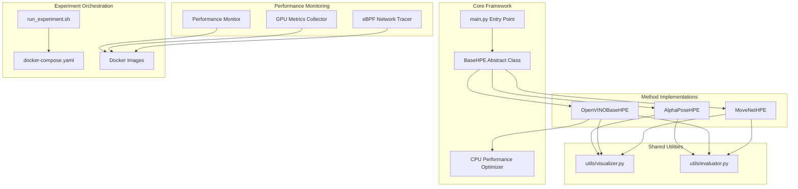

**Diagram sources**
- [main.py:22-99](file://main.py#L22-L99)
- [base_hpe.py:36-546](file://base_hpe.py#L36-L546)
- [openvino_base_hpe.py:55-653](file://openvino_base_hpe.py#L55-L653)
- [optimizations/cpu_performance_optimizer.py:336-403](file://optimizations/cpu_performance_optimizer.py#L336-L403)

**Section sources**
- [README.md:1-125](file://README.md#L1-L125)
- [main.py:22-99](file://main.py#L22-L99)

## Core Components

### BaseHPE Abstract Class

The foundation of the framework is the `BaseHPE` abstract class, which establishes the unified interface pattern shared by all pose estimation implementations. This class provides:

- **Unified Input Handling**: Supports images, videos, directories, webcam feeds, and HTTP streams with automatic detection and initialization
- **Hardware Acceleration**: Built-in support for PyNvCodec GPU video decoding and fallback to OpenCV for CPU processing
- **Standardized Processing Loop**: Consistent frame processing pipeline with timing, visualization, and output generation
- **Output Management**: Unified JSON and CSV export capabilities with COCO format compliance
- **Performance Monitoring**: Integrated FPS calculation and processing time tracking

### Method-Specific Implementations

Each pose estimation method extends the BaseHPE class with method-specific optimizations:

- **AlphaPoseHPE**: PyTorch-based implementation with integrated YOLOv3 detection and HRNet pose estimation
- **OpenVINOBaseHPE**: Multi-model OpenVINO implementation supporting OpenPose, HigherHRNet, and EfficientHRNet variants
- **MoveNetHPE**: OpenVINO-based MoveNet implementation optimized for real-time performance

**Section sources**
- [base_hpe.py:36-546](file://base_hpe.py#L36-L546)
- [openvino_base_hpe.py:55-653](file://openvino_base_hpe.py#L55-L653)
- [movenet_hpe.py:12-111](file://movenet_hpe.py#L12-L111)
- [alphapose_hpe.py:33-334](file://alphapose_hpe.py#L33-L334)

## Architecture Overview

The framework implements a layered architecture with clear separation between hardware abstraction, model implementations, and utility functions, now enhanced with comprehensive performance monitoring:

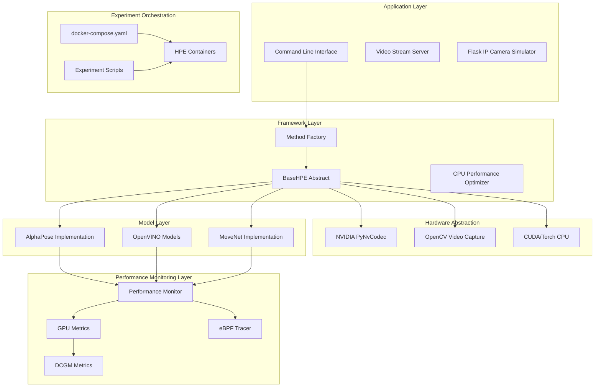

**Diagram sources**
- [main.py:64-84](file://main.py#L64-L84)
- [base_hpe.py:94-157](file://base_hpe.py#L94-L157)
- [openvino_base_hpe.py:183-260](file://openvino_base_hpe.py#L183-L260)
- [dev_tools/README.md:1-102](file://dev_tools/README.md#L1-L102)

The architecture ensures that:

1. **Consistency**: All methods share the same input/output interface and processing pipeline
2. **Flexibility**: Easy addition of new pose estimation methods
3. **Performance**: Hardware-specific optimizations without changing the interface
4. **Maintainability**: Clear separation of concerns across different functional areas
5. **Observability**: Comprehensive monitoring and performance tracking capabilities

## Detailed Component Analysis

### Unified Interface Pattern

The framework implements a consistent interface pattern across all pose estimation methods:

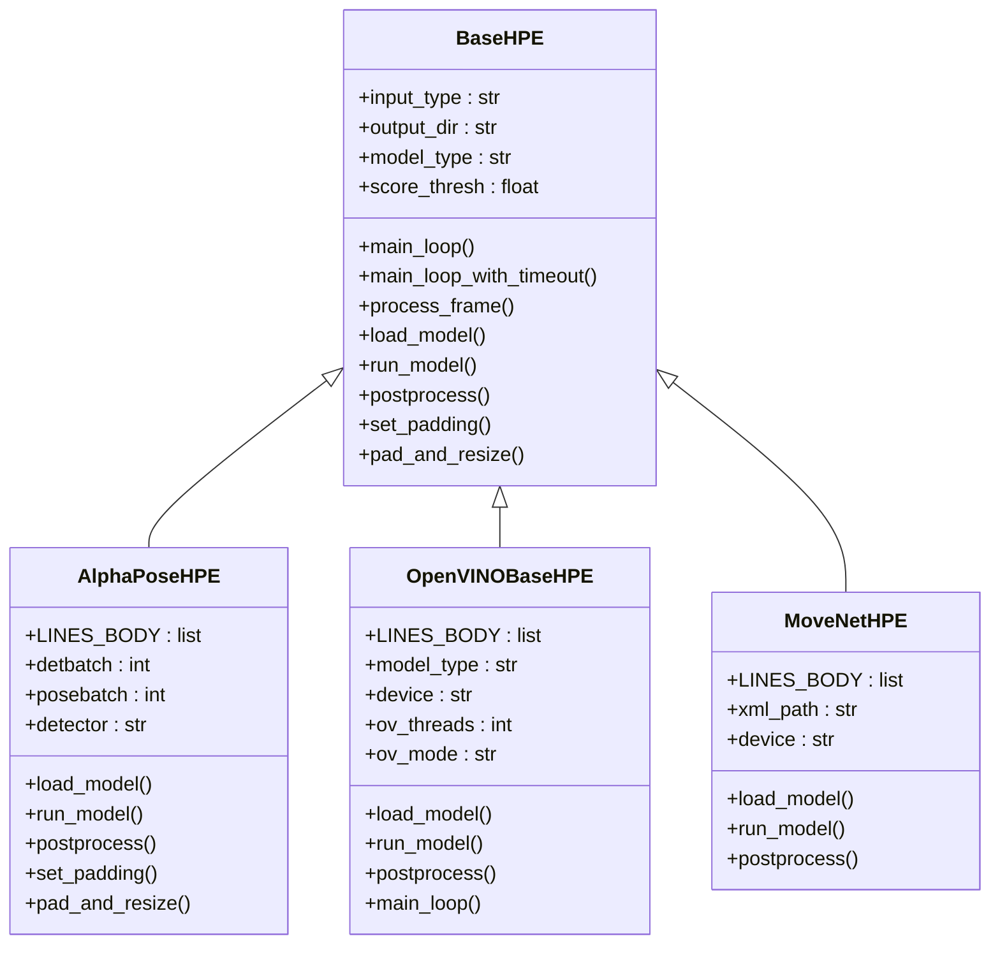

**Diagram sources**
- [base_hpe.py:36-546](file://base_hpe.py#L36-L546)
- [alphapose_hpe.py:33-334](file://alphapose_hpe.py#L33-L334)
- [openvino_base_hpe.py:55-653](file://openvino_base_hpe.py#L55-L653)
- [movenet_hpe.py:12-111](file://movenet_hpe.py#L12-L111)

### Processing Pipeline Flow

The standardized processing pipeline ensures consistent behavior across all implementations:

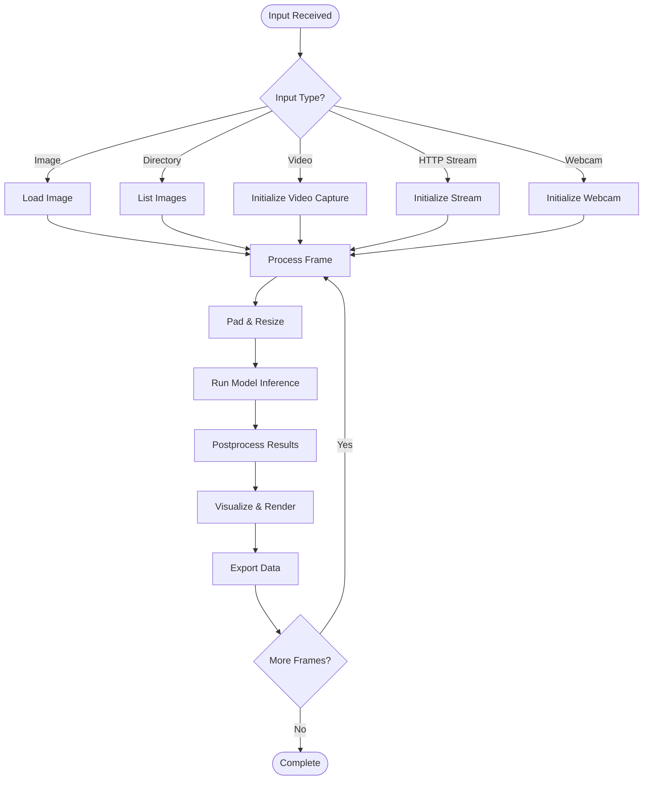

**Diagram sources**
- [base_hpe.py:207-282](file://base_hpe.py#L207-L282)
- [base_hpe.py:405-519](file://base_hpe.py#L405-L519)

### Method-Specific Optimizations

#### AlphaPose Implementation

AlphaPoseHPE integrates both object detection and pose estimation in a single pipeline:

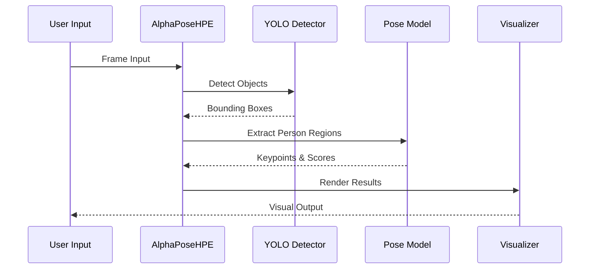

**Diagram sources**
- [alphapose_hpe.py:126-294](file://alphapose_hpe.py#L126-L294)

#### OpenVINO Implementation

OpenVINOBaseHPE provides multi-model support with configurable performance settings:

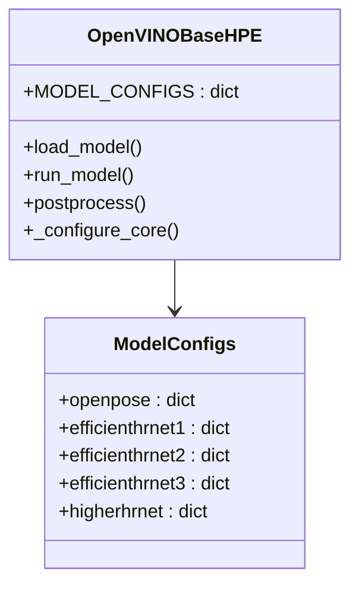

**Diagram sources**
- [openvino_base_hpe.py:22-53](file://openvino_base_hpe.py#L22-L53)
- [openvino_base_hpe.py:183-260](file://openvino_base_hpe.py#L183-L260)

#### MoveNet Implementation

MoveNetHPE focuses on real-time performance with minimal overhead:

**Diagram sources**
- [movenet_hpe.py:83-111](file://movenet_hpe.py#L83-L111)

**Section sources**
- [base_hpe.py:207-519](file://base_hpe.py#L207-L519)
- [alphapose_hpe.py:126-334](file://alphapose_hpe.py#L126-L334)
- [openvino_base_hpe.py:183-314](file://openvino_base_hpe.py#L183-L314)
- [movenet_hpe.py:58-111](file://movenet_hpe.py#L58-L111)

## Dependency Analysis

The framework maintains loose coupling between components through well-defined interfaces:

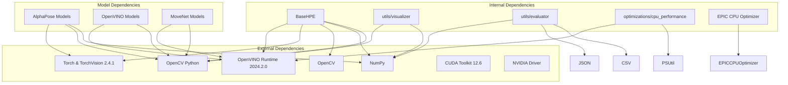

**Diagram sources**
- [main.py:10-12](file://main.py#L10-L12)
- [base_hpe.py:1-17](file://base_hpe.py#L1-L17)
- [openvino_base_hpe.py:15-20](file://openvino_base_hpe.py#L15-L20)
- [Dockerfile_base:1-84](file://Dockerfile_base#L1-L84)

The dependency structure ensures:

1. **Modularity**: Each component can be developed and tested independently
2. **Scalability**: New methods can be added without affecting existing implementations
3. **Maintainability**: Clear boundaries between different functional areas
4. **Testability**: Well-defined interfaces enable comprehensive unit testing

**Section sources**
- [main.py:10-12](file://main.py#L10-L12)
- [base_hpe.py:1-17](file://base_hpe.py#L1-L17)
- [openvino_base_hpe.py:15-20](file://openvino_base_hpe.py#L15-L20)

## Performance Considerations

The framework incorporates several performance optimization strategies:

### Hardware Acceleration

- **PyNvCodec Integration**: GPU-accelerated video decoding for reduced CPU load
- **CUDA Support**: Native PyTorch CUDA integration for AlphaPose
- **OpenVINO Optimization**: Multi-threading and stream configuration for CPU-bound models

### Memory Management

- **Frame Buffering**: Configurable frame queues to prevent memory overflow
- **Batch Processing**: Intelligent batching strategies for different model types
- **Resource Cleanup**: Proper resource deallocation and cleanup procedures

### Performance Monitoring

The framework provides comprehensive performance metrics:

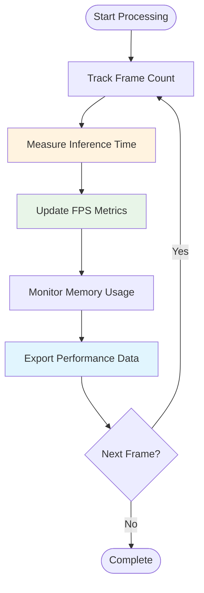

**Diagram sources**
- [base_hpe.py:451-467](file://base_hpe.py#L451-L467)
- [utils/evaluator.py:50-76](file://utils/evaluator.py#L50-L76)

**Section sources**
- [optimizations/cpu_performance_optimizer.py:336-403](file://optimizations/cpu_performance_optimizer.py#L336-L403)
- [base_hpe.py:451-519](file://base_hpe.py#L451-L519)

## Performance Benchmarking Framework

The framework now includes a comprehensive performance benchmarking system with containerized experimentation:

### Architecture

Each experiment rig operates independently with its own orchestration and monitoring:

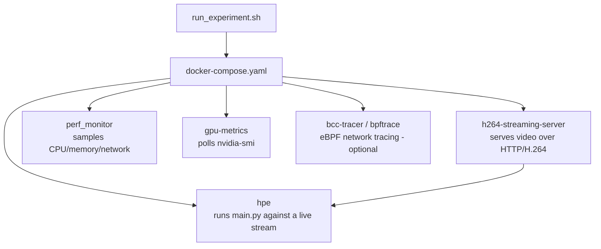

**Diagram sources**
- [README.md:133-142](file://README.md#L133-L142)

### Experiment Rigs

#### Monitor HPE Baseline
The simplest rig with two containers for local process monitoring without streaming.

#### FFmpeg HPE Main Rig
The primary experiment rig with five containers for comprehensive monitoring:
- H.264 streaming server
- HPE container with selected method
- Performance monitor
- GPU metrics collector
- Optional eBPF tracer

#### Recent Dash DASH Experiment
Separate experiment measuring DASH video streaming proxy with shared monitoring infrastructure.

#### RTSP IPCam Streaming Server
Reusable streaming server component used by other experiment rigs.

### Standalone Measurement Tools

| Script | What it measures | Method |
|--------|------------------|--------|
| `Measure_Flops/measure_flops.sh` | GPU FLOPS, TOPS, memory bandwidth, warp latency | NVIDIA Nsight Compute (`ncu`) + `nvidia-smi` + `ps` |
| `Measure_gpu_dcgm/run_nvidia_dcgm.sh` | GPU power, temperature, utilisation, memory | `nvidia-smi` polling loop → CSV; `plot_smi_output.py` generates PNG charts |
| `Measure_plot_cpu_perf/run_perf_plot.sh` | CPU cycles and clock | Reads PID from `/pids/dash.pid`, runs `perf stat -p`, plots with `plot_perf_metrics.py` |

### CPU Optimizations

The framework includes sophisticated CPU optimization for EPIC processors:

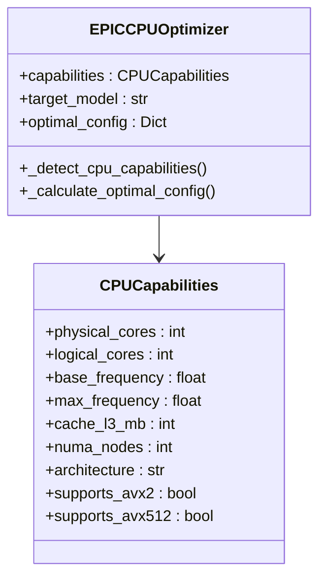

**Diagram sources**
- [optimizations/cpu_performance_optimizer.py:20-98](file://optimizations/cpu_performance_optimizer.py#L20-L98)

**Section sources**
- [README.md:117-231](file://README.md#L117-L231)
- [docs/experiment-scripts.md:1-355](file://docs/experiment-scripts.md#L1-L355)
- [optimizations/README.md:1-220](file://optimizations/README.md#L1-L220)

## Containerization and Experimentation

The framework utilizes Docker for consistent environment setup and experiment reproducibility:

### Dockerfile Structure

The base Dockerfile provides a comprehensive environment with all dependencies pre-installed:

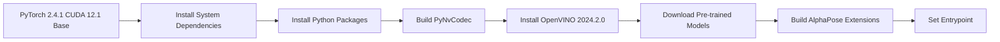

**Diagram sources**
- [Dockerfile_base:1-84](file://Dockerfile_base#L1-L84)

### Experiment Orchestration

Each experiment rig follows a standardized workflow:

1. **Environment Setup**: Clean up previous containers and CSV files
2. **Service Startup**: Start streaming server with health checks
3. **HPE Execution**: Launch HPE container with method and device parameters
4. **Monitoring**: Start performance sidecars (CPU, GPU, network)
5. **Data Collection**: Poll until completion and collect results
6. **Cleanup**: Teardown containers and organize output

**Section sources**
- [Dockerfile_base:1-84](file://Dockerfile_base#L1-L84)
- [docs/experiment-scripts.md:1-355](file://docs/experiment-scripts.md#L1-L355)

## Troubleshooting Guide

### Common Issues and Solutions

#### Model Loading Problems

**Issue**: Models fail to load or throw import errors
**Solution**: Verify model file paths and dependencies are correctly installed

#### Video Input Issues

**Issue**: Video streams fail to decode or show artifacts
**Solution**: Check PyNvCodec installation and GPU drivers

#### Performance Issues

**Issue**: Low FPS or high latency
**Solution**: Adjust OpenVINO configuration parameters and system optimizations

#### Memory Issues

**Issue**: Out of memory errors during processing
**Solution**: Reduce batch sizes and enable frame buffering

#### Containerization Issues

**Issue**: Docker containers fail to start or crash
**Solution**: Check Docker permissions, GPU drivers, and resource allocation

**Section sources**
- [README.md:71-94](file://README.md#L71-L94)
- [openvino_base_hpe.py:153-182](file://openvino_base_hpe.py#L153-L182)

## Conclusion

This Human Pose Estimation framework provides a robust, extensible solution for multi-method 2D pose estimation with consistent functionality across different implementations. The unified interface pattern ensures that developers can easily switch between AlphaPose, OpenPose, HigherHRNet, EfficientHRNet, and MoveNet implementations while maintaining the same input/output behavior and processing pipeline.

The framework's modular architecture, comprehensive performance monitoring, and hardware acceleration support make it suitable for both research and production deployment scenarios. The standardized output formats and visualization capabilities facilitate easy integration with downstream applications and analysis tools.

**Updated** The enhanced README.md now features cleaner dependency listings, improved project overview, and expanded performance benchmarking section with comprehensive Mermaid diagrams. The framework's containerization and experiment orchestration capabilities provide researchers and developers with powerful tools for performance analysis and optimization across different hardware configurations and use cases.

Future enhancements could include additional pose estimation methods, improved multi-GPU support, enhanced real-time streaming capabilities for edge computing deployments, and expanded performance monitoring with additional metrics and visualization options.