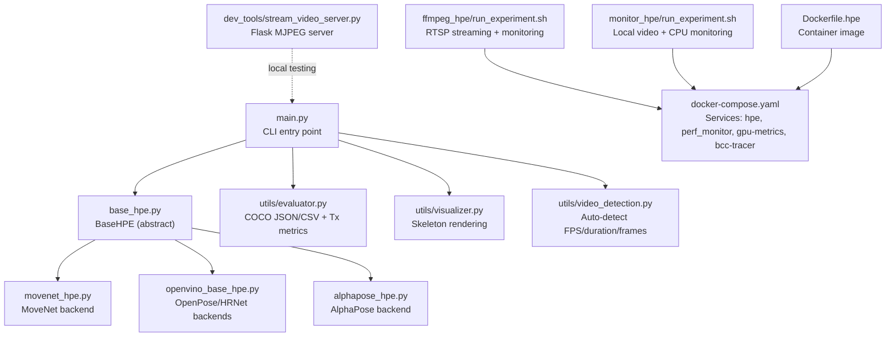
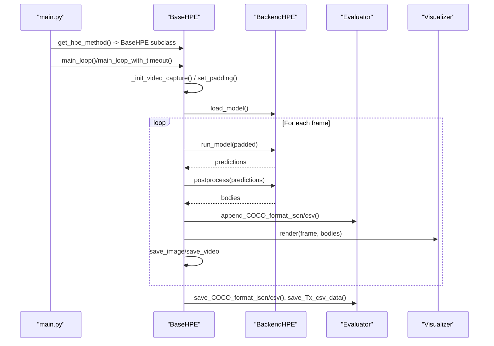
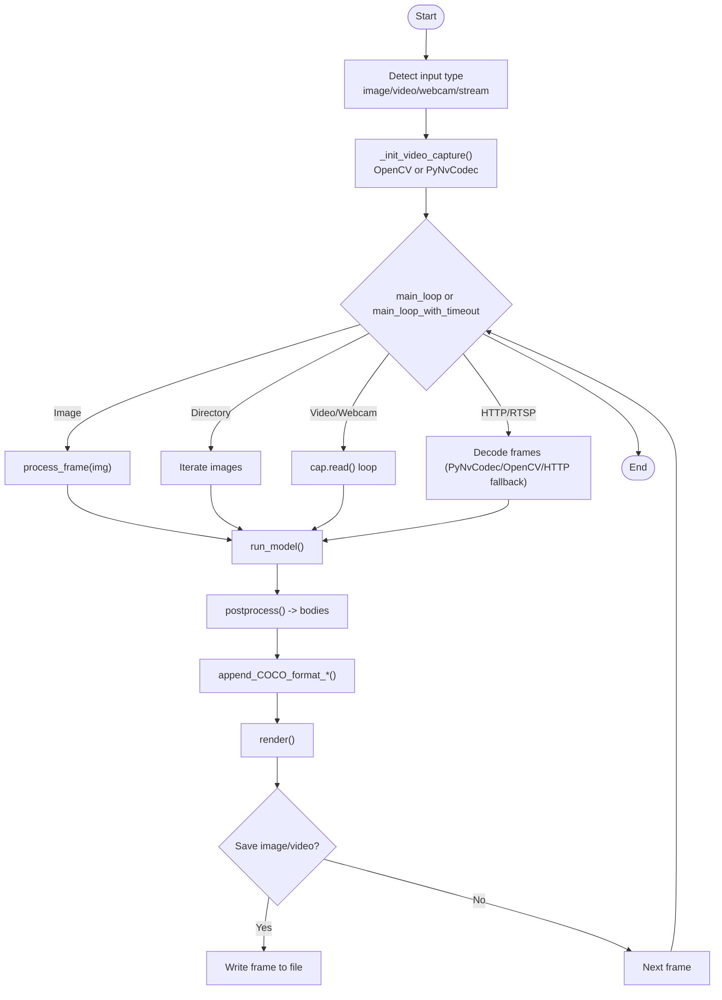
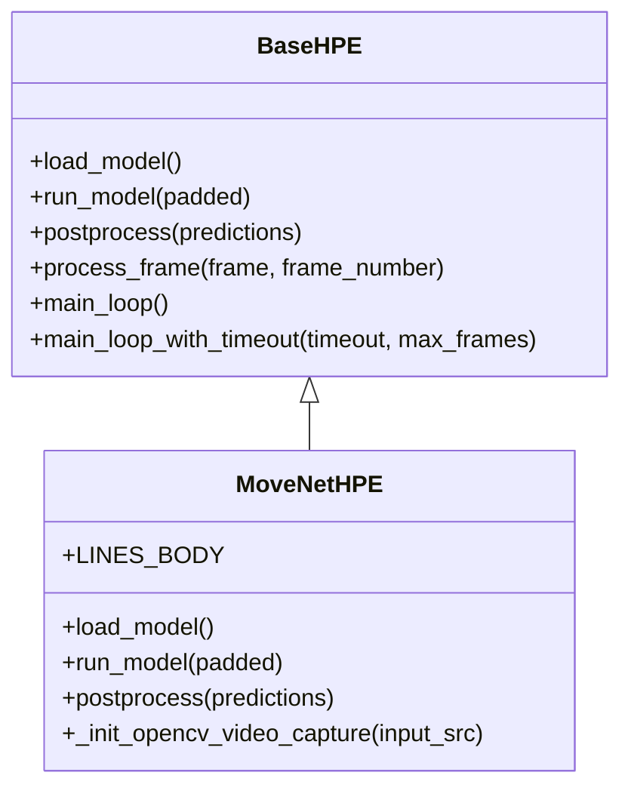
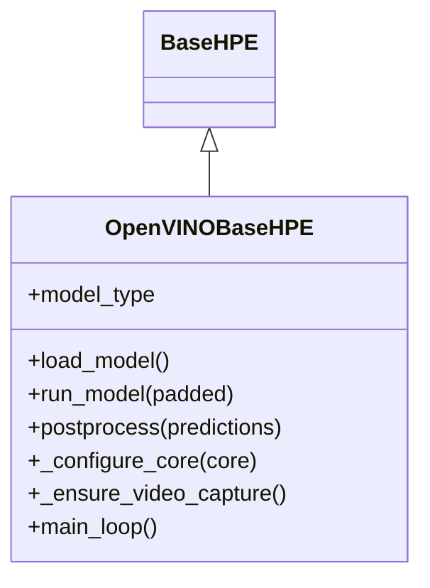
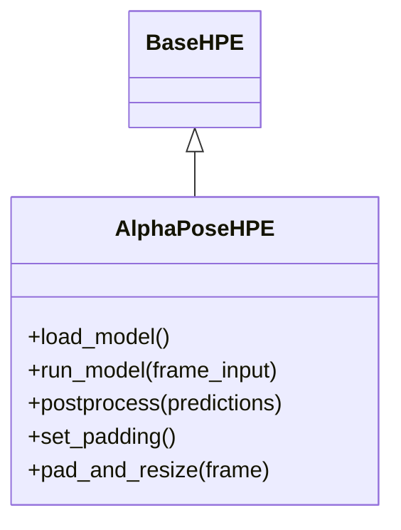
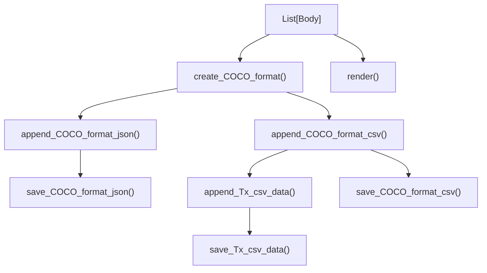
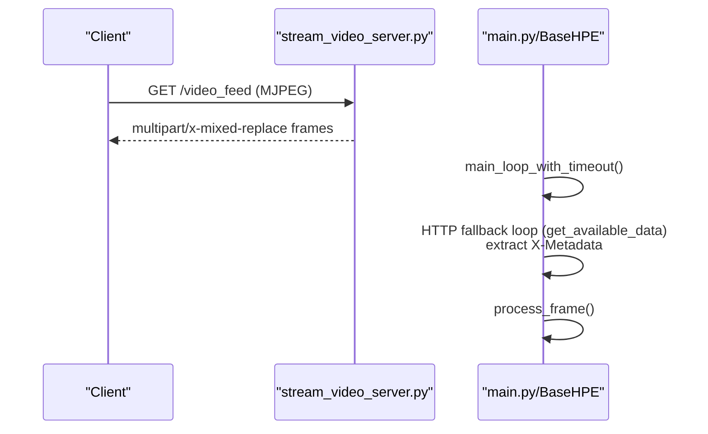
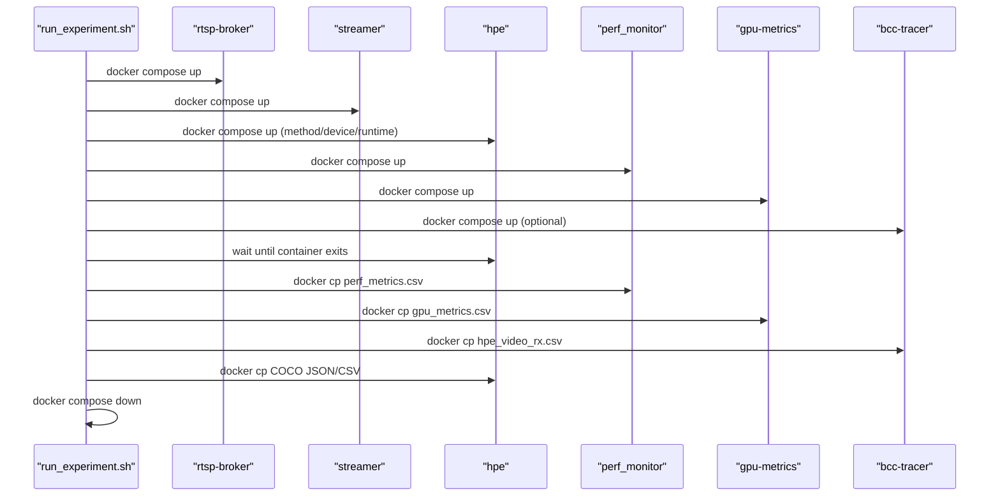
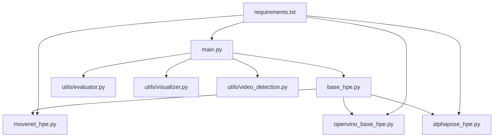

# Core Features and Capabilities

<cite>
**Referenced Files in This Document**
- [README.md](file://README.md)
- [main.py](file://main.py)
- [base_hpe.py](file://base_hpe.py)
- [movenet_hpe.py](file://movenet_hpe.py)
- [openvino_base_hpe.py](file://openvino_base_hpe.py)
- [alphapose_hpe.py](file://alphapose_hpe.py)
- [utils/evaluator.py](file://utils/evaluator.py)
- [utils/visualizer.py](file://utils/visualizer.py)
- [utils/video_detection.py](file://utils/video_detection.py)
- [ffmpeg_hpe/run_experiment.sh](file://ffmpeg_hpe/run_experiment.sh)
- [monitor_hpe/run_experiment.sh](file://monitor_hpe/run_experiment.sh)
- [Dockerfile.hpe](file://Dockerfile.hpe)
- [docker-compose.yml](file://docker-compose.yml)
- [dev_tools/stream_video_server.py](file://dev_tools/stream_video_server.py)
- [requirements.txt](file://requirements.txt)
</cite>

## Table of Contents
1. [Introduction](#introduction)
2. [Project Structure](#project-structure)
3. [Core Components](#core-components)
4. [Architecture Overview](#architecture-overview)
5. [Detailed Component Analysis](#detailed-component-analysis)
6. [Dependency Analysis](#dependency-analysis)
7. [Performance Considerations](#performance-considerations)
8. [Troubleshooting Guide](#troubleshooting-guide)
9. [Conclusion](#conclusion)
10. [Appendices](#appendices)

## Introduction
This document explains the core features and capabilities of the 2D Human Pose Estimation platform. It covers:
- Unified Python interface supporting five backends (AlphaPose, MoveNet, OpenPose, HigherHRNet, EfficientHRNet)
- Multiple input sources (images, videos, webcam, IP streams)
- COCO keypoint output format with 17 keypoints and visibility flags
- Real-time streaming, performance monitoring, and containerized deployment
- Benchmarking platform, experiment orchestration, and automated resource allocation
- Typical use cases and workflows for inference and performance measurement

## Project Structure
The repository combines a unified HPE library with a containerized benchmarking platform:
- Inference engine: a shared base class and backend-specific implementations
- Utilities for evaluation, visualization, and video property detection
- Benchmarking rigs orchestrated by Docker Compose scripts
- Container images and orchestration for GPU/CPU performance measurement

**Diagram sources**
- [main.py:1-242](file://main.py#L1-L242)
- [base_hpe.py:1-675](file://base_hpe.py#L1-L675)
- [movenet_hpe.py:1-111](file://movenet_hpe.py#L1-L111)
- [openvino_base_hpe.py:1-412](file://openvino_base_hpe.py#L1-L412)
- [alphapose_hpe.py:1-341](file://alphapose_hpe.py#L1-L341)
- [utils/evaluator.py:1-114](file://utils/evaluator.py#L1-L114)
- [utils/visualizer.py:1-53](file://utils/visualizer.py#L1-L53)
- [utils/video_detection.py:1-221](file://utils/video_detection.py#L1-L221)
- [ffmpeg_hpe/run_experiment.sh:1-481](file://ffmpeg_hpe/run_experiment.sh#L1-L481)
- [monitor_hpe/run_experiment.sh:1-235](file://monitor_hpe/run_experiment.sh#L1-L235)
- [Dockerfile.hpe:1-122](file://Dockerfile.hpe#L1-L122)
- [docker-compose.yml:1-30](file://docker-compose.yml#L1-L30)
- [dev_tools/stream_video_server.py:1-228](file://dev_tools/stream_video_server.py#L1-L228)

**Section sources**
- [README.md:1-403](file://README.md#L1-L403)
- [main.py:1-242](file://main.py#L1-L242)
- [base_hpe.py:1-675](file://base_hpe.py#L1-L675)

## Core Components
- Unified Python interface:
  - Central CLI entry point parses arguments and instantiates the selected backend
  - Base class encapsulates input routing, main loop, padding/resizing, and output saving
  - Backend-specific implementations define model loading, inference, and postprocessing
- Backends:
  - MoveNet (OpenVINO runtime, CPU only)
  - OpenPose, HigherHRNet, EfficientHRNet (OpenVINO runtime, CPU/GPU)
  - AlphaPose (PyTorch + YOLO detector)
- Output and visualization:
  - COCO-format JSON/CSV with 17 keypoints and visibility flags
  - Optional annotated image/video output
- Streaming and input sources:
  - Images, videos, webcam, HTTP/RTSP streams
  - Auto-detection of video properties for HTTP/RTSP streams
  - Development MJPEG server for local IP stream testing
- Performance monitoring and benchmarking:
  - Docker-based experiment rigs with CPU/GPU/memory monitoring
  - Automated resource allocation based on vCPU availability
  - Network bandwidth measurement (TX via bpftrace, RX via BCC tracer)

**Section sources**
- [README.md:20-110](file://README.md#L20-L110)
- [main.py:190-242](file://main.py#L190-L242)
- [base_hpe.py:98-196](file://base_hpe.py#L98-L196)
- [utils/evaluator.py:11-47](file://utils/evaluator.py#L11-L47)
- [utils/visualizer.py:4-53](file://utils/visualizer.py#L4-L53)
- [utils/video_detection.py:42-221](file://utils/video_detection.py#L42-L221)
- [dev_tools/stream_video_server.py:1-228](file://dev_tools/stream_video_server.py#L1-L228)

## Architecture Overview
The system separates concerns across layers:
- CLI layer: argument parsing and backend selection
- Pipeline layer: input detection, decoding, preprocessing, inference, postprocessing, rendering, and output serialization
- Backend layer: model-specific implementations
- Orchestration layer: Docker Compose scripts for benchmarking and monitoring

**Diagram sources**
- [main.py:51-189](file://main.py#L51-L189)
- [base_hpe.py:250-330](file://base_hpe.py#L250-L330)
- [base_hpe.py:550-653](file://base_hpe.py#L550-L653)
- [utils/evaluator.py:35-114](file://utils/evaluator.py#L35-L114)
- [utils/visualizer.py:4-53](file://utils/visualizer.py#L4-L53)

## Detailed Component Analysis

### Unified Python Interface and Base Pipeline
- Input routing:
  - Supports images, directories, videos, webcam, HTTP/RTSP streams
  - Auto-detection of video properties for HTTP/RTSP improves timeout/max_frames handling
- Main loop:
  - Handles both bounded and unbounded processing
  - Integrates PyNvCodec GPU decoding path when available
  - Provides robust HTTP/MJPEG fallback for IP streams
- Performance tracking:
  - Maintains rolling window of processing times for FPS calculation
  - Renders FPS overlay on output frames
- Output:
  - COCO JSON/CSV accumulation and periodic TX bandwidth CSV

**Diagram sources**
- [base_hpe.py:202-248](file://base_hpe.py#L202-L248)
- [base_hpe.py:250-549](file://base_hpe.py#L250-L549)
- [base_hpe.py:550-653](file://base_hpe.py#L550-L653)

**Section sources**
- [base_hpe.py:98-196](file://base_hpe.py#L98-L196)
- [base_hpe.py:202-248](file://base_hpe.py#L202-L248)
- [base_hpe.py:250-549](file://base_hpe.py#L250-L549)
- [base_hpe.py:550-653](file://base_hpe.py#L550-L653)

### Backend Implementations

#### MoveNetHPE (OpenVINO, CPU only)
- Uses OpenVINO runtime with a multipose Lightning model
- Initializes OpenCV video capture for fallback paths
- Postprocesses outputs to Body objects with 17 keypoints and visibility flags

**Diagram sources**
- [movenet_hpe.py:12-111](file://movenet_hpe.py#L12-L111)
- [base_hpe.py:98-196](file://base_hpe.py#L98-L196)

**Section sources**
- [movenet_hpe.py:20-111](file://movenet_hpe.py#L20-L111)

#### OpenVINOBaseHPE (OpenPose, HigherHRNet, EfficientHRNet)
- Supports multiple architectures with configurable OpenVINO settings
- Configurable CPU threads, streams, and performance mode
- Robust HTTP/RTSP initialization and streaming URL handling
- Postprocess converts normalized keypoints to original image coordinates

**Diagram sources**
- [openvino_base_hpe.py:56-412](file://openvino_base_hpe.py#L56-L412)
- [base_hpe.py:98-196](file://base_hpe.py#L98-L196)

**Section sources**
- [openvino_base_hpe.py:65-190](file://openvino_base_hpe.py#L65-L190)
- [openvino_base_hpe.py:191-282](file://openvino_base_hpe.py#L191-L282)
- [openvino_base_hpe.py:284-322](file://openvino_base_hpe.py#L284-L322)

#### AlphaPoseHPE (PyTorch + YOLO detector)
- Uses PyTorch models with a YOLO detector
- Implements custom detection and pose estimation pipeline
- Overrides padding/resizing to preserve original resolution
- Converts heatmap coordinates to normalized keypoints

**Diagram sources**
- [alphapose_hpe.py:33-341](file://alphapose_hpe.py#L33-L341)
- [base_hpe.py:98-196](file://base_hpe.py#L98-L196)

**Section sources**
- [alphapose_hpe.py:69-125](file://alphapose_hpe.py#L69-L125)
- [alphapose_hpe.py:126-294](file://alphapose_hpe.py#L126-L294)
- [alphapose_hpe.py:295-341](file://alphapose_hpe.py#L295-L341)

### Output Format and Visualization
- COCO keypoint format:
  - 17 keypoints per person in COCO order
  - Each keypoint: x, y, visibility flag (0=not detected, 1=detected, 2=visible)
  - Score field reflects mean keypoint score above threshold
- CSV/JSON serialization:
  - Accumulates per-frame results with timestamps
  - Generates TX bandwidth CSV per millisecond interval
- Visualization:
  - Draws skeleton lines and keypoint circles with optional scores and bounding boxes

**Diagram sources**
- [utils/evaluator.py:11-114](file://utils/evaluator.py#L11-L114)
- [utils/visualizer.py:4-53](file://utils/visualizer.py#L4-L53)

**Section sources**
- [utils/evaluator.py:11-47](file://utils/evaluator.py#L11-L47)
- [utils/visualizer.py:4-53](file://utils/visualizer.py#L4-L53)

### Real-Time Streaming and IP Stream Support
- HTTP/RTSP streams:
  - Auto-detection of FPS/duration/frames for HTTP streams
  - PyNvCodec GPU decoding path when available
  - HTTP/MJPEG fallback for IP streams with frame extraction and X-Metadata parsing
- Local MJPEG server:
  - Flask-based server for development/testing
  - Streams a video file as multipart frames

**Diagram sources**
- [dev_tools/stream_video_server.py:100-172](file://dev_tools/stream_video_server.py#L100-L172)
- [base_hpe.py:442-540](file://base_hpe.py#L442-L540)

**Section sources**
- [utils/video_detection.py:42-221](file://utils/video_detection.py#L42-L221)
- [base_hpe.py:202-248](file://base_hpe.py#L202-L248)
- [base_hpe.py:442-540](file://base_hpe.py#L442-L540)
- [dev_tools/stream_video_server.py:1-228](file://dev_tools/stream_video_server.py#L1-L228)

### Benchmarking Platform, Experiment Orchestration, and Automated Resource Allocation
- RTSP streaming rig:
  - Orchestrated by a single script that starts services, waits for readiness, runs HPE, collects metrics, and cleans up
  - Auto-detects vCPUs and allocates resources among sidecars and HPE
  - Supports GPU vs CPU methods with appropriate thread/memory limits
- Baseline CPU monitoring rig:
  - Runs HPE against a local video file and monitors CPU/RAM via a dedicated container
- Monitoring sidecars:
  - CPU/RAM metrics, GPU telemetry, optional RX network tracing via BCC tracer

**Diagram sources**
- [ffmpeg_hpe/run_experiment.sh:1-481](file://ffmpeg_hpe/run_experiment.sh#L1-L481)

**Section sources**
- [ffmpeg_hpe/run_experiment.sh:99-178](file://ffmpeg_hpe/run_experiment.sh#L99-L178)
- [ffmpeg_hpe/run_experiment.sh:206-304](file://ffmpeg_hpe/run_experiment.sh#L206-L304)
- [ffmpeg_hpe/run_experiment.sh:394-466](file://ffmpeg_hpe/run_experiment.sh#L394-L466)
- [monitor_hpe/run_experiment.sh:12-103](file://monitor_hpe/run_experiment.sh#L12-L103)
- [monitor_hpe/run_experiment.sh:132-175](file://monitor_hpe/run_experiment.sh#L132-L175)

### Containerized Deployment Options
- Container image:
  - PyTorch base with CUDA, compiled FFmpeg and OpenCV, OpenVINO, and model downloads
- Orchestration:
  - Prometheus/Grafana stack for telemetry
  - DCGM exporter for GPU metrics scraping

**Section sources**
- [Dockerfile.hpe:1-122](file://Dockerfile.hpe#L1-L122)
- [docker-compose.yml:1-30](file://docker-compose.yml#L1-L30)

## Dependency Analysis
- Core dependencies:
  - PyTorch, OpenCV, OpenVINO, NumPy, Pandas, Matplotlib, Requests, Flask
- Backend-specific dependencies:
  - AlphaPose requires internal modules and YOLO weights
  - MoveNet uses OpenVINO runtime
  - OpenPose/HRNet/EfficientHRNet use OpenVINO runtime
- Runtime dependencies:
  - CUDA toolkit and NVIDIA drivers for GPU backends
  - FFmpeg with NVIDIA NVENC for streaming

**Diagram sources**
- [requirements.txt:1-100](file://requirements.txt#L1-L100)
- [main.py:1-242](file://main.py#L1-L242)
- [base_hpe.py:1-675](file://base_hpe.py#L1-L675)
- [movenet_hpe.py:1-111](file://movenet_hpe.py#L1-L111)
- [openvino_base_hpe.py:1-412](file://openvino_base_hpe.py#L1-L412)
- [alphapose_hpe.py:1-341](file://alphapose_hpe.py#L1-L341)
- [utils/evaluator.py:1-114](file://utils/evaluator.py#L1-L114)
- [utils/visualizer.py:1-53](file://utils/visualizer.py#L1-L53)
- [utils/video_detection.py:1-221](file://utils/video_detection.py#L1-L221)

**Section sources**
- [requirements.txt:1-100](file://requirements.txt#L1-L100)

## Performance Considerations
- Throughput vs latency:
  - OpenVINO supports performance modes and CPU thread/stream configuration
  - PyNvCodec enables GPU-accelerated decoding for RTSP streams
- Resource allocation:
  - Scripts auto-detect vCPUs and reserve sidecars; HPE threads/memory scale with available cores
- Monitoring:
  - CPU%, RAM, GPU utilization, and network RX/TX metrics collected during experiments
- Practical tips:
  - Prefer PyNvCodec for RTSP streams when available
  - Tune OV_THREADS and performance mode for CPU backends
  - Use HTTP streamer with target FPS for predictable frame counts

[No sources needed since this section provides general guidance]

## Troubleshooting Guide
Common issues and resolutions:
- Video property detection failures for HTTP/RTSP:
  - The system falls back to user-provided timeout and max_frames
  - For HTTP streams, the streamer’s video_info endpoint can supply converted properties
- PyNvCodec not available:
  - Falls back to OpenCV/FFmpeg with reduced latency settings
- RTSP stream not publishing:
  - Scripts probe broker and streamer readiness; verify ports and logs
- BCC tracer RX measurement:
  - Use the dedicated tracer container sharing the HPE network namespace for accurate RX measurement
- PID-based RX measurement:
  - Only TX via bpftrace PID filter is reliable; RX requires BPF socket filter

**Section sources**
- [utils/video_detection.py:42-221](file://utils/video_detection.py#L42-L221)
- [base_hpe.py:202-248](file://base_hpe.py#L202-L248)
- [ffmpeg_hpe/run_experiment.sh:206-304](file://ffmpeg_hpe/run_experiment.sh#L206-L304)
- [README.md:333-385](file://README.md#L333-L385)

## Conclusion
The platform provides a unified, extensible 2D HPE solution with strong support for multiple backends, diverse input sources, and comprehensive performance measurement. Its containerized benchmarking framework automates experiment orchestration and resource allocation, enabling reproducible performance studies under realistic streaming conditions.

[No sources needed since this section summarizes without analyzing specific files]

## Appendices

### Typical Use Cases and Workflows
- Inference workflows:
  - Single image: choose a backend and enable image output
  - Video file: configure timeout and max_frames or process the whole file
  - Webcam: specify device index and run with real-time rendering
  - IP stream: use the Flask server for development or connect to a live RTSP broker
- Performance measurement workflows:
  - RTSP rig: run the experiment script to start streaming, HPE, and monitoring sidecars; collect CSVs and logs
  - Baseline CPU monitoring: run the monitor rig against a local video file and analyze CPU/RAM metrics

**Section sources**
- [README.md:176-208](file://README.md#L176-L208)
- [ffmpeg_hpe/run_experiment.sh:1-481](file://ffmpeg_hpe/run_experiment.sh#L1-L481)
- [monitor_hpe/run_experiment.sh:1-235](file://monitor_hpe/run_experiment.sh#L1-L235)