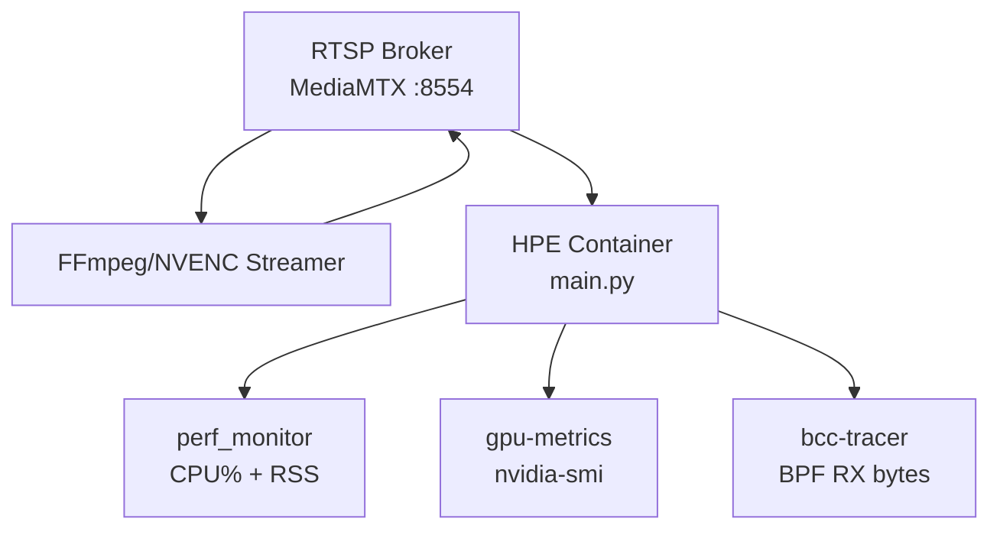

# Getting Started

<cite>
**Referenced Files in This Document**
- [README.md](file://README.md)
- [ONBOARDING.md](file://ONBOARDING.md)
- [requirements.txt](file://requirements.txt)
- [setup.py](file://setup.py)
- [models/AlphaPose/build_extensions.sh](file://models/AlphaPose/build_extensions.sh)
- [Dockerfile_base](file://Dockerfile_base)
- [docker-compose.yaml](file://ffmpeg_hpe/docker-compose.yaml)
- [run_experiment.sh](file://ffmpeg_hpe/run_experiment.sh)
- [main.py](file://main.py)
- [base_hpe.py](file://base_hpe.py)
- [evaluator.py](file://utils/evaluator.py)
- [stream_video_server.py](file://dev_tools/stream_video_server.py)
</cite>

## Table of Contents
1. [Introduction](#introduction)
2. [System Requirements](#system-requirements)
3. [Environment Setup](#environment-setup)
4. [Model Download](#model-download)
5. [Local Inference Examples](#local-inference-examples)
6. [Benchmarking Platform](#benchmarking-platform)
7. [Output Formats](#output-formats)
8. [Troubleshooting](#troubleshooting)
9. [Next Steps](#next-steps)

## Introduction
This guide walks you through setting up the 2D Human Pose Estimation benchmarking platform. You will configure the environment, download pretrained models, and run inference on images, videos, directories, and IP streams. The platform supports five backends: AlphaPose, MoveNet, OpenPose, HigherHRNet, and EfficientHRNet variants. It also includes a Docker-based benchmarking rig to measure throughput, CPU/GPU utilization, memory, and network bandwidth under realistic streaming conditions.

## System Requirements
- Operating System: Ubuntu 20.04 (recommended)
- Python: 3.8.10
- PyTorch: 2.4.1+cu121
- CUDA Toolkit: 12.6
- NVIDIA GPU (any CUDA-capable GPU) for GPU backends; CPU-only for OpenVINO-based methods
- Docker and Docker Compose v20+ with nvidia-container-toolkit for GPU methods

**Section sources**
- [README.md:7-16](file://README.md#L7-L16)
- [ONBOARDING.md:189-204](file://ONBOARDING.md#L189-L204)

## Environment Setup
Choose one of the following approaches to prepare your environment.

### Option A: Conda (Recommended)
- Create and activate a Conda environment with Python 3.8.10
- Install PyTorch with CUDA support
- Install all remaining dependencies from requirements.txt

**Section sources**
- [README.md:164-169](file://README.md#L164-L169)
- [ONBOARDING.md:239-251](file://ONBOARDING.md#L239-L251)

### Option B: pip + virtualenv
- Create a virtual environment
- Install CPU-focused PyTorch wheels first (requirements_torch_cpu.txt)
- Install development and additional dependencies

**Section sources**
- [ONBOARDING.md:253-270](file://ONBOARDING.md#L253-L270)

### Build AlphaPose Cython Extensions
- Use the provided build script to compile required extensions
- The script builds ROI align, deformable convolutions, and NMS modules

**Section sources**
- [README.md:170-171](file://README.md#L170-L171)
- [models/AlphaPose/build_extensions.sh:1-25](file://models/AlphaPose/build_extensions.sh#L1-L25)
- [setup.py:1-37](file://setup.py#L1-L37)

## Model Download
Pretrained model weights are not included in the repository. Download each model and place it at the indicated path.

### AlphaPose
- ResNet50 pose estimation weights
- YOLOv3 person detector weights

**Section sources**
- [README.md:119-126](file://README.md#L119-L126)
- [ONBOARDING.md:310-320](file://ONBOARDING.md#L310-L320)

### MoveNet
- Multipose Lightning FP32 binary

**Section sources**
- [README.md:128-132](file://README.md#L128-L132)
- [ONBOARDING.md:322-327](file://ONBOARDING.md#L322-L327)

### OpenPose (OpenVINO)
- Intel human-pose-estimation-0001 binary

**Section sources**
- [README.md:134-138](file://README.md#L134-L138)
- [ONBOARDING.md:329-334](file://ONBOARDING.md#L329-L334)

### HigherHRNet (OpenVINO)
- Public FP32 higher-hrnet-w32-human-pose-estimation binary

**Section sources**
- [README.md:140-144](file://README.md#L140-L144)
- [ONBOARDING.md:336-341](file://ONBOARDING.md#L336-L341)

### EfficientHRNet Variants (ae1, ae2, ae3)
- human-pose-estimation-0005, 0006, 0007 FP32 binaries

**Section sources**
- [README.md:146-156](file://README.md#L146-L156)
- [ONBOARDING.md:343-357](file://ONBOARDING.md#L343-L357)

## Local Inference Examples
Run inference directly on your machine using the selected backend and input type.

### Basic Examples
- Single image with MoveNet, saving annotated image
- Directory of images with AlphaPose, exporting JSON
- GIF/video with EfficientHRNet1, saving output video
- HTTP stream with MoveNet, forcing CPU
- AlphaPose with CSV output, custom output directory, explicit device

**Section sources**
- [README.md:178-190](file://README.md#L178-L190)
- [ONBOARDING.md:388-408](file://ONBOARDING.md#L388-L408)

### CLI Flags Overview
- method: Required; choose from openpose, alphapose, movenet, hrnet, ae1, ae2, ae3
- input: Path to image, directory, video/GIF file, or HTTP stream URL (default: webcam)
- output_dir: Directory for output files
- device: GPU or CPU (default: GPU)
- json/csv: Enable COCO-format exports
- save_image/save_video: Save annotated outputs
- detbatch: Detection batch size (AlphaPose only)
- timeout/max_frames: Control processing duration and frame count
- measurement_interval_ms: Interval for measuring transmitted data volume

**Section sources**
- [README.md:192](file://README.md#L192)
- [main.py:190-205](file://main.py#L190-L205)

### Using the Local Dev Streaming Server
- Start a Flask-based MJPEG stream server
- Run HPE against the local stream URL

**Section sources**
- [README.md:194-204](file://README.md#L194-L204)
- [stream_video_server.py:1-228](file://dev_tools/stream_video_server.py#L1-L228)

## Benchmarking Platform
The platform includes a Docker-based experiment rig to measure performance under realistic streaming conditions.

### Architecture Overview
The rig consists of:
- RTSP broker (MediaMTX) publishing port 8554
- FFmpeg/NVENC streamer looping a local video file
- HPE container running pose estimation
- Monitoring sidecars: perf_monitor (CPU/memory), gpu-metrics (GPU telemetry), bcc-tracer (kernel-level RX byte tracing)

**Diagram sources**
- [docker-compose.yaml:1-239](file://ffmpeg_hpe/docker-compose.yaml#L1-L239)
- [run_experiment.sh:512-527](file://ffmpeg_hpe/run_experiment.sh#L512-L527)

### Experiment Flow
- Generates a timestamped results directory
- Cleans up previous containers and CSV files
- Starts RTSP broker and streamer, waits for readiness
- Launches HPE container with method/device configuration
- Starts monitoring sidecars (perf_monitor, gpu-metrics, bcc-tracer)
- Waits for HPE container to exit
- Copies CSVs, logs, and metrics into results directory
- Tears down all containers

**Section sources**
- [run_experiment.sh:70-118](file://ffmpeg_hpe/run_experiment.sh#L70-L118)
- [run_experiment.sh:206-304](file://ffmpeg_hpe/run_experiment.sh#L206-L304)
- [run_experiment.sh:352-382](file://ffmpeg_hpe/run_experiment.sh#L352-L382)
- [run_experiment.sh:394-466](file://ffmpeg_hpe/run_experiment.sh#L394-L466)

### Running Benchmarks
- Build Docker images once
- Run experiments for each method (CPU-only or GPU as applicable)
- Configure video source via VIDEO_FILE_NAME in .env

**Section sources**
- [ONBOARDING.md:583-591](file://ONBOARDING.md#L583-L591)
- [ONBOARDING.md:592-616](file://ONBOARDING.md#L592-L616)
- [ONBOARDING.md:618-632](file://ONBOARDING.md#L618-L632)

## Output Formats
All backends produce COCO-format keypoint data. Each detected person includes:
- image_id/frame_number
- category_id
- keypoints: flattened x, y, visibility triples
- score

Additional outputs:
- CSV: frame_number, timestamp, json_output
- JSON: aggregated COCO-format results
- Annotated images/videos (when requested)

**Section sources**
- [README.md:96-110](file://README.md#L96-L110)
- [evaluator.py:11-33](file://utils/evaluator.py#L11-L33)
- [evaluator.py:93-114](file://utils/evaluator.py#L93-L114)

## Troubleshooting
Common setup and runtime issues:

- GPU driver persistence: Enable persistence mode for stable GPU timings
- Docker GPU access: Ensure nvidia-container-toolkit is installed and working
- Model downloads: Use gdown if wget fails for large Google Drive files
- BCC tracer permission errors: Kernel headers and debug symbols required
- Stream readiness: RTSP broker readiness is probed via host-side port check
- Container resource limits: Adjust HPE_CPU_LIMIT/HPE_MEMORY_LIMIT if needed

**Section sources**
- [ONBOARDING.md:220-233](file://ONBOARDING.md#L220-L233)
- [ONBOARDING.md:359-362](file://ONBOARDING.md#L359-L362)
- [run_experiment.sh:214-233](file://ffmpeg_hpe/run_experiment.sh#L214-L233)
- [run_experiment.sh:44-67](file://ffmpeg_hpe/run_experiment.sh#L44-L67)

## Next Steps
- Start with a CPU-only quick run using MoveNet to validate the environment
- Proceed to GPU methods (AlphaPose, OpenPose) after installing CUDA 12.6 and ensuring GPU drivers are functional
- Explore the benchmarking rig for comprehensive performance analysis under realistic streaming conditions

**Section sources**
- [ONBOARDING.md:532-572](file://ONBOARDING.md#L532-L572)