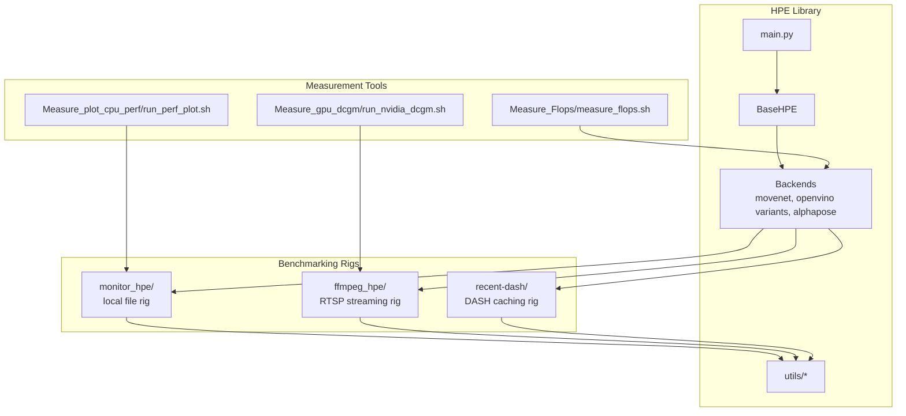
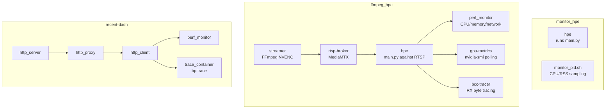
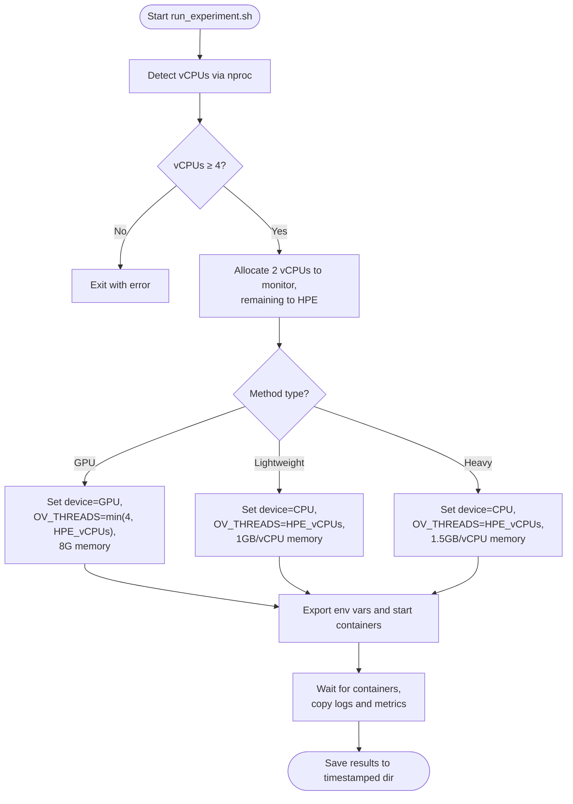
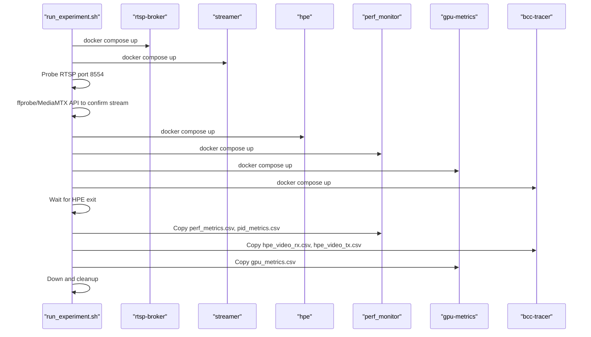
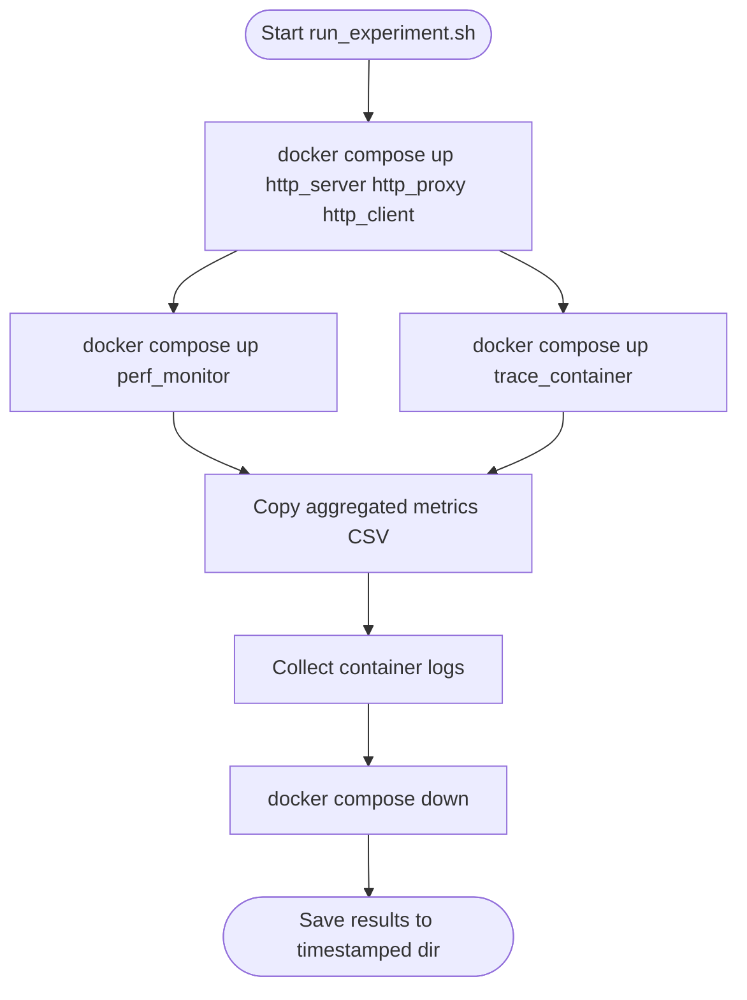
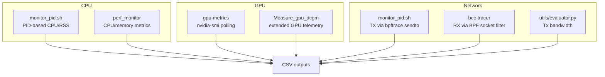
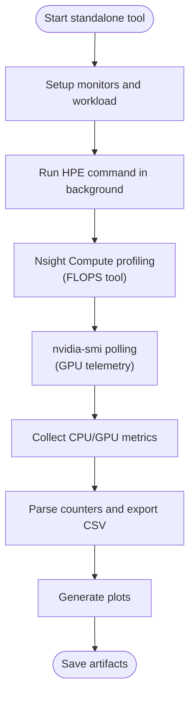
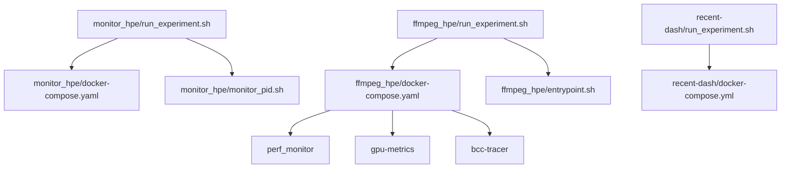

# Performance Benchmarking Platform

<cite>
**Referenced Files in This Document**
- [README.md](file://README.md)
- [monitor_hpe/docker-compose.yaml](file://monitor_hpe/docker-compose.yaml)
- [monitor_hpe/run_experiment.sh](file://monitor_hpe/run_experiment.sh)
- [monitor_hpe/monitor_pid.sh](file://monitor_hpe/monitor_pid.sh)
- [monitor_hpe/AUTO_SCALING_IMPLEMENTATION_SUMMARY.md](file://monitor_hpe/AUTO_SCALING_IMPLEMENTATION_SUMMARY.md)
- [monitor_hpe/RESOURCE_ALLOCATION.md](file://monitor_hpe/RESOURCE_ALLOCATION.md)
- [ffmpeg_hpe/docker-compose.yaml](file://ffmpeg_hpe/docker-compose.yaml)
- [ffmpeg_hpe/run_experiment.sh](file://ffmpeg_hpe/run_experiment.sh)
- [ffmpeg_hpe/DYNAMIC_RESOURCE_ALLOCATION.md](file://ffmpeg_hpe/DYNAMIC_RESOURCE_ALLOCATION.md)
- [ffmpeg_hpe/entrypoint.sh](file://ffmpeg_hpe/entrypoint.sh)
- [recent-dash/docker-compose.yml](file://recent-dash/docker-compose.yml)
- [recent-dash/run_experiment.sh](file://recent-dash/run_experiment.sh)
- [Measure_Flops/measure_flops.sh](file://Measure_Flops/measure_flops.sh)
- [Measure_gpu_dcgm/run_nvidia_dcgm.sh](file://Measure_gpu_dcgm/run_nvidia_dcgm.sh)
- [Measure_plot_cpu_perf/run_perf_plot.sh](file://Measure_plot_cpu_perf/run_perf_plot.sh)
- [docs/project-architecture-diagram.md](file://docs/project-architecture-diagram.md)
</cite>

## Table of Contents
1. [Introduction](#introduction)
2. [Project Structure](#project-structure)
3. [Core Components](#core-components)
4. [Architecture Overview](#architecture-overview)
5. [Detailed Component Analysis](#detailed-component-analysis)
6. [Dependency Analysis](#dependency-analysis)
7. [Performance Considerations](#performance-considerations)
8. [Troubleshooting Guide](#troubleshooting-guide)
9. [Conclusion](#conclusion)

## Introduction
This document explains the performance benchmarking platform used to measure 2D Human Pose Estimation (HPE) inference performance under realistic conditions. It covers three experiment rigs:
- monitor_hpe: baseline CPU-only monitoring using a local video file
- ffmpeg_hpe: full RTSP streaming benchmark with CPU/GPU/network monitoring
- recent-dash: DASH/HTTP caching research using HTTP proxy and client

It documents the experiment orchestration workflow, auto-scaling implementation, resource allocation strategies, and the monitoring stack. It also describes standalone measurement tools for FLOPS, GPU telemetry, and CPU cycle counting, and provides guidance for interpreting benchmark results and optimizing inference pipelines.

## Project Structure
The repository is organized into modular experiment rigs and supporting utilities:
- HPE inference library: main entry point and backend implementations
- Benchmarking rigs: containerized experiment environments
- Monitoring and measurement tools: standalone utilities for performance analysis

**Diagram sources**
- [docs/project-architecture-diagram.md:1-80](file://docs/project-architecture-diagram.md#L1-L80)

**Section sources**
- [README.md:20-45](file://README.md#L20-L45)
- [docs/project-architecture-diagram.md:1-80](file://docs/project-architecture-diagram.md#L1-L80)

## Core Components
- monitor_hpe: Runs HPE against a local video file and monitors CPU/RSS via a PID-based script. Auto-detects vCPUs and allocates resources dynamically.
- ffmpeg_hpe: Full streaming rig with MediaMTX RTSP broker, FFmpeg NVENC streamer, HPE container, perf_monitor, gpu-metrics, and optional bcc-tracer.
- recent-dash: HTTP caching proxy rig with perf_monitor and bpftrace tracer for RX/TX analysis.
- Standalone measurement tools: FLOPS calculator, GPU telemetry collector, and CPU cycle counter.

Key orchestration scripts:
- monitor_hpe/run_experiment.sh
- ffmpeg_hpe/run_experiment.sh
- recent-dash/run_experiment.sh

**Section sources**
- [README.md:210-320](file://README.md#L210-L320)
- [monitor_hpe/run_experiment.sh:1-235](file://monitor_hpe/run_experiment.sh#L1-L235)
- [ffmpeg_hpe/run_experiment.sh:1-481](file://ffmpeg_hpe/run_experiment.sh#L1-L481)
- [recent-dash/run_experiment.sh:1-286](file://recent-dash/run_experiment.sh#L1-L286)

## Architecture Overview
The platform uses Docker Compose to define service topologies and orchestrate experiments. Each rig defines a results directory structure and collects metrics into CSV files for post-run analysis.

**Diagram sources**
- [monitor_hpe/docker-compose.yaml:1-60](file://monitor_hpe/docker-compose.yaml#L1-L60)
- [ffmpeg_hpe/docker-compose.yaml:1-239](file://ffmpeg_hpe/docker-compose.yaml#L1-L239)
- [recent-dash/docker-compose.yml:1-103](file://recent-dash/docker-compose.yml#L1-L103)

## Detailed Component Analysis

### monitor_hpe — Baseline CPU Monitoring
- Purpose: Baseline inference cost without network overhead. Mounts a local video file and monitors the HPE process via PID.
- Auto-scaling: Detects vCPUs, reserves 2 for monitoring, allocates remaining to HPE, with method-aware thread/memory settings.
- Monitoring: Uses monitor_pid.sh to sample CPU and RSS from the monitored PID and export CSV metrics.

**Diagram sources**
- [monitor_hpe/run_experiment.sh:12-80](file://monitor_hpe/run_experiment.sh#L12-L80)
- [monitor_hpe/docker-compose.yaml:24-31](file://monitor_hpe/docker-compose.yaml#L24-L31)

**Section sources**
- [monitor_hpe/run_experiment.sh:1-235](file://monitor_hpe/run_experiment.sh#L1-L235)
- [monitor_hpe/docker-compose.yaml:1-60](file://monitor_hpe/docker-compose.yaml#L1-L60)
- [monitor_hpe/monitor_pid.sh:1-215](file://monitor_hpe/monitor_pid.sh#L1-L215)
- [monitor_hpe/AUTO_SCALING_IMPLEMENTATION_SUMMARY.md:1-298](file://monitor_hpe/AUTO_SCALING_IMPLEMENTATION_SUMMARY.md#L1-L298)
- [monitor_hpe/RESOURCE_ALLOCATION.md:1-290](file://monitor_hpe/RESOURCE_ALLOCATION.md#L1-L290)

### ffmpeg_hpe — RTSP Streaming Benchmark
- Purpose: Full-stack streaming benchmark with RTSP broker, NVENC streamer, HPE inference, and comprehensive monitoring.
- Orchestration: run_experiment.sh manages startup order, readiness checks, container timing, and result collection.
- Auto-scaling: Detects vCPUs, reserves 2 for sidecars, and allocates the rest to HPE with per-method tuning.
- Monitoring: perf_monitor captures CPU/memory/network; gpu-metrics polls nvidia-smi; bcc-tracer captures RX/TX traces.

**Diagram sources**
- [ffmpeg_hpe/run_experiment.sh:206-481](file://ffmpeg_hpe/run_experiment.sh#L206-L481)
- [ffmpeg_hpe/docker-compose.yaml:1-239](file://ffmpeg_hpe/docker-compose.yaml#L1-L239)

**Section sources**
- [ffmpeg_hpe/run_experiment.sh:1-481](file://ffmpeg_hpe/run_experiment.sh#L1-L481)
- [ffmpeg_hpe/docker-compose.yaml:1-239](file://ffmpeg_hpe/docker-compose.yaml#L1-L239)
- [ffmpeg_hpe/DYNAMIC_RESOURCE_ALLOCATION.md:1-167](file://ffmpeg_hpe/DYNAMIC_RESOURCE_ALLOCATION.md#L1-L167)
- [ffmpeg_hpe/entrypoint.sh:1-20](file://ffmpeg_hpe/entrypoint.sh#L1-L20)

### recent-dash — DASH/HTTP Caching Research
- Purpose: HTTP caching proxy research using an HTTP server, proxy, and client. Shares monitoring infrastructure with perf_monitor and bpftrace tracer.
- Orchestration: run_experiment.sh builds and starts services, measures container startup times, collects performance data, and saves logs.

**Diagram sources**
- [recent-dash/run_experiment.sh:70-199](file://recent-dash/run_experiment.sh#L70-L199)
- [recent-dash/docker-compose.yml:1-103](file://recent-dash/docker-compose.yml#L1-L103)

**Section sources**
- [recent-dash/run_experiment.sh:1-286](file://recent-dash/run_experiment.sh#L1-L286)
- [recent-dash/docker-compose.yml:1-103](file://recent-dash/docker-compose.yml#L1-L103)

### Monitoring Stack and Metrics Collection
- CPU performance tracking: monitor_pid.sh samples CPU/RSS from the monitored PID and exports CSV; perf_monitor in ffmpeg_hpe collects broader CPU/memory metrics.
- GPU metrics: gpu-metrics container polls nvidia-smi; Measure_gpu_dcgm provides extended GPU telemetry.
- Network traffic analysis: bcc-tracer captures RX/TX bytes; monitor_pid.sh captures TX via bpftrace syscalls; RX must use bcc-tracer for accuracy.
- Bandwidth measurement: utils/evaluator.py includes Tx bandwidth measurement; BCC RX traces complement perf_monitor TX.

**Diagram sources**
- [monitor_hpe/monitor_pid.sh:1-215](file://monitor_hpe/monitor_pid.sh#L1-L215)
- [ffmpeg_hpe/docker-compose.yaml:135-235](file://ffmpeg_hpe/docker-compose.yaml#L135-L235)
- [README.md:333-362](file://README.md#L333-L362)

**Section sources**
- [monitor_hpe/monitor_pid.sh:1-215](file://monitor_hpe/monitor_pid.sh#L1-L215)
- [ffmpeg_hpe/docker-compose.yaml:135-235](file://ffmpeg_hpe/docker-compose.yaml#L135-L235)
- [README.md:333-362](file://README.md#L333-L362)

### Standalone Measurement Tools
- FLOPS calculation: Measure_Flops/measure_flops.sh runs Nsight Compute profiling, collects CPU/GPU utilization, and computes GFLOPS/TOPS and bandwidth.
- GPU telemetry: Measure_gpu_dcgm/run_nvidia_dcgm.sh polls nvidia-smi and writes CSV with GPU metrics.
- CPU cycle counting: Measure_plot_cpu_perf/run_perf_plot.sh runs perf stat against tracked PIDs and plots metrics.

**Diagram sources**
- [Measure_Flops/measure_flops.sh:1-128](file://Measure_Flops/measure_flops.sh#L1-L128)
- [Measure_gpu_dcgm/run_nvidia_dcgm.sh:1-29](file://Measure_gpu_dcgm/run_nvidia_dcgm.sh#L1-L29)
- [Measure_plot_cpu_perf/run_perf_plot.sh:1-25](file://Measure_plot_cpu_perf/run_perf_plot.sh#L1-L25)

**Section sources**
- [Measure_Flops/measure_flops.sh:1-128](file://Measure_Flops/measure_flops.sh#L1-L128)
- [Measure_gpu_dcgm/run_nvidia_dcgm.sh:1-29](file://Measure_gpu_dcgm/run_nvidia_dcgm.sh#L1-L29)
- [Measure_plot_cpu_perf/run_perf_plot.sh:1-25](file://Measure_plot_cpu_perf/run_perf_plot.sh#L1-L25)

## Dependency Analysis
- Experiment orchestration scripts depend on Docker Compose service definitions and environment variables exported by the scripts themselves.
- ffmpeg_hpe relies on MediaMTX and FFmpeg NVENC for RTSP streaming; it integrates with perf_monitor, gpu-metrics, and bcc-tracer.
- recent-dash uses perf_monitor and bpftrace tracer to analyze HTTP proxy behavior.
- monitor_hpe depends on monitor_pid.sh and Docker host PID mode for accurate CPU sampling.

**Diagram sources**
- [monitor_hpe/run_experiment.sh:1-235](file://monitor_hpe/run_experiment.sh#L1-L235)
- [monitor_hpe/docker-compose.yaml:1-60](file://monitor_hpe/docker-compose.yaml#L1-L60)
- [monitor_hpe/monitor_pid.sh:1-215](file://monitor_hpe/monitor_pid.sh#L1-L215)
- [ffmpeg_hpe/run_experiment.sh:1-481](file://ffmpeg_hpe/run_experiment.sh#L1-L481)
- [ffmpeg_hpe/docker-compose.yaml:1-239](file://ffmpeg_hpe/docker-compose.yaml#L1-L239)
- [ffmpeg_hpe/entrypoint.sh:1-20](file://ffmpeg_hpe/entrypoint.sh#L1-L20)
- [recent-dash/run_experiment.sh:1-286](file://recent-dash/run_experiment.sh#L1-L286)
- [recent-dash/docker-compose.yml:1-103](file://recent-dash/docker-compose.yml#L1-L103)

**Section sources**
- [monitor_hpe/run_experiment.sh:1-235](file://monitor_hpe/run_experiment.sh#L1-L235)
- [ffmpeg_hpe/run_experiment.sh:1-481](file://ffmpeg_hpe/run_experiment.sh#L1-L481)
- [recent-dash/run_experiment.sh:1-286](file://recent-dash/run_experiment.sh#L1-L286)

## Performance Considerations
- Auto-scaling: Both monitor_hpe and ffmpeg_hpe auto-detect vCPUs and allocate resources dynamically. The ffmpeg_hpe rig reserves 2 vCPUs for sidecars and allocates the rest to HPE, with per-method thread/memory tuning.
- OpenVINO tuning: Scripts export OV_THREADS, OV_MODE, OV_CPU_PINNING, and OV_HYPER_THREADING to optimize CPU-bound inference.
- GPU-bound methods: For GPU-accelerated methods, CPU threads are capped to avoid oversubscription; memory is fixed at 8GB.
- Network measurement accuracy: Use bcc-tracer for RX byte counts; monitor_pid.sh TX via bpftrace sendto is valid for outbound traffic.
- Container isolation: Resource limits and reservations minimize contention between HPE and sidecar services.

**Section sources**
- [monitor_hpe/AUTO_SCALING_IMPLEMENTATION_SUMMARY.md:1-298](file://monitor_hpe/AUTO_SCALING_IMPLEMENTATION_SUMMARY.md#L1-L298)
- [monitor_hpe/RESOURCE_ALLOCATION.md:1-290](file://monitor_hpe/RESOURCE_ALLOCATION.md#L1-L290)
- [ffmpeg_hpe/DYNAMIC_RESOURCE_ALLOCATION.md:1-167](file://ffmpeg_hpe/DYNAMIC_RESOURCE_ALLOCATION.md#L1-L167)
- [README.md:333-362](file://README.md#L333-L362)

## Troubleshooting Guide
Common issues and resolutions:
- RTSP stream not ready: run_experiment.sh probes port 8554 and uses ffprobe or MediaMTX API to confirm stream publication.
- HPE container exit codes: Non-zero exit codes indicate incomplete results; check HPE container logs.
- PID detection: monitor_pid.sh waits for PID file; missing PID prevents CPU/RSS tracking.
- BCC tracer RX accuracy: Use bcc-tracer RX trace; monitor_pid.sh RX via netif_receive_skb in softirq context yields zero.
- GPU metrics cleanup: entrypoint.sh registers EXIT trap to stop GPU metrics cleanly.

**Section sources**
- [ffmpeg_hpe/run_experiment.sh:268-304](file://ffmpeg_hpe/run_experiment.sh#L268-L304)
- [monitor_hpe/monitor_pid.sh:99-123](file://monitor_hpe/monitor_pid.sh#L99-L123)
- [README.md:333-362](file://README.md#L333-L362)
- [ffmpeg_hpe/entrypoint.sh:11-13](file://ffmpeg_hpe/entrypoint.sh#L11-L13)

## Conclusion
The performance benchmarking platform provides robust, containerized experiment rigs for HPE inference under realistic streaming conditions. Auto-scaling and per-method resource tuning ensure consistent, portable performance measurements. The monitoring stack captures CPU, GPU, and network metrics, while standalone tools enable deeper analysis of FLOPS, GPU telemetry, and CPU cycles. By following the documented workflows and interpreting results with the provided guidance, teams can optimize inference pipelines effectively.