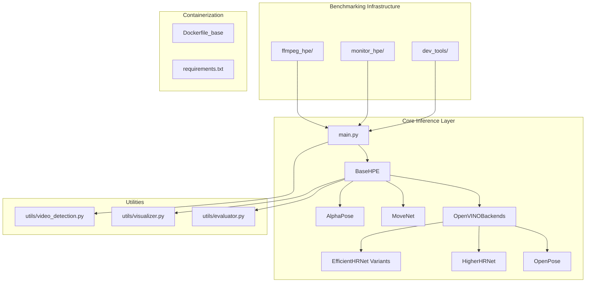
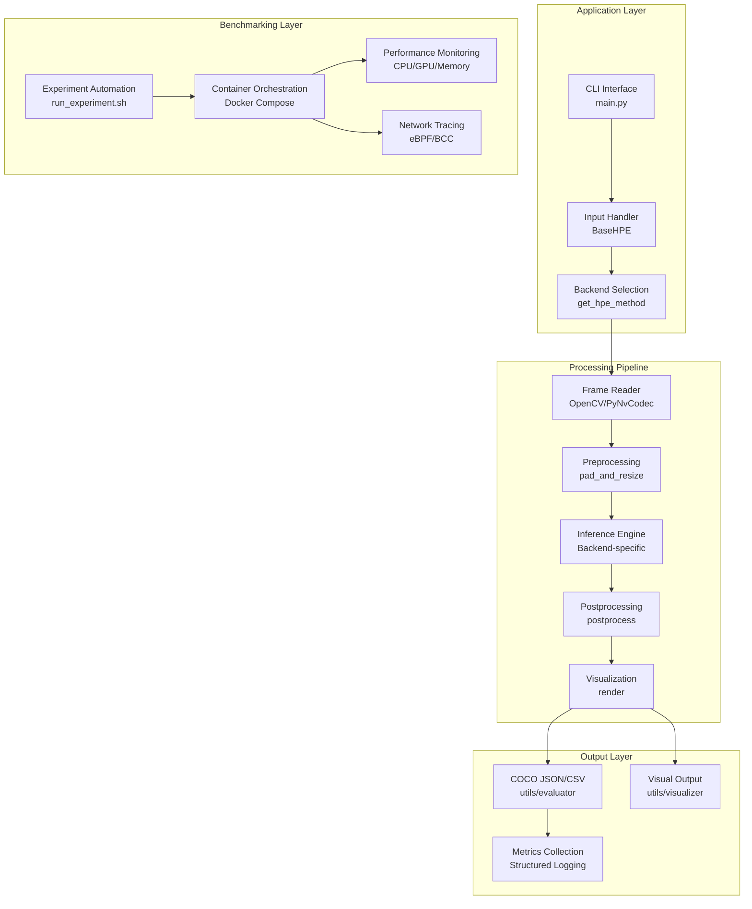
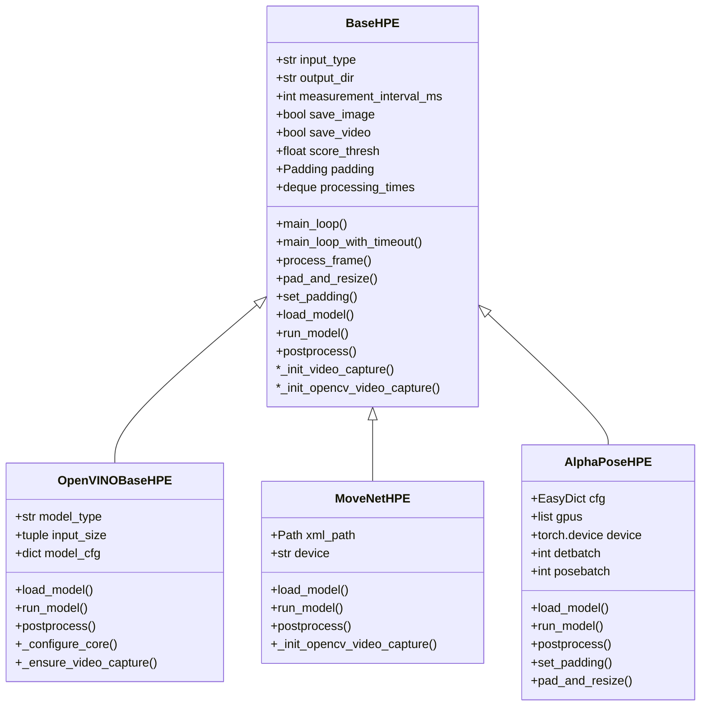
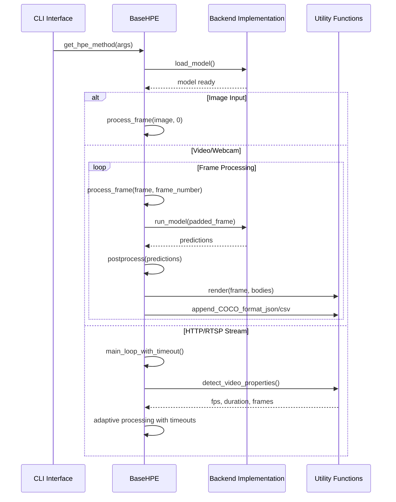
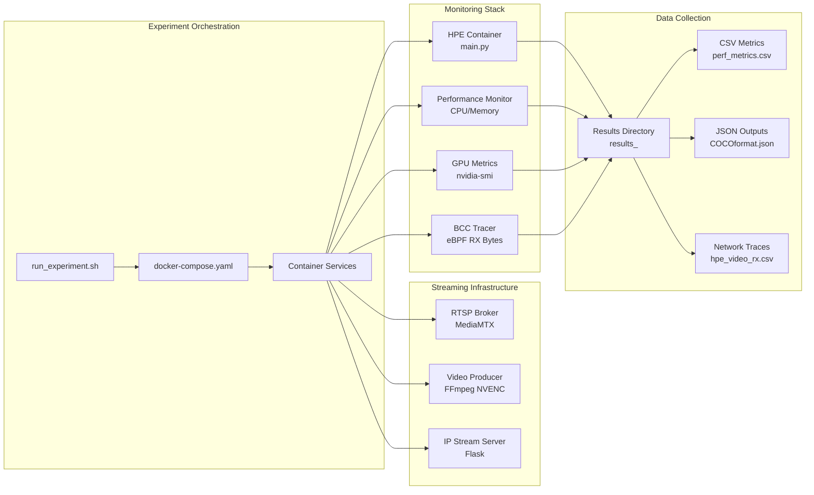
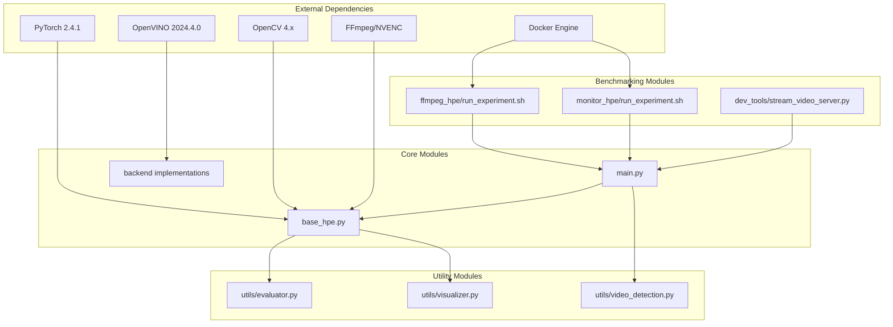

# Project Overview

<cite>
**Referenced Files in This Document**
- [README.md](file://README.md)
- [main.py](file://main.py)
- [base_hpe.py](file://base_hpe.py)
- [openvino_base_hpe.py](file://openvino_base_hpe.py)
- [movenet_hpe.py](file://movenet_hpe.py)
- [alphapose_hpe.py](file://alphapose_hpe.py)
- [utils/evaluator.py](file://utils/evaluator.py)
- [utils/visualizer.py](file://utils/visualizer.py)
- [utils/video_detection.py](file://utils/video_detection.py)
- [dev_tools/stream_video_server.py](file://dev_tools/stream_video_server.py)
- [ffmpeg_hpe/run_experiment.sh](file://ffmpeg_hpe/run_experiment.sh)
- [monitor_hpe/run_experiment.sh](file://monitor_hpe/run_experiment.sh)
- [Dockerfile_base](file://Dockerfile_base)
</cite>

## Table of Contents
1. [Introduction](#introduction)
2. [Project Structure](#project-structure)
3. [Core Components](#core-components)
4. [Architecture Overview](#architecture-overview)
5. [Detailed Component Analysis](#detailed-component-analysis)
6. [Dependency Analysis](#dependency-analysis)
7. [Performance Considerations](#performance-considerations)
8. [Troubleshooting Guide](#troubleshooting-guide)
9. [Conclusion](#conclusion)

## Introduction

This project is a comprehensive 2D Human Pose Estimation (HPE) benchmarking platform designed to unify inference across five major backends while providing robust performance measurement capabilities. The platform serves a dual role:

- **HPE Inference Library**: A unified Python interface supporting AlphaPose, MoveNet, OpenPose, HigherHRNet, and EfficientHRNet backends
- **Performance Benchmarking Platform**: A containerized experiment rig for measuring inference throughput, CPU/GPU utilization, memory consumption, and network bandwidth under realistic streaming conditions

The platform supports diverse input sources including images, videos, webcam feeds, and HTTP/RTSP streams, producing COCO-format keypoint outputs and comprehensive performance metrics.

## Project Structure

The codebase is organized around a modular architecture that separates concerns between inference backends, common processing logic, and benchmarking infrastructure:

**Diagram sources**
- [main.py:1-242](file://main.py#L1-L242)
- [base_hpe.py:1-675](file://base_hpe.py#L1-L675)
- [openvino_base_hpe.py:1-412](file://openvino_base_hpe.py#L1-L412)

**Section sources**
- [README.md:20-45](file://README.md#L20-L45)
- [main.py:190-242](file://main.py#L190-L242)

## Core Components

### Unified Backend Interface

The platform implements a sophisticated abstraction layer through the BaseHPE class, which provides shared functionality while allowing backend-specific implementations:

- **Input Type Detection**: Automatic recognition of images, videos, directories, webcam feeds, and HTTP/RTSP streams
- **Hardware Acceleration**: Seamless integration of PyNvCodec for GPU-accelerated video decoding when available
- **Cross-Platform Compatibility**: Fallback mechanisms for OpenCV-based video processing when hardware acceleration is unavailable

### Five Backend Implementations

Each backend maintains its own specialized implementation while adhering to the common BaseHPE interface:

- **AlphaPose**: PyTorch-based with integrated YOLO detector for person detection
- **MoveNet**: TensorFlow Lite-based multipose model optimized for CPU execution
- **OpenPose**: OpenVINO implementation with configurable performance modes
- **HigherHRNet**: High-resolution network variant with CPU-only optimization
- **EfficientHRNet**: Multiple variants optimized for different computational budgets

### Real-Time Streaming Capabilities

The platform excels at handling streaming scenarios through several key mechanisms:

- **Adaptive Stream Detection**: Automatic property detection for HTTP/RTSP streams including FPS conversion and frame counting
- **Latency Optimization**: FFmpeg backend selection for reduced buffering and improved responsiveness
- **Buffer Management**: Configurable buffer sizes to balance latency and reliability

**Section sources**
- [base_hpe.py:98-180](file://base_hpe.py#L98-L180)
- [main.py:51-189](file://main.py#L51-L189)
- [utils/video_detection.py:42-221](file://utils/video_detection.py#L42-L221)

## Architecture Overview

The platform employs a layered architecture that separates concerns between inference, processing, and benchmarking:

**Diagram sources**
- [main.py:207-227](file://main.py#L207-L227)
- [base_hpe.py:250-549](file://base_hpe.py#L250-L549)
- [ffmpeg_hpe/run_experiment.sh:1-481](file://ffmpeg_hpe/run_experiment.sh#L1-L481)

The architecture supports both standalone inference and containerized benchmarking scenarios, with automatic resource allocation and performance monitoring capabilities.

**Section sources**
- [README.md:45-82](file://README.md#L45-L82)
- [openvino_base_hpe.py:56-94](file://openvino_base_hpe.py#L56-L94)

## Detailed Component Analysis

### BaseHPE Class Architecture

The BaseHPE class serves as the foundation for all backend implementations, providing a comprehensive framework for video processing:

**Diagram sources**
- [base_hpe.py:98-675](file://base_hpe.py#L98-L675)
- [openvino_base_hpe.py:56-412](file://openvino_base_hpe.py#L56-L412)
- [movenet_hpe.py:12-111](file://movenet_hpe.py#L12-L111)
- [alphapose_hpe.py:33-341](file://alphapose_hpe.py#L33-L341)

### Inference Pipeline Flow

The core inference pipeline demonstrates sophisticated handling of different input types and processing stages:

**Diagram sources**
- [main.py:207-227](file://main.py#L207-L227)
- [base_hpe.py:250-549](file://base_hpe.py#L250-L549)
- [utils/video_detection.py:42-221](file://utils/video_detection.py#L42-L221)

### Benchmarking Platform Architecture

The benchmarking infrastructure provides comprehensive performance measurement capabilities:

**Diagram sources**
- [ffmpeg_hpe/run_experiment.sh:1-481](file://ffmpeg_hpe/run_experiment.sh#L1-L481)
- [monitor_hpe/run_experiment.sh:1-235](file://monitor_hpe/run_experiment.sh#L1-L235)
- [dev_tools/stream_video_server.py:1-228](file://dev_tools/stream_video_server.py#L1-L228)

**Section sources**
- [README.md:210-332](file://README.md#L210-L332)
- [ffmpeg_hpe/run_experiment.sh:1-481](file://ffmpeg_hpe/run_experiment.sh#L1-L481)

## Dependency Analysis

The platform exhibits a well-structured dependency hierarchy that promotes modularity and maintainability:

**Diagram sources**
- [Dockerfile_base:1-93](file://Dockerfile_base#L1-L93)
- [requirements.txt:1-200](file://requirements.txt#L1-L200)

The dependency analysis reveals strategic separation between inference logic and benchmarking infrastructure, enabling independent development and deployment of each component.

**Section sources**
- [README.md:7-17](file://README.md#L7-L17)
- [Dockerfile_base:1-93](file://Dockerfile_base#L1-L93)

## Performance Considerations

### Hardware Acceleration Strategy

The platform implements a tiered hardware acceleration approach:

- **PyNvCodec Integration**: Automatic GPU-accelerated video decoding when available, reducing CPU load during video processing
- **OpenVINO Optimization**: Configurable performance modes (latency vs throughput) with automatic thread and stream allocation
- **Backend-Specific Tuning**: GPU-capable backends (AlphaPose, OpenPose) leverage CUDA acceleration while CPU-only backends (MoveNet) optimize for single-threaded performance

### Memory Management

The platform employs sophisticated memory management techniques:

- **Dynamic Buffer Sizing**: Adaptive buffer allocation based on input resolution and backend requirements
- **GPU Memory Optimization**: Proper tensor allocation and deallocation to prevent memory leaks
- **Streaming Memory Limits**: Controlled memory usage for long-running stream processing

### Network Performance

For streaming scenarios, the platform implements several optimization strategies:

- **FFmpeg Backend Selection**: Uses FFmpeg backend for HTTP/RTSP streams to minimize latency
- **Buffer Size Control**: Configurable buffer sizes to balance latency and reliability
- **Adaptive Frame Skipping**: Intelligent frame processing to maintain real-time performance

**Section sources**
- [openvino_base_hpe.py:154-190](file://openvino_base_hpe.py#L154-L190)
- [base_hpe.py:202-248](file://base_hpe.py#L202-L248)
- [utils/video_detection.py:176-221](file://utils/video_detection.py#L176-L221)

## Troubleshooting Guide

### Common Issues and Solutions

The platform includes comprehensive error handling and diagnostic capabilities:

**Video Input Issues**
- **Symptom**: Video capture initialization failures
- **Solution**: Automatic fallback to OpenCV/FFmpeg backend when PyNvCodec is unavailable
- **Diagnostic**: Check hardware acceleration availability and backend compatibility

**Streaming Problems**
- **Symptom**: HTTP/RTSP stream timeouts or buffering issues
- **Solution**: Automatic property detection and adaptive processing with configurable timeouts
- **Diagnostic**: Use video property detection utilities to verify stream characteristics

**Memory Management**
- **Symptom**: Out-of-memory errors during processing
- **Solution**: Automatic memory cleanup and proper tensor deallocation
- **Diagnostic**: Monitor GPU memory usage and adjust batch sizes accordingly

**Container Deployment Issues**
- **Symptom**: Docker container startup failures
- **Solution**: Comprehensive container orchestration with health checks and automatic cleanup
- **Diagnostic**: Review container logs and resource allocation settings

### Performance Monitoring

The platform provides extensive performance monitoring capabilities:

- **Real-time Metrics**: CPU utilization, GPU utilization, memory consumption, and network bandwidth
- **Structured Logging**: Machine-readable logs for automated analysis and reporting
- **Automated Diagnostics**: Comprehensive system information collection for troubleshooting

**Section sources**
- [base_hpe.py:442-549](file://base_hpe.py#L442-L549)
- [ffmpeg_hpe/run_experiment.sh:43-67](file://ffmpeg_hpe/run_experiment.sh#L43-L67)
- [monitor_hpe/run_experiment.sh:166-168](file://monitor_hpe/run_experiment.sh#L166-L168)

## Conclusion

This 2D Human Pose Estimation benchmarking platform represents a comprehensive solution for both inference and performance measurement. Its dual nature as both an HPE library and benchmarking platform enables researchers and practitioners to:

- **Standardize Inference**: Unified Python interface across five major backends with consistent APIs
- **Optimize Performance**: Comprehensive benchmarking capabilities with detailed performance metrics
- **Support Real-world Scenarios**: Robust streaming support with adaptive processing and latency optimization
- **Facilitate Research**: Containerized deployment enabling reproducible experiments and performance comparisons

The platform's modular architecture, comprehensive error handling, and extensive monitoring capabilities make it suitable for academic research, industrial applications, and performance optimization studies. Its containerized deployment model ensures consistent environments across different systems while maintaining flexibility for customization and extension.