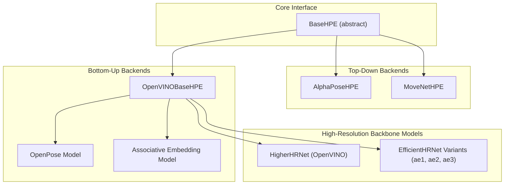
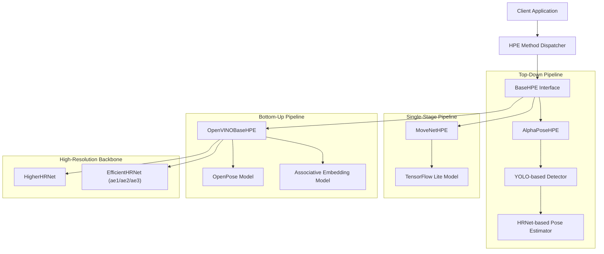
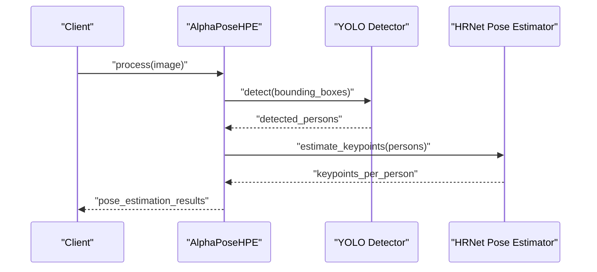
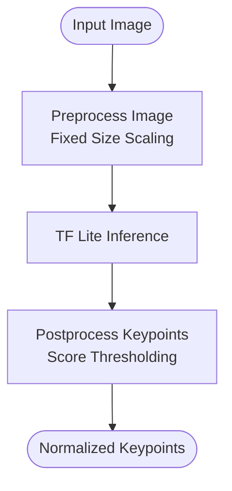
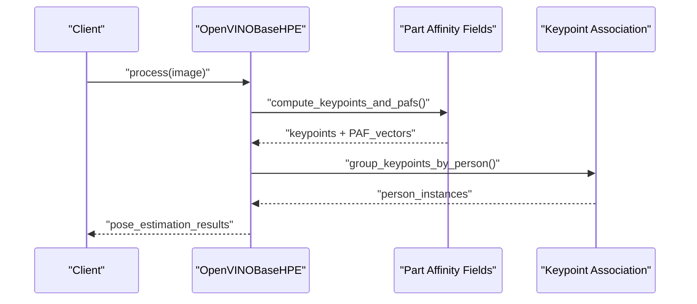
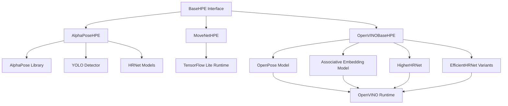

# Supported HPE Backends

<cite>
**Referenced Files in This Document**
- [base_hpe.py](file://base_hpe.py)
- [alphapose_hpe.py](file://alphapose_hpe.py)
- [movenet_hpe.py](file://movenet_hpe.py)
- [openvino_base_hpe.py](file://openvino_base_hpe.py)
- [models/AlphaPose/alphapose/__init__.py](file://models/AlphaPose/alphapose/__init__.py)
- [models/AlphaPose/alphapose/models/hrnet.py](file://models/AlphaPose/alphapose/models/hrnet.py)
- [models/AlphaPose/alphapose/models/fastpose.py](file://models/AlphaPose/alphapose/models/fastpose.py)
- [models/AlphaPose/alphapose/datasets/coco_wholebody.py](file://models/AlphaPose/alphapose/datasets/coco_wholebody.py)
- [models/AlphaPose/alphapose/utils/detector.py](file://models/AlphaPose/alphapose/utils/detector.py)
- [models/OpenVINO/model_api/models/open_pose.py](file://models/OpenVINO/model_api/models/open_pose.py)
- [models/OpenVINO/model_api/models/hpe_associative_embedding.py](file://models/OpenVINO/model_api/models/hpe_associative_embedding.py)
- [models/OpenVINO/pretrained_models/intel/human-pose-estimation-0001/human-pose-estimation-0001.xml](file://models/OpenVINO/pretrained_models/intel/human-pose-estimation-0001/human-pose-estimation-0001.xml)
- [models/OpenVINO/pretrained_models/public/higher-hrnet-w32-human-pose-estimation.xml](file://models/OpenVINO/pretrained_models/public/higher-hrnet-w32-human-pose-estimation.xml)
- [models/OpenVINO/pretrained_models/intel/efficient-hrnet/FP32/](file://models/OpenVINO/pretrained_models/intel/efficient-hrnet/FP32/)
- [docs/hpe-methods.md](file://docs/hpe-methods.md)
- [main.py](file://main.py)
</cite>

## Table of Contents
1. [Introduction](#introduction)
2. [Project Structure](#project-structure)
3. [Core Components](#core-components)
4. [Architecture Overview](#architecture-overview)
5. [Detailed Component Analysis](#detailed-component-analysis)
6. [Dependency Analysis](#dependency-analysis)
7. [Performance Considerations](#performance-considerations)
8. [Troubleshooting Guide](#troubleshooting-guide)
9. [Conclusion](#conclusion)

## Introduction
This document provides comprehensive technical documentation for the five supported Human Pose Estimation (HPE) backends in the platform: AlphaPose (top-down with YOLO detector), MoveNet (single-stage lightweight TensorFlow Lite), OpenPose (bottom-up Part Affinity Fields), HigherHRNet (high-resolution backbone), and EfficientHRNet variants (ae1, ae2, ae3). It explains the technical characteristics, performance profiles, hardware requirements, and use case suitability for each backend. The unified interface design enabling seamless switching between backends while maintaining consistent input/output formats is documented, along with comparative analysis of accuracy versus speed trade-offs and selection guidance for deployment scenarios.

## Project Structure
The HPE backends are implemented as specialized subclasses of a shared BaseHPE interface. Each backend encapsulates its own model loading, preprocessing, inference pipeline, and postprocessing logic. The repository organizes backend-specific implementations alongside their model assets and configuration files.

**Diagram sources**
- [base_hpe.py:97-150](file://base_hpe.py#L97-L150)
- [alphapose_hpe.py:32-120](file://alphapose_hpe.py#L32-L120)
- [movenet_hpe.py:11-80](file://movenet_hpe.py#L11-L80)
- [openvino_base_hpe.py:55-120](file://openvino_base_hpe.py#L55-L120)
- [models/OpenVINO/model_api/models/open_pose.py](file://models/OpenVINO/model_api/models/open_pose.py)
- [models/OpenVINO/model_api/models/hpe_associative_embedding.py](file://models/OpenVINO/model_api/models/hpe_associative_embedding.py)

**Section sources**
- [base_hpe.py:97-150](file://base_hpe.py#L97-L150)
- [alphapose_hpe.py:32-120](file://alphapose_hpe.py#L32-L120)
- [movenet_hpe.py:11-80](file://movenet_hpe.py#L11-L80)
- [openvino_base_hpe.py:55-120](file://openvino_base_hpe.py#L55-L120)

## Core Components
The unified BaseHPE interface defines the contract that all HPE implementations must satisfy. This ensures consistent input/output formats, standardized method signatures, and predictable behavior across backends. Subclasses implement model-specific initialization, preprocessing, inference, and postprocessing logic while adhering to the shared interface.

Key responsibilities of BaseHPE include:
- Standardized input validation and preprocessing
- Unified inference execution
- Consistent pose estimation output format
- Resource management and cleanup
- Error handling and logging

**Section sources**
- [base_hpe.py:97-150](file://base_hpe.py#L97-L150)

## Architecture Overview
The system architecture centers on the BaseHPE abstraction, with each backend implementing its own model adapter and pipeline. Top-down backends first detect humans and then estimate poses per detected person. Bottom-up backends estimate keypoints and associate them into person instances using Part Affinity Fields or Associative Embedding. High-resolution backbone models leverage multi-scale representation learning for improved accuracy.

**Diagram sources**
- [main.py:206-250](file://main.py#L206-L250)
- [base_hpe.py:97-150](file://base_hpe.py#L97-L150)
- [alphapose_hpe.py:32-120](file://alphapose_hpe.py#L32-L120)
- [movenet_hpe.py:11-80](file://movenet_hpe.py#L11-L80)
- [openvino_base_hpe.py:55-120](file://openvino_base_hpe.py#L55-L120)
- [models/OpenVINO/model_api/models/open_pose.py](file://models/OpenVINO/model_api/models/open_pose.py)
- [models/OpenVINO/model_api/models/hpe_associative_embedding.py](file://models/OpenVINO/model_api/models/hpe_associative_embedding.py)

## Detailed Component Analysis

### AlphaPose (Top-Down with YOLO Detector)
AlphaPose implements a top-down pose estimation pipeline that first detects bounding boxes using a YOLO-based detector and then estimates poses for each detected person using HRNet-based models. The implementation integrates with the AlphaPose library and supports multiple dataset configurations for training and evaluation.

Technical characteristics:
- Detection stage: YOLO-based detector with configurable anchor scales and confidence thresholds
- Pose estimation stage: HRNet-based architecture with multi-scale fusion and high-resolution representation
- Dataset support: COCO WholeBody, HALPE variants, MPII, and custom datasets
- Preprocessing: Center-based cropping, aspect ratio preservation, and normalized coordinate systems
- Postprocessing: NMS filtering, score thresholding, and keypoint normalization

Performance profile:
- Accuracy: High, especially for complex poses and occlusions
- Speed: Moderate to low due to two-stage processing
- Memory: Moderate to high, depending on input resolution and batch size
- Latency: Higher than single-stage approaches

Hardware requirements:
- CPU: Quad-core minimum recommended
- GPU: Dedicated GPU recommended for real-time inference
- RAM: 8GB+ for typical workloads
- Storage: Model weights and dataset assets

Use case suitability:
- Indoor environments with controlled lighting
- Research and development applications
- Applications requiring precise pose estimation despite occlusions
- Batch processing scenarios where latency is less critical

**Diagram sources**
- [alphapose_hpe.py:32-120](file://alphapose_hpe.py#L32-L120)
- [models/AlphaPose/alphapose/utils/detector.py](file://models/AlphaPose/alphapose/utils/detector.py)
- [models/AlphaPose/alphapose/models/hrnet.py](file://models/AlphaPose/alphapose/models/hrnet.py)

**Section sources**
- [alphapose_hpe.py:32-120](file://alphapose_hpe.py#L32-L120)
- [models/AlphaPose/alphapose/__init__.py](file://models/AlphaPose/alphapose/__init__.py)
- [models/AlphaPose/alphapose/models/hrnet.py](file://models/AlphaPose/alphapose/models/hrnet.py)
- [models/AlphaPose/alphapose/models/fastpose.py](file://models/AlphaPose/alphapose/models/fastpose.py)
- [models/AlphaPose/alphapose/datasets/coco_wholebody.py](file://models/AlphaPose/alphapose/datasets/coco_wholebody.py)
- [models/AlphaPose/alphapose/utils/detector.py](file://models/AlphaPose/alphapose/utils/detector.py)

### MoveNet (Single-Stage Lightweight TensorFlow Lite)
MoveNet provides a single-stage, lightweight pose estimation solution optimized for edge devices and mobile platforms. The implementation leverages TensorFlow Lite for efficient inference with minimal resource requirements.

Technical characteristics:
- Single-stage detection and pose estimation in one model
- TensorFlow Lite optimization for quantization and model compression
- Lightweight architecture designed for real-time performance
- Fixed input size and simplified preprocessing pipeline
- Edge-friendly memory footprint and computational requirements

Performance profile:
- Accuracy: Good baseline performance suitable for many applications
- Speed: Very high, optimized for real-time inference
- Memory: Low to moderate, suitable for constrained environments
- Latency: Minimal, ideal for interactive applications

Hardware requirements:
- CPU: Modern ARM Cortex-A series or equivalent x86
- GPU: Optional acceleration via GPU delegate
- RAM: 2GB+ recommended
- Storage: Minimal model footprint

Use case suitability:
- Mobile applications and embedded systems
- Real-time interactive scenarios
- Resource-constrained environments
- Applications prioritizing speed over absolute accuracy

**Diagram sources**
- [movenet_hpe.py:11-80](file://movenet_hpe.py#L11-L80)

**Section sources**
- [movenet_hpe.py:11-80](file://movenet_hpe.py#L11-L80)

### OpenPose (Bottom-Up Part Affinity Fields)
OpenPose implements a bottom-up pose estimation approach using Part Affinity Fields (PAFs) to associate keypoints into person instances. The implementation utilizes OpenVINO for optimized inference across Intel hardware platforms.

Technical characteristics:
- Bottom-up processing: Detects keypoints first, then associates them into persons
- Part Affinity Fields: Vector-based fields encoding spatial relationships between body parts
- Associative Scoring: Uses PAF scores to group keypoints into anatomically plausible poses
- Multi-person Support: Handles multiple people in a single frame
- Robustness: Less sensitive to occlusions compared to top-down approaches

Performance profile:
- Accuracy: High, particularly for multiple people and complex scenes
- Speed: Moderate, influenced by PAF computation and association scoring
- Memory: Moderate to high, depending on resolution and person count
- Latency: Acceptable for real-time applications

Hardware requirements:
- CPU: Modern Intel processor with AVX support
- GPU: Intel integrated graphics or discrete GPU recommended
- RAM: 8GB+ for typical deployments
- Storage: Model assets and calibration data

Use case suitability:
- Multi-person scenarios and crowded environments
- Real-time surveillance and monitoring applications
- Applications requiring robust pose estimation under challenging conditions
- Deployments on Intel hardware platforms

**Diagram sources**
- [openvino_base_hpe.py:55-120](file://openvino_base_hpe.py#L55-L120)
- [models/OpenVINO/model_api/models/open_pose.py](file://models/OpenVINO/model_api/models/open_pose.py)

**Section sources**
- [openvino_base_hpe.py:55-120](file://openvino_base_hpe.py#L55-L120)
- [models/OpenVINO/model_api/models/open_pose.py](file://models/OpenVINO/model_api/models/open_pose.py)

### HigherHRNet (High-Resolution Backbone)
HigherHRNet represents a high-resolution backbone approach that maintains high-resolution representations throughout the network, enabling precise spatial localization of keypoints. The implementation is optimized for OpenVINO deployment with FP32 precision models.

Technical characteristics:
- High-resolution backbone: Preserves spatial detail across network layers
- Multi-scale fusion: Combines features from multiple resolutions
- Precise localization: Enhanced ability to distinguish closely spaced keypoints
- Robust architecture: Designed for challenging pose estimation tasks
- OpenVINO optimization: Leverages hardware acceleration for inference

Performance profile:
- Accuracy: Very high, particularly for fine-grained pose details
- Speed: Moderate to low, constrained by high-resolution computations
- Memory: High, due to maintaining detailed spatial representations
- Latency: Higher than compact architectures

Hardware requirements:
- CPU: Modern multi-core processor
- GPU: Dedicated GPU recommended for acceleration
- RAM: 16GB+ for optimal performance
- Storage: Large model assets

Use case suitability:
- Applications requiring exceptional pose accuracy
- Research and clinical applications
- High-quality video analysis and editing
- Environments where computational resources are abundant

**Section sources**
- [openvino_base_hpe.py:55-120](file://openvino_base_hpe.py#L55-L120)
- [models/OpenVINO/pretrained_models/public/higher-hrnet-w32-human-pose-estimation.xml](file://models/OpenVINO/pretrained_models/public/higher-hrnet-w32-human-pose-estimation.xml)

### EfficientHRNet Variants (ae1, ae2, ae3)
EfficientHRNet variants represent optimized versions of the HRNet architecture with different architectural choices and trade-offs. The implementation supports three variants (ae1, ae2, ae3) with FP32 precision models in the Intel OpenVINO ecosystem.

Technical characteristics:
- Architectural variants: Different configurations optimized for specific use cases
- Associative embedding: Uses embedding vectors to associate keypoints into persons
- Efficiency focus: Reduced computational complexity while maintaining accuracy
- Scalable design: Allows tuning between speed and accuracy
- Hardware optimization: OpenVINO acceleration for Intel platforms

Performance profile varies by variant:
- ae1: Balanced performance and efficiency
- ae2: Emphasizes speed with moderate accuracy trade-offs
- ae3: Optimized for maximum efficiency with acceptable accuracy

Hardware requirements:
- CPU: Modern Intel processor
- GPU: Intel integrated graphics recommended
- RAM: 8GB+ for typical deployments
- Storage: Model assets for selected variant

Use case suitability:
- Production deployments requiring balanced performance
- Edge computing scenarios with resource constraints
- Applications needing multiple variant options for optimization
- Intel hardware platform deployments

**Section sources**
- [openvino_base_hpe.py:55-120](file://openvino_base_hpe.py#L55-L120)
- [models/OpenVINO/pretrained_models/intel/efficient-hrnet/FP32/](file://models/OpenVINO/pretrained_models/intel/efficient-hrnet/FP32/)
- [models/OpenVINO/model_api/models/hpe_associative_embedding.py](file://models/OpenVINO/model_api/models/hpe_associative_embedding.py)

## Dependency Analysis
The HPE backends exhibit a layered dependency structure with shared interfaces and backend-specific implementations. The BaseHPE interface provides the foundation, while each backend adds its own model adapters and processing logic.

**Diagram sources**
- [base_hpe.py:97-150](file://base_hpe.py#L97-L150)
- [alphapose_hpe.py:32-120](file://alphapose_hpe.py#L32-L120)
- [movenet_hpe.py:11-80](file://movenet_hpe.py#L11-L80)
- [openvino_base_hpe.py:55-120](file://openvino_base_hpe.py#L55-L120)

**Section sources**
- [base_hpe.py:97-150](file://base_hpe.py#L97-L150)
- [alphapose_hpe.py:32-120](file://alphapose_hpe.py#L32-L120)
- [movenet_hpe.py:11-80](file://movenet_hpe.py#L11-L80)
- [openvino_base_hpe.py:55-120](file://openvino_base_hpe.py#L55-L120)

## Performance Considerations
Performance across the five backends varies significantly based on architectural design and optimization strategies:

Accuracy vs. Speed Trade-offs:
- AlphaPose: Highest accuracy with moderate speed; suitable for research and quality-critical applications
- MoveNet: Excellent speed with good baseline accuracy; ideal for real-time and edge deployments
- OpenPose: High accuracy with moderate speed; robust for multi-person scenarios
- HigherHRNet: Exceptional accuracy with lower speed; optimal for quality-focused applications
- EfficientHRNet: Tunable balance between accuracy and speed; flexible for various deployment needs

Selection Guidance:
- Choose AlphaPose for applications requiring maximum pose fidelity despite latency constraints
- Select MoveNet for mobile, embedded, or real-time interactive scenarios
- Use OpenPose for multi-person detection and robust performance in challenging conditions
- Deploy HigherHRNet for research, clinical, or high-quality video analysis applications
- Opt for EfficientHRNet variants when balancing accuracy and computational efficiency is critical

[No sources needed since this section provides general guidance]

## Troubleshooting Guide
Common issues and solutions across HPE backends:

Video Input Issues:
- Symptom: "Video capture not initialized" errors
- Solution: Verify camera permissions, device availability, and codec support
- Prevention: Implement proper initialization checks and fallback mechanisms

Model Loading Problems:
- Symptom: Failed to load model weights or configuration files
- Solution: Check file paths, model compatibility, and storage permissions
- Prevention: Validate model assets during deployment and implement graceful degradation

Memory Management:
- Symptom: Out-of-memory errors during inference
- Solution: Reduce batch size, adjust input resolution, or enable memory optimization
- Prevention: Monitor memory usage and implement adaptive resource allocation

Performance Degradation:
- Symptom: Inference latency exceeding requirements
- Solution: Enable hardware acceleration, optimize model quantization, or reduce model complexity
- Prevention: Profile performance regularly and tune parameters based on workload characteristics

**Section sources**
- [base_hpe.py:300-350](file://base_hpe.py#L300-L350)
- [openvino_base_hpe.py:380-420](file://openvino_base_hpe.py#L380-L420)

## Conclusion
The platform provides five distinct Human Pose Estimation backends, each optimized for different performance and accuracy requirements. The unified BaseHPE interface enables seamless switching between backends while maintaining consistent input/output formats. AlphaPose offers the highest accuracy for research applications, MoveNet excels in real-time and edge scenarios, OpenPose provides robust multi-person detection, HigherHRNet achieves exceptional accuracy for quality-critical applications, and EfficientHRNet variants offer flexible trade-offs between speed and accuracy. The choice of backend should align with specific deployment requirements, hardware constraints, and performance targets.