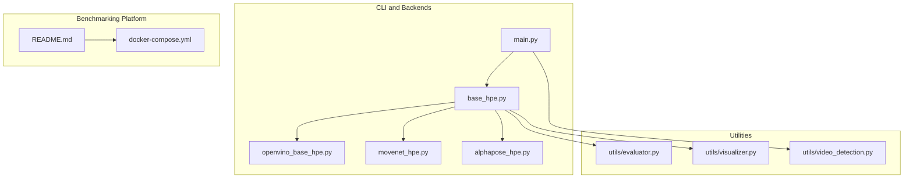
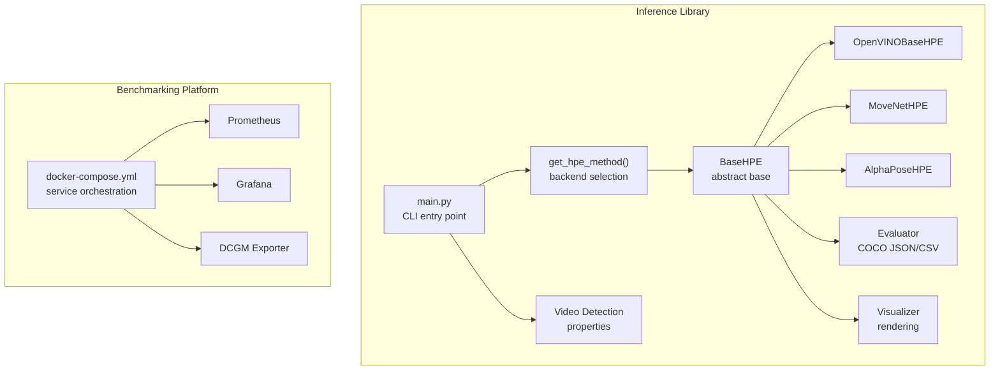
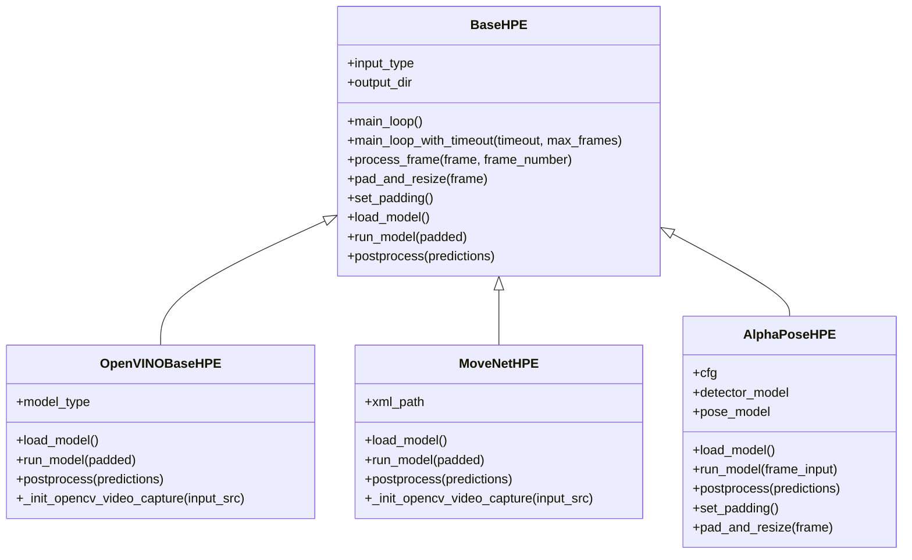
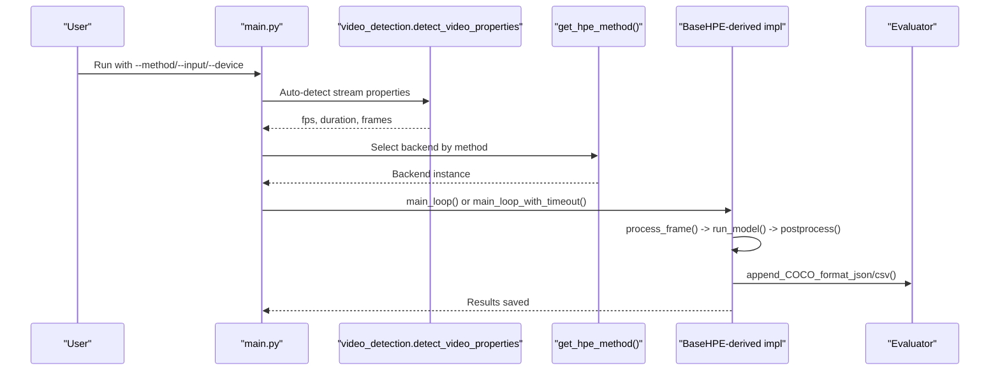
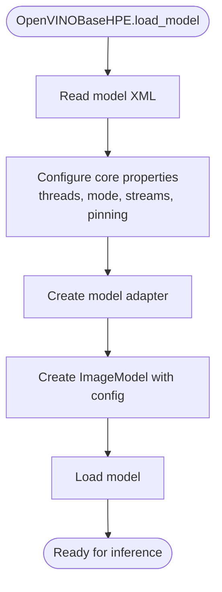
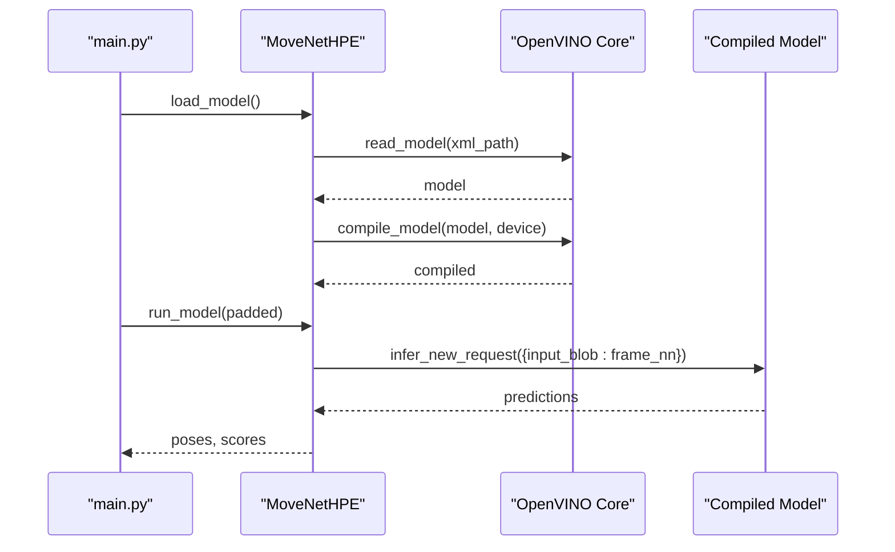
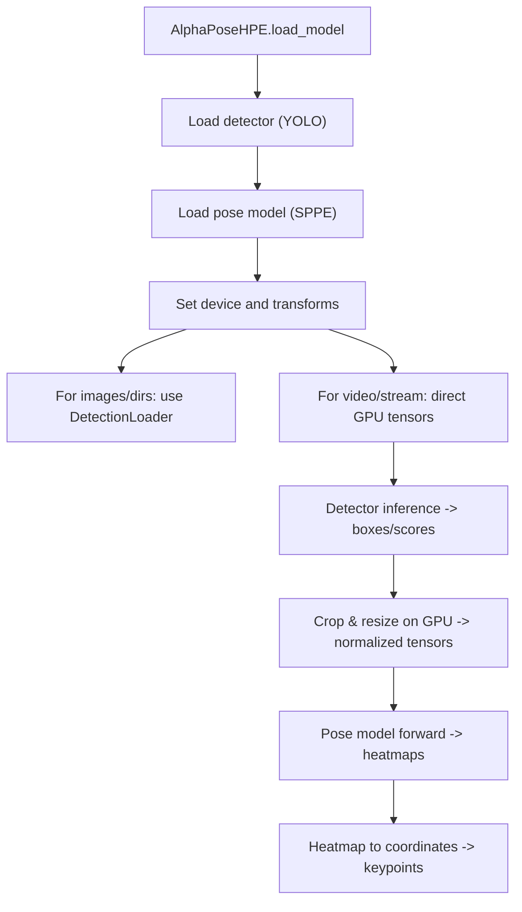
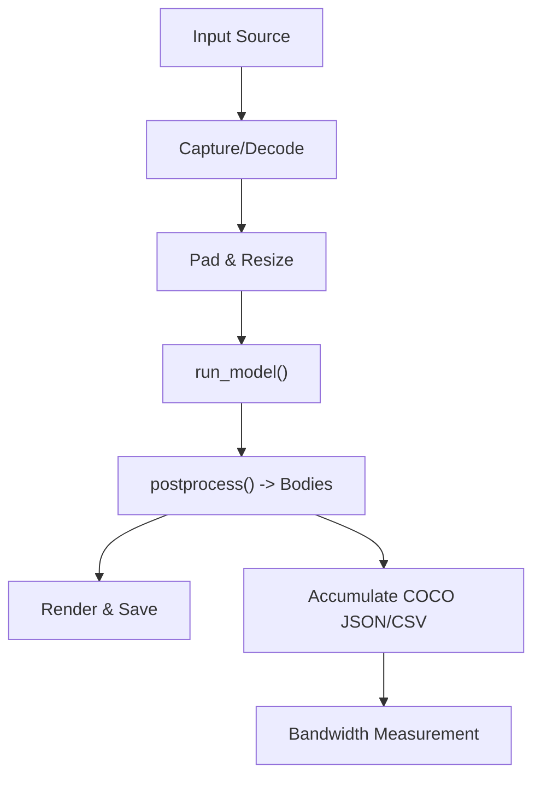
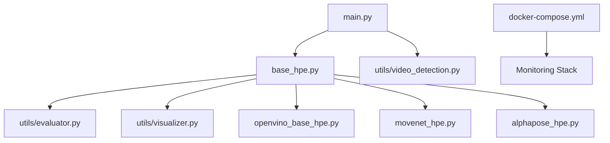

# System Architecture Overview

<cite>
**Referenced Files in This Document**
- [main.py](file://main.py)
- [base_hpe.py](file://base_hpe.py)
- [openvino_base_hpe.py](file://openvino_base_hpe.py)
- [movenet_hpe.py](file://movenet_hpe.py)
- [alphapose_hpe.py](file://alphapose_hpe.py)
- [utils/evaluator.py](file://utils/evaluator.py)
- [utils/visualizer.py](file://utils/visualizer.py)
- [utils/video_detection.py](file://utils/video_detection.py)
- [docker-compose.yml](file://docker-compose.yml)
- [README.md](file://README.md)
</cite>

## Table of Contents
1. [Introduction](#introduction)
2. [Project Structure](#project-structure)
3. [Core Components](#core-components)
4. [Architecture Overview](#architecture-overview)
5. [Detailed Component Analysis](#detailed-component-analysis)
6. [Dependency Analysis](#dependency-analysis)
7. [Performance Considerations](#performance-considerations)
8. [Troubleshooting Guide](#troubleshooting-guide)
9. [Conclusion](#conclusion)

## Introduction
This document describes the system architecture of a 2D Human Pose Estimation (HPE) platform designed for both inference library functionality and performance benchmarking. The platform centers around a modular, backend-agnostic design with BaseHPE as the abstract foundation. It supports multiple HPE backends (OpenVINO-based models, AlphaPose, and MoveNet), diverse input sources (images, videos, directories, webcams, and IP streams), and integrates with a containerized benchmarking platform for measuring throughput, CPU/GPU utilization, memory, and network bandwidth under realistic streaming conditions.

## Project Structure
The repository is organized into:
- CLI entry point and backend selection logic
- Backend implementations (OpenVINO, AlphaPose, MoveNet)
- Utility modules for evaluation, visualization, and video property detection
- Container orchestration for benchmarking and monitoring
- Documentation and experiment rigs



**Diagram sources**
- [main.py:1-242](file://main.py#L1-L242)
- [base_hpe.py:1-675](file://base_hpe.py#L1-L675)
- [openvino_base_hpe.py:1-412](file://openvino_base_hpe.py#L1-L412)
- [movenet_hpe.py:1-111](file://movenet_hpe.py#L1-L111)
- [alphapose_hpe.py:1-341](file://alphapose_hpe.py#L1-L341)
- [utils/evaluator.py:1-114](file://utils/evaluator.py#L1-L114)
- [utils/visualizer.py:1-53](file://utils/visualizer.py#L1-L53)
- [utils/video_detection.py:1-221](file://utils/video_detection.py#L1-L221)
- [docker-compose.yml:1-30](file://docker-compose.yml#L1-L30)
- [README.md:1-403](file://README.md#L1-L403)

**Section sources**
- [README.md:20-44](file://README.md#L20-L44)
- [main.py:190-237](file://main.py#L190-L237)
- [base_hpe.py:98-196](file://base_hpe.py#L98-L196)

## Core Components
- BaseHPE: Abstract base class defining input routing, video/webcam/stream handling, padding/resizing, main processing loop, and output accumulation. Backends implement load_model(), run_model(), and postprocess().
- OpenVINO-based backends: OpenVINOBaseHPE supporting OpenPose, HigherHRNet, and EfficientHRNet variants with configurable CPU/GPU performance settings.
- MoveNet backend: GPU-unfriendly OpenVINO runtime implementation optimized for multipose on CPU.
- AlphaPose backend: PyTorch-based implementation with integrated YOLO detector and custom preprocessing.
- Utilities: Evaluator for COCO-format serialization and bandwidth measurement; visualizer for rendering skeletons; video detection for stream property inference.
- Benchmarking platform: Docker-based orchestration with Prometheus/Grafana, DCGM exporter, and optional eBPF tracing.

**Section sources**
- [base_hpe.py:98-675](file://base_hpe.py#L98-L675)
- [openvino_base_hpe.py:56-412](file://openvino_base_hpe.py#L56-L412)
- [movenet_hpe.py:12-111](file://movenet_hpe.py#L12-L111)
- [alphapose_hpe.py:33-341](file://alphapose_hpe.py#L33-L341)
- [utils/evaluator.py:11-114](file://utils/evaluator.py#L11-L114)
- [utils/visualizer.py:4-53](file://utils/visualizer.py#L4-L53)
- [utils/video_detection.py:42-221](file://utils/video_detection.py#L42-L221)

## Architecture Overview
The system separates the HPE inference library from the performance benchmarking platform:
- Inference library: Single-process CLI (main.py) selects a backend, initializes BaseHPE, loads the model, and processes frames in a loop with optional timeout and frame limits. Outputs are accumulated to COCO-format JSON/CSV and optionally rendered to images/videos.
- Benchmarking platform: Docker Compose orchestrates multiple services (streaming broker, streamer, HPE container, monitoring sidecars) to simulate realistic streaming conditions and collect performance metrics.



**Diagram sources**
- [main.py:51-237](file://main.py#L51-L237)
- [base_hpe.py:98-675](file://base_hpe.py#L98-L675)
- [openvino_base_hpe.py:56-412](file://openvino_base_hpe.py#L56-L412)
- [movenet_hpe.py:12-111](file://movenet_hpe.py#L12-L111)
- [alphapose_hpe.py:33-341](file://alphapose_hpe.py#L33-L341)
- [utils/evaluator.py:11-114](file://utils/evaluator.py#L11-L114)
- [utils/visualizer.py:4-53](file://utils/visualizer.py#L4-L53)
- [utils/video_detection.py:42-221](file://utils/video_detection.py#L42-L221)
- [docker-compose.yml:1-30](file://docker-compose.yml#L1-L30)

## Detailed Component Analysis

### BaseHPE: Abstract Foundation
BaseHPE encapsulates shared logic for input detection, video/webcam/stream initialization, padding/resizing, main loops, and output handling. It defines three extension points that backends must implement:
- load_model(): backend-specific model loading
- run_model(padded): inference on preprocessed frame
- postprocess(predictions): transform raw outputs to Body objects

It also manages:
- Input type detection (image, video, directory, webcam, stream)
- Video capture via OpenCV or PyNvCodec fallback
- Frame processing pipeline with timing and FPS calculation
- COCO-format serialization and bandwidth measurement
- Optional rendering and saving of annotated frames



**Diagram sources**
- [base_hpe.py:98-675](file://base_hpe.py#L98-L675)
- [openvino_base_hpe.py:56-412](file://openvino_base_hpe.py#L56-L412)
- [movenet_hpe.py:12-111](file://movenet_hpe.py#L12-L111)
- [alphapose_hpe.py:33-341](file://alphapose_hpe.py#L33-L341)

**Section sources**
- [base_hpe.py:198-675](file://base_hpe.py#L198-L675)

### CLI Entry Point and Backend Selection
The CLI entry point parses arguments, auto-detects video properties for streams, selects a backend via get_hpe_method(), and dispatches to the appropriate main loop. It supports:
- Method selection among OpenVINO-based models, AlphaPose, and MoveNet
- Device selection (CPU/GPU)
- Output options (JSON, CSV, images, videos)
- Timeout and frame limits for streaming scenarios



**Diagram sources**
- [main.py:51-188](file://main.py#L51-L188)
- [utils/video_detection.py:42-221](file://utils/video_detection.py#L42-L221)
- [base_hpe.py:250-549](file://base_hpe.py#L250-L549)
- [utils/evaluator.py:35-114](file://utils/evaluator.py#L35-L114)

**Section sources**
- [main.py:190-237](file://main.py#L190-L237)
- [main.py:207-227](file://main.py#L207-L227)

### OpenVINO-Based Backends
OpenVINOBaseHPE provides a unified implementation for OpenPose, HigherHRNet, and EfficientHRNet variants. It:
- Loads models from XML/weights using OpenVINO runtime
- Configures CPU performance hints, threads, streams, and CPU pinning/hyperthreading
- Handles video/webcam/stream inputs with OpenCV fallback
- Preprocesses frames to model input sizes and postprocesses detections to Body objects



**Diagram sources**
- [openvino_base_hpe.py:191-262](file://openvino_base_hpe.py#L191-L262)

**Section sources**
- [openvino_base_hpe.py:56-412](file://openvino_base_hpe.py#L56-L412)

### MoveNet Backend
MoveNetHPE uses OpenVINO runtime to load a multipose model and performs inference on RGB tensors. It:
- Initializes OpenCV capture for streams and sets buffer size for low-latency
- Loads the model and infers new requests
- Postprocesses outputs to Body objects with bounding boxes and keypoints



**Diagram sources**
- [movenet_hpe.py:58-86](file://movenet_hpe.py#L58-L86)
- [movenet_hpe.py:83-86](file://movenet_hpe.py#L83-L86)

**Section sources**
- [movenet_hpe.py:12-111](file://movenet_hpe.py#L12-L111)

### AlphaPose Backend
AlphaPoseHPE integrates a YOLO detector and a pose model built with PyTorch. It:
- Supports both image/directory inputs (via DetectionLoader) and video/webcam/stream inputs
- Performs GPU-accelerated detection and pose estimation with batching
- Overrides padding/resizing to maintain original resolution



**Diagram sources**
- [alphapose_hpe.py:69-125](file://alphapose_hpe.py#L69-L125)
- [alphapose_hpe.py:126-294](file://alphapose_hpe.py#L126-L294)

**Section sources**
- [alphapose_hpe.py:33-341](file://alphapose_hpe.py#L33-L341)

### Data Flow and Output Generation
The processing pipeline is consistent across backends:
- Input detection and capture
- Preprocessing (padding/resizing) to model input size
- Inference via backend-specific run_model()
- Postprocessing to Body objects
- Rendering and saving outputs (images/videos)
- Accumulating COCO-format JSON/CSV and bandwidth measurements



**Diagram sources**
- [base_hpe.py:550-653](file://base_hpe.py#L550-L653)
- [utils/evaluator.py:11-114](file://utils/evaluator.py#L11-L114)
- [utils/visualizer.py:4-53](file://utils/visualizer.py#L4-L53)

**Section sources**
- [base_hpe.py:250-653](file://base_hpe.py#L250-L653)
- [utils/evaluator.py:35-114](file://utils/evaluator.py#L35-L114)
- [utils/visualizer.py:4-53](file://utils/visualizer.py#L4-L53)

### Benchmarking Platform and Containerized Deployment
The benchmarking platform is containerized and orchestrated via Docker Compose. It includes:
- Prometheus and Grafana for metrics visualization
- DCGM exporter for GPU telemetry
- Optional eBPF tracing for RX network traffic
- Experiment scripts to run full streaming benchmarks with RTSP broker and streamer

```mermaid
graph TB
subgraph "Experiment Services"
BROKER["MediaMTX RTSP Broker"]
STREAMER["FFmpeg Streamer"]
HPE["HPE Container<br/>runs main.py"]
PERF["Perf Monitor"]
GPU["GPU Metrics"]
BPF["BCC Tracer (optional)"]
end
BROKER <- --> STREAMER
STREAMER --> HPE
HPE --> PERF
HPE --> GPU
HPE --> BPF
```

**Diagram sources**
- [docker-compose.yml:1-30](file://docker-compose.yml#L1-L30)
- [README.md:214-236](file://README.md#L214-L236)

**Section sources**
- [docker-compose.yml:1-30](file://docker-compose.yml#L1-L30)
- [README.md:210-296](file://README.md#L210-L296)

## Dependency Analysis
- main.py depends on backend implementations and utility modules for video detection and logging.
- BaseHPE depends on OpenCV, PyTorch, and visualization/evaluation utilities.
- OpenVINO-based backends depend on OpenVINO runtime and model adapters.
- AlphaPose backend depends on PyTorch, YOLO detector, and custom model builders.
- Benchmarking platform depends on Docker Compose and external monitoring services.



**Diagram sources**
- [main.py:10-14](file://main.py#L10-L14)
- [base_hpe.py:22-24](file://base_hpe.py#L22-L24)
- [openvino_base_hpe.py:16-18](file://openvino_base_hpe.py#L16-L18)
- [alphapose_hpe.py:12-22](file://alphapose_hpe.py#L12-L22)
- [docker-compose.yml:1-30](file://docker-compose.yml#L1-L30)

**Section sources**
- [main.py:10-14](file://main.py#L10-L14)
- [base_hpe.py:22-24](file://base_hpe.py#L22-L24)
- [openvino_base_hpe.py:16-18](file://openvino_base_hpe.py#L16-L18)
- [alphapose_hpe.py:12-22](file://alphapose_hpe.py#L12-L22)

## Performance Considerations
- CPU/GPU tuning: OpenVINO backends expose performance hints, thread counts, streams, CPU pinning, and hyperthreading via environment variables and constructor parameters.
- Streaming latency: OpenCV CAP_FFMPEG backend with reduced buffer size is used for HTTP/RTSP streams to minimize latency.
- Frame skipping for MJPEG: BaseHPE’s HTTP/MJPEG fallback extracts the latest frame from a buffered stream and skips intermediate frames to keep up with the stream rate.
- Bandwidth measurement: COCO CSV includes timestamps enabling per-interval JSON payload size aggregation for TX bandwidth analysis.

[No sources needed since this section provides general guidance]

## Troubleshooting Guide
Common issues and resolutions:
- Video property detection failures for HTTP streams: The CLI falls back to user-provided timeout and max_frames and logs structured events for diagnostics.
- Stream initialization errors: OpenVINOBaseHPE ensures video capture for streaming URLs and logs defaults when initialization fails.
- PyNvCodec availability: BaseHPE gracefully falls back to OpenCV/FFmpeg when hardware acceleration is unavailable.
- eBPF RX measurement accuracy: Use the dedicated BCC tracer container sharing the HPE network namespace; avoid relying on bpftrace RX measurements due to PID filtering limitations.

**Section sources**
- [main.py:76-149](file://main.py#L76-L149)
- [openvino_base_hpe.py:134-152](file://openvino_base_hpe.py#L134-L152)
- [base_hpe.py:210-222](file://base_hpe.py#L210-L222)
- [README.md:333-362](file://README.md#L333-L362)

## Conclusion
The platform provides a clean separation between the HPE inference library and the performance benchmarking platform. BaseHPE offers a robust abstraction for diverse backends and input sources, while the benchmarking platform enables realistic, containerized experiments with comprehensive monitoring. The modular design allows adding new backends by implementing the three required methods, and the containerized deployment supports scalable experimentation across CPU and GPU configurations.