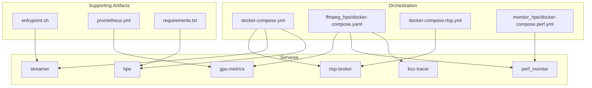
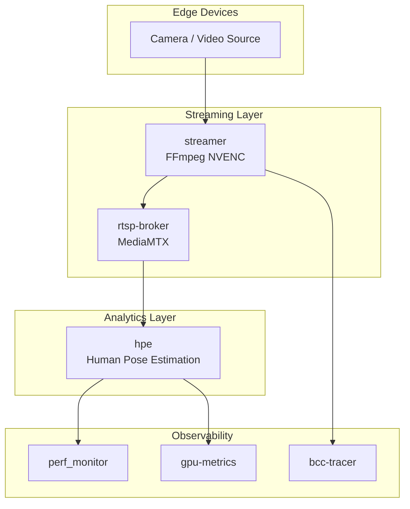
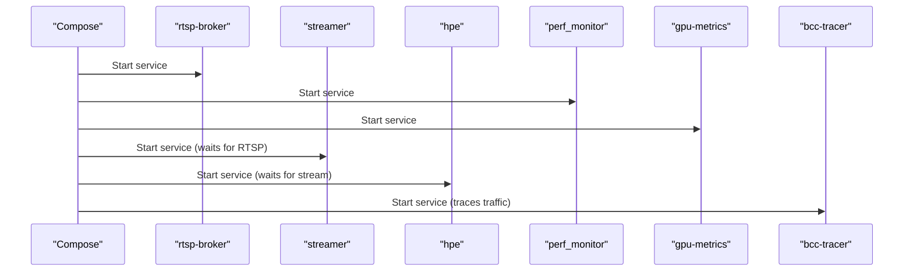
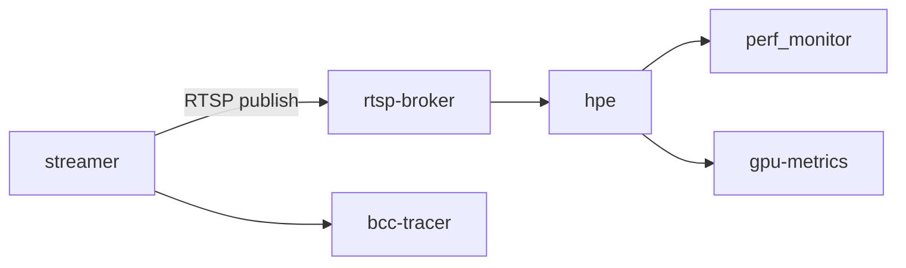
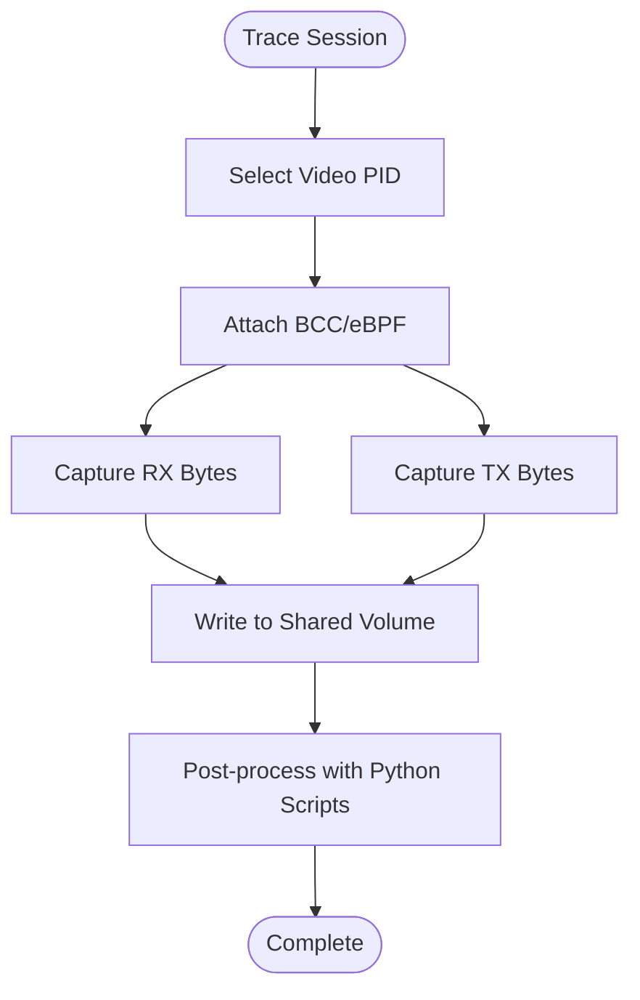
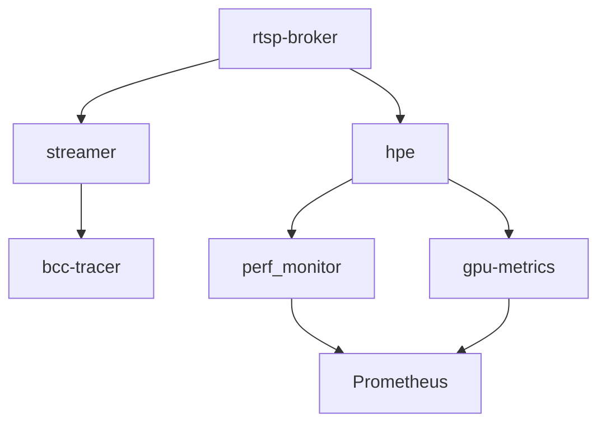

# Container Orchestration and Dependencies

<cite>
**Referenced Files in This Document**
- [docker-compose.yaml](file://ffmpeg_hpe/docker-compose.yaml)
- [Dockerfile.cuda_ffmpeg_hpe](file://Dockerfile.cuda_ffmpeg_hpe)
- [Dockerfile.gpu_metrics](file://Measure_gpu_dcgm/Dockerfile.gpu_metrics)
- [Dockerfile.perf](file://Measure_plot_cpu_perf/Dockerfile)
- [docker-compose.perf.yml](file://monitor_hpe/docker-compose.perf.yml)
- [docker-compose.rtsp.yml](file://docker-compose.rtsp.yml)
- [docker-compose.yml](file://docker-compose.yml)
- [entrypoint.sh](file://ffmpeg_hpe/entrypoint.sh)
- [run_experiment.sh](file://ffmpeg_hpe/run_experiment.sh)
- [run_experiment_bcc.sh](file://ffmpeg_hpe/run_experiment_bcc.sh)
- [bcc_rx_bytes.py](file://ffmpeg_hpe/bpftrace-tracer/bcc_rx_bytes.py)
- [bcc_tx_bytes.py](file://ffmpeg_hpe/bpftrace-tracer/bcc_tx_bytes.py)
- [trace_video_traffic.sh](file://ffmpeg_hpe/bpftrace-tracer/trace_video_traffic.sh)
- [trace_video_traffic_tcpdump.sh](file://ffmpeg_hpe/bpftrace-tracer/trace_video_traffic_tcpdump.sh)
- [windsurf_tracer.sh](file://ffmpeg_hpe/bpftrace-tracer/windsurf_tracer.sh)
- [monitor_pid.sh](file://monitor_hpe/monitor_pid.sh)
- [monitor_pid_perf.sh](file://recent-dash/perf_monitor/monitor_pid_perf.sh)
- [prometheus.yml](file://prometheus.yml)
- [requirements.txt](file://requirements.txt)
- [DYNAMIC_RESOURCE_ALLOCATION.md](file://ffmpeg_hpe/DYNAMIC_RESOURCE_ALLOCATION.md)
- [OPENVINO_CONFIG_USEFULNESS_ANALYSIS.md](file://OPENVINO_CONFIG_USEFULNESS_ANALYSIS.md)
- [REMAINING_ISSUES_ANALYSIS.md](file://REMAINING_ISSUES_ANALYSIS.md)
</cite>

## Table of Contents
1. [Introduction](#introduction)
2. [Project Structure](#project-structure)
3. [Core Components](#core-components)
4. [Architecture Overview](#architecture-overview)
5. [Detailed Component Analysis](#detailed-component-analysis)
6. [Dependency Analysis](#dependency-analysis)
7. [Performance Considerations](#performance-considerations)
8. [Troubleshooting Guide](#troubleshooting-guide)
9. [Conclusion](#conclusion)

## Introduction
This document explains the container orchestration system that powers the streaming pipeline. It covers service dependencies, startup ordering, inter-service communication, health checks, restart policies, readiness validation, environment variables, volumes, networking, resource limits, GPU allocation, CPU/memory reservations, and troubleshooting guidance. The primary services include:
- rtsp-broker (MediaMTX)
- streamer (FFmpeg NVENC)
- hpe (Human Pose Estimation)
- gpu-metrics
- perf_monitor
- bcc-tracer

## Project Structure
The orchestration spans multiple compose files and supporting artifacts:
- Primary orchestration: docker-compose.yml and ffmpeg_hpe/docker-compose.yaml
- RTSP-specific orchestration: docker-compose.rtsp.yml
- Performance monitoring orchestration: monitor_hpe/docker-compose.perf.yml
- Supporting Dockerfiles for specialized containers
- Tracing utilities for network and GPU metrics
- Prometheus configuration for observability

**Diagram sources**
- [docker-compose.yml](file://docker-compose.yml)
- [ffmpeg_hpe/docker-compose.yaml](file://ffmpeg_hpe/docker-compose.yaml)
- [docker-compose.rtsp.yml](file://docker-compose.rtsp.yml)
- [monitor_hpe/docker-compose.perf.yml](file://monitor_hpe/docker-compose.perf.yml)
- [entrypoint.sh](file://ffmpeg_hpe/entrypoint.sh)
- [prometheus.yml](file://prometheus.yml)
- [requirements.txt](file://requirements.txt)

**Section sources**
- [docker-compose.yml](file://docker-compose.yml)
- [ffmpeg_hpe/docker-compose.yaml](file://ffmpeg_hpe/docker-compose.yaml)
- [docker-compose.rtsp.yml](file://docker-compose.rtsp.yml)
- [monitor_hpe/docker-compose.perf.yml](file://monitor_hpe/docker-compose.perf.yml)

## Core Components
This section documents each service’s role, dependencies, and configuration touchpoints.

- rtsp-broker (MediaMTX)
  - Purpose: Provides RTSP ingestion and distribution for the streaming pipeline.
  - Startup order: Typically started first to serve media streams.
  - Inter-service communication: Streamer publishes to rtsp-broker; hpe consumes from rtsp-broker.
  - Health checks: Implemented via MediaMTX health endpoints.
  - Restart policy: Automatic restart on failure.
  - Readiness validation: Depends on successful RTSP port binding and stream availability.

- streamer (FFmpeg NVENC)
  - Purpose: Encodes and publishes video streams to rtsp-broker using NVENC.
  - Startup order: Starts after rtsp-broker is ready.
  - Inter-service communication: Publishes to rtsp-broker; optionally traces traffic via bcc-tracer.
  - Environment variables: Encoding parameters, RTSP destination, and stream identifiers.
  - Volumes: Mounts input video sources or device feeds.
  - Resource limits: GPU memory and compute allocation for NVENC.
  - Restart policy: Automatic restart on failure.
  - Readiness validation: Confirms encoder process and RTSP publishing.

- hpe (Human Pose Estimation)
  - Purpose: Performs pose estimation on incoming streams.
  - Startup order: Starts after rtsp-broker and streamer are ready.
  - Inter-service communication: Consumes from rtsp-broker; outputs metrics/logs.
  - Environment variables: Model selection, inference parameters, and output destinations.
  - Volumes: Mounts model artifacts and output directories.
  - Resource limits: GPU/CPU memory and concurrency controls.
  - Restart policy: Automatic restart on failure.
  - Readiness validation: Confirms model loading and initial inference pass.

- gpu-metrics
  - Purpose: Gathers GPU utilization and power metrics.
  - Startup order: Starts alongside hpe or as part of performance monitoring stack.
  - Inter-service communication: Exposes metrics for Prometheus scraping.
  - Environment variables: Metrics collection intervals and device selection.
  - Volumes: Mounts host GPU drivers and telemetry interfaces.
  - Resource limits: Minimal CPU/memory footprint; GPU visibility only.
  - Restart policy: Automatic restart on failure.
  - Readiness validation: Confirms metrics endpoint availability.

- perf_monitor
  - Purpose: Monitors CPU and system performance metrics.
  - Startup order: Starts early in the stack for baseline measurements.
  - Inter-service communication: Exposes metrics for Prometheus scraping.
  - Environment variables: Sampling frequency and metric categories.
  - Volumes: Mounts host procfs and sysfs for live metrics.
  - Resource limits: Lightweight container with minimal overhead.
  - Restart policy: Automatic restart on failure.
  - Readiness validation: Confirms metrics endpoint availability.

- bcc-tracer
  - Purpose: Traces network traffic and packet statistics for video streams.
  - Startup order: Starts after streamer and network interfaces are initialized.
  - Inter-service communication: Runs independently; writes to shared volumes for analysis.
  - Environment variables: Interface selection, capture filters, and output paths.
  - Volumes: Mounts host network namespaces and tracing devices.
  - Resource limits: Minimal CPU/memory; depends on kernel tracing capabilities.
  - Restart policy: Automatic restart on failure.
  - Readiness validation: Confirms eBPF/BCC module load and initial capture.

**Section sources**
- [docker-compose.yml](file://docker-compose.yml)
- [ffmpeg_hpe/docker-compose.yaml](file://ffmpeg_hpe/docker-compose.yaml)
- [docker-compose.rtsp.yml](file://docker-compose.rtsp.yml)
- [monitor_hpe/docker-compose.perf.yml](file://monitor_hpe/docker-compose.perf.yml)
- [Dockerfile.gpu_metrics](file://Measure_gpu_dcgm/Dockerfile.gpu_metrics)
- [Dockerfile.perf](file://Measure_plot_cpu_perf/Dockerfile)
- [prometheus.yml](file://prometheus.yml)

## Architecture Overview
The streaming pipeline orchestrates FFmpeg NVENC encoding, MediaMTX RTSP distribution, Human Pose Estimation inference, and observability layers.

**Diagram sources**
- [docker-compose.yml](file://docker-compose.yml)
- [ffmpeg_hpe/docker-compose.yaml](file://ffmpeg_hpe/docker-compose.yaml)
- [docker-compose.rtsp.yml](file://docker-compose.rtsp.yml)
- [monitor_hpe/docker-compose.perf.yml](file://monitor_hpe/docker-compose.perf.yml)

## Detailed Component Analysis

### Service Dependencies and Startup Ordering
- rtsp-broker starts first to establish the RTSP server.
- streamer starts second and validates RTSP readiness before publishing.
- hpe starts third and waits for stream availability from rtsp-broker.
- perf_monitor and gpu-metrics start early for baseline metrics.
- bcc-tracer starts after network interfaces are ready.

**Diagram sources**
- [docker-compose.yml](file://docker-compose.yml)
- [ffmpeg_hpe/docker-compose.yaml](file://ffmpeg_hpe/docker-compose.yaml)
- [docker-compose.rtsp.yml](file://docker-compose.rtsp.yml)
- [monitor_hpe/docker-compose.perf.yml](file://monitor_hpe/docker-compose.perf.yml)

### Inter-Service Communication
- RTSP protocol for media transport between streamer and rtsp-broker, and between rtsp-broker and hpe.
- Prometheus endpoints for metrics consumption by external collectors.
- Shared volumes for trace outputs and model artifacts.

**Diagram sources**
- [docker-compose.yml](file://docker-compose.yml)
- [ffmpeg_hpe/docker-compose.yaml](file://ffmpeg_hpe/docker-compose.yaml)
- [docker-compose.rtsp.yml](file://docker-compose.rtsp.yml)
- [monitor_hpe/docker-compose.perf.yml](file://monitor_hpe/docker-compose.perf.yml)

### Health Checks, Restart Policies, and Readiness Validation
- Health checks:
  - rtsp-broker: Uses MediaMTX health endpoints.
  - streamer: Validates RTSP publishing and encoder process.
  - hpe: Confirms model load and inference loop.
  - gpu-metrics/perf_monitor: Validates Prometheus scrape endpoints.
  - bcc-tracer: Confirms eBPF/BCC module load and capture.
- Restart policies: Automatic restart on failure for resilience.
- Readiness validation: Services expose readiness endpoints or wait for upstream dependencies.

**Section sources**
- [docker-compose.yml](file://docker-compose.yml)
- [ffmpeg_hpe/docker-compose.yaml](file://ffmpeg_hpe/docker-compose.yaml)
- [docker-compose.rtsp.yml](file://docker-compose.rtsp.yml)
- [monitor_hpe/docker-compose.perf.yml](file://monitor_hpe/docker-compose.perf.yml)

### Environment Variables and Volume Mounting Strategies
- Environment variables:
  - streamer: Encoding profile, RTSP destination, stream ID, and NVENC parameters.
  - hpe: Model path, inference backend, output format, and logging level.
  - gpu-metrics/perf_monitor: Collection interval, device IDs, and metric categories.
  - bcc-tracer: Interface name, filter expressions, and output directory.
- Volume mounting:
  - streamer: Mounts input video sources or device nodes.
  - hpe: Mounts model artifacts and output directories.
  - gpu-metrics/perf_monitor: Mounts host GPU drivers and procfs/sysfs.
  - bcc-tracer: Mounts host network namespaces and tracing devices.

**Section sources**
- [docker-compose.yml](file://docker-compose.yml)
- [ffmpeg_hpe/docker-compose.yaml](file://ffmpeg_hpe/docker-compose.yaml)
- [Dockerfile.cuda_ffmpeg_hpe](file://Dockerfile.cuda_ffmpeg_hpe)
- [Dockerfile.gpu_metrics](file://Measure_gpu_dcgm/Dockerfile.gpu_metrics)
- [Dockerfile.perf](file://Measure_plot_cpu_perf/Dockerfile)

### Network Isolation and Security
- Compose networks isolate services by default; explicit network configuration can be used to segment traffic.
- RTSP uses TCP/TLS where applicable; ensure certificates and firewall rules align with deployment.
- Prometheus scraping uses internal ports; restrict exposure via proxy or ingress if needed.

**Section sources**
- [docker-compose.yml](file://docker-compose.yml)
- [ffmpeg_hpe/docker-compose.yaml](file://ffmpeg_hpe/docker-compose.yaml)
- [docker-compose.rtsp.yml](file://docker-compose.rtsp.yml)
- [monitor_hpe/docker-compose.perf.yml](file://monitor_hpe/docker-compose.perf.yml)

### Resource Limits, GPU Allocation, and CPU/Memory Reservations
- GPU allocation:
  - streamer: NVENC GPU device assignment and memory reservation.
  - hpe: GPU/CPU fallback with explicit device selection.
  - gpu-metrics: GPU visibility only, minimal overhead.
- CPU/memory:
  - Set reservations for hpe and streamer to prevent contention.
  - Limit gpu-metrics/perf_monitor to minimal resources.
- Dynamic resource allocation:
  - Refer to dynamic allocation guidelines for scaling inference workloads.

**Section sources**
- [Dockerfile.cuda_ffmpeg_hpe](file://Dockerfile.cuda_ffmpeg_hpe)
- [Dockerfile.gpu_metrics](file://Measure_gpu_dcgm/Dockerfile.gpu_metrics)
- [Dockerfile.perf](file://Measure_plot_cpu_perf/Dockerfile)
- [DYNAMIC_RESOURCE_ALLOCATION.md](file://ffmpeg_hpe/DYNAMIC_RESOURCE_ALLOCATION.md)

### Tracing and Monitoring Utilities
- bcc-tracer scripts:
  - Capture RX/TX bytes per PID for video traffic.
  - Trace video traffic with tcpdump integration.
  - WindSurf tracer for advanced packet inspection.
- perf_monitor:
  - Monitors CPU and system performance for correlation with inference latency.
- Prometheus:
  - Centralized metrics collection for GPU and system metrics.

**Diagram sources**
- [bcc_rx_bytes.py](file://ffmpeg_hpe/bpftrace-tracer/bcc_rx_bytes.py)
- [bcc_tx_bytes.py](file://ffmpeg_hpe/bpftrace-tracer/bcc_tx_bytes.py)
- [trace_video_traffic.sh](file://ffmpeg_hpe/bpftrace-tracer/trace_video_traffic.sh)
- [trace_video_traffic_tcpdump.sh](file://ffmpeg_hpe/bpftrace-tracer/trace_video_traffic_tcpdump.sh)
- [windsurf_tracer.sh](file://ffmpeg_hpe/bpftrace-tracer/windsurf_tracer.sh)
- [monitor_pid.sh](file://monitor_hpe/monitor_pid.sh)
- [monitor_pid_perf.sh](file://recent-dash/perf_monitor/monitor_pid_perf.sh)
- [prometheus.yml](file://prometheus.yml)

**Section sources**
- [bcc_rx_bytes.py](file://ffmpeg_hpe/bpftrace-tracer/bcc_rx_bytes.py)
- [bcc_tx_bytes.py](file://ffmpeg_hpe/bpftrace-tracer/bcc_tx_bytes.py)
- [trace_video_traffic.sh](file://ffmpeg_hpe/bpftrace-tracer/trace_video_traffic.sh)
- [trace_video_traffic_tcpdump.sh](file://ffmpeg_hpe/bpftrace-tracer/trace_video_traffic_tcpdump.sh)
- [windsurf_tracer.sh](file://ffmpeg_hpe/bpftrace-tracer/windsurf_tracer.sh)
- [monitor_pid.sh](file://monitor_hpe/monitor_pid.sh)
- [monitor_pid_perf.sh](file://recent-dash/perf_monitor/monitor_pid_perf.sh)
- [prometheus.yml](file://prometheus.yml)

## Dependency Analysis
This section maps service-to-service dependencies and runtime coupling.

**Diagram sources**
- [docker-compose.yml](file://docker-compose.yml)
- [ffmpeg_hpe/docker-compose.yaml](file://ffmpeg_hpe/docker-compose.yaml)
- [docker-compose.rtsp.yml](file://docker-compose.rtsp.yml)
- [monitor_hpe/docker-compose.perf.yml](file://monitor_hpe/docker-compose.perf.yml)
- [prometheus.yml](file://prometheus.yml)

**Section sources**
- [docker-compose.yml](file://docker-compose.yml)
- [ffmpeg_hpe/docker-compose.yaml](file://ffmpeg_hpe/docker-compose.yaml)
- [docker-compose.rtsp.yml](file://docker-compose.rtsp.yml)
- [monitor_hpe/docker-compose.perf.yml](file://monitor_hpe/docker-compose.perf.yml)
- [prometheus.yml](file://prometheus.yml)

## Performance Considerations
- Align GPU memory reservations with NVENC and inference requirements.
- Use CPU/memory limits to prevent contention during peak loads.
- Enable dynamic resource allocation for adaptive inference scaling.
- Correlate perf_monitor and gpu-metrics with HPE inference latency.
- Validate OpenVINO configurations for optimal inference throughput.

**Section sources**
- [DYNAMIC_RESOURCE_ALLOCATION.md](file://ffmpeg_hpe/DYNAMIC_RESOURCE_ALLOCATION.md)
- [OPENVINO_CONFIG_USEFULNESS_ANALYSIS.md](file://OPENVINO_CONFIG_USEFULNESS_ANALYSIS.md)

## Troubleshooting Guide
Common issues and resolutions:
- Container startup failures:
  - Verify health checks and readiness endpoints for each service.
  - Check restart policies and logs for transient errors.
- Dependency conflicts:
  - Ensure rtsp-broker is reachable before starting streamer.
  - Confirm stream availability before launching hpe.
- Resource contention:
  - Reduce concurrent inference tasks or increase GPU/CPU reservations.
  - Monitor perf_monitor and gpu-metrics for saturation.
- Tracing and metrics:
  - Validate BCC/eBPF module load and permissions.
  - Confirm Prometheus targets and scrape intervals.

**Section sources**
- [REMAINING_ISSUES_ANALYSIS.md](file://REMAINING_ISSUES_ANALYSIS.md)
- [docker-compose.yml](file://docker-compose.yml)
- [ffmpeg_hpe/docker-compose.yaml](file://ffmpeg_hpe/docker-compose.yaml)
- [docker-compose.rtsp.yml](file://docker-compose.rtsp.yml)
- [monitor_hpe/docker-compose.perf.yml](file://monitor_hpe/docker-compose.perf.yml)
- [prometheus.yml](file://prometheus.yml)

## Conclusion
The orchestration system coordinates RTSP streaming, NVENC encoding, Human Pose Estimation, and observability layers. By enforcing proper startup ordering, health checks, restart policies, and resource limits, the system achieves reliable operation under varying workloads. The tracing and monitoring utilities enable deep diagnostics for performance tuning and troubleshooting.