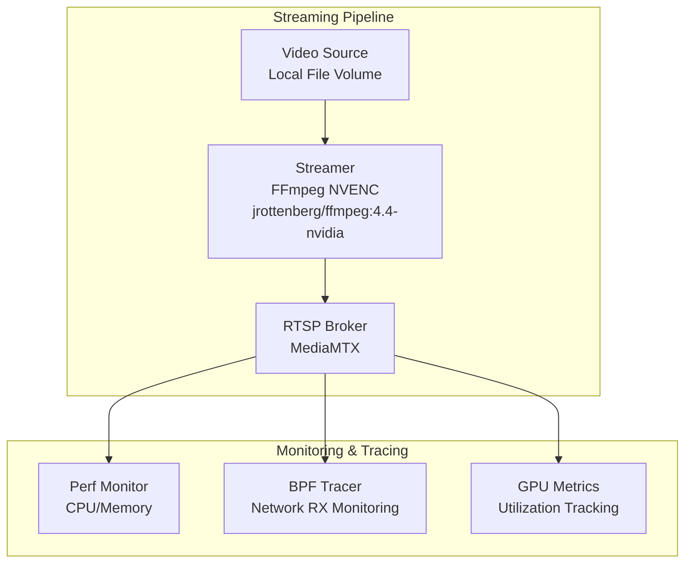
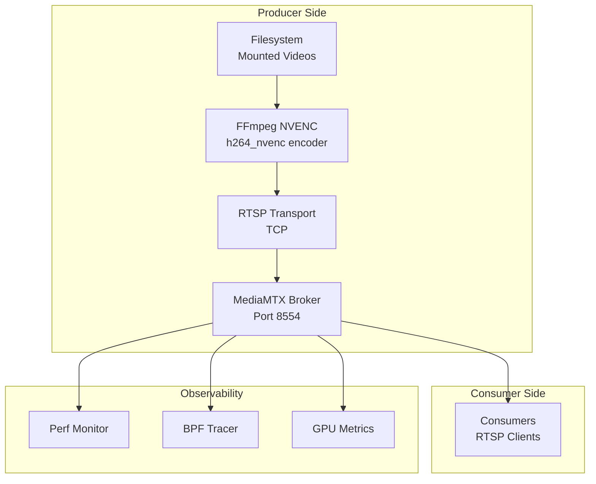
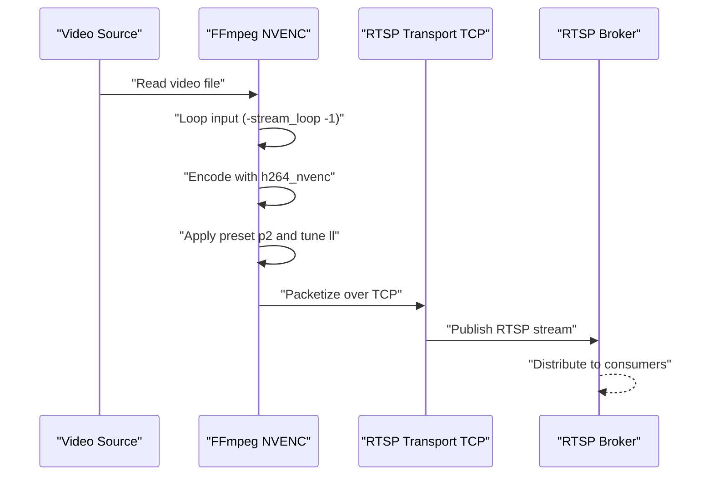
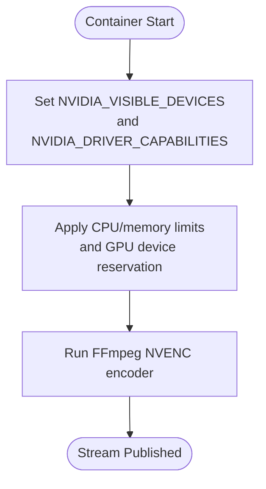
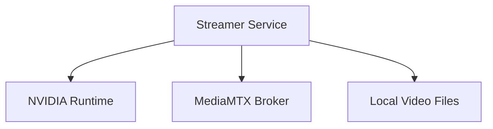

# FFmpeg NVENC Encoding Setup

<cite>
**Referenced Files in This Document**
- [docker-compose.yaml](file://ffmpeg_hpe/docker-compose.yaml)
- [Dockerfile.hpe](file://Dockerfile.hpe)
- [Dockerfile_cuda_ffmpeg_hpe](file://Dockerfile_cuda_ffmpeg_hpe)
- [build_ffmpeg_cuda.sh](file://build_ffmpeg_cuda.sh)
- [check_stream_compat.sh](file://check_stream_compat.sh)
- [README.md](file://README.md)
- [ONBOARDING.md](file://ONBOARDING.md)
- [COMPLETE_AUDIT_SUMMARY.md](file://COMPLETE_AUDIT_SUMMARY.md)
</cite>

## Table of Contents
1. [Introduction](#introduction)
2. [Project Structure](#project-structure)
3. [Core Components](#core-components)
4. [Architecture Overview](#architecture-overview)
5. [Detailed Component Analysis](#detailed-component-analysis)
6. [Dependency Analysis](#dependency-analysis)
7. [Performance Considerations](#performance-considerations)
8. [Troubleshooting Guide](#troubleshooting-guide)
9. [Conclusion](#conclusion)

## Introduction
This document explains the FFmpeg NVENC encoding configuration within the streaming pipeline. It focuses on the jrottenberg/ffmpeg:4.4-nvidia container setup, NVENC hardware acceleration configuration, and encoding parameters. It documents the FFmpeg command-line options including -preset p2 (low-latency-balanced), -tune ll (low-latency tune), -rtsp_transport tcp, and -stream_loop -1 for continuous streaming. It also covers GPU resource allocation, NVIDIA driver capabilities, CUDA device configuration, and guidance on optimizing encoding quality versus performance, codec selection, latency considerations, bandwidth optimization, and adaptation for different video sources and resolutions.

## Project Structure
The FFmpeg NVENC streaming pipeline is orchestrated through Docker Compose. The key elements are:
- A dedicated streamer service using the jrottenberg/ffmpeg:4.4-nvidia container
- An RTSP broker (MediaMTX) for stream distribution
- Optional monitoring and tracing components for performance and network observation

**Diagram sources**
- [docker-compose.yaml](file://ffmpeg_hpe/docker-compose.yaml)
- [COMPLETE_AUDIT_SUMMARY.md](file://COMPLETE_AUDIT_SUMMARY.md)

**Section sources**
- [docker-compose.yaml](file://ffmpeg_hpe/docker-compose.yaml)
- [COMPLETE_AUDIT_SUMMARY.md](file://COMPLETE_AUDIT_SUMMARY.md)

## Core Components
- Streamer service: Encodes video using NVENC and publishes an RTSP stream. It uses the jrottenberg/ffmpeg:4.4-nvidia container and runs with GPU access.
- RTSP Broker: MediaMTX RTSP server that receives and distributes the stream.
- Video source: Local video files mounted into the streamer container for looping playback.
- Monitoring and tracing: Optional components for CPU/memory profiling, network RX observation, and GPU metrics collection.

Key configuration highlights:
- Container image: jrottenberg/ffmpeg:4.4-nvidia
- GPU access: NVIDIA_VISIBLE_DEVICES and NVIDIA_DRIVER_CAPABILITIES configured for video, compute, and utility
- Resource limits: CPUs and memory limits set for the streamer
- Device reservation: One GPU device reserved via Docker runtime
- FFmpeg command: -re, -stream_loop -1, -c:v h264_nvenc, -preset p2, -tune ll, -rtsp_transport tcp, and RTSP output URL

**Section sources**
- [docker-compose.yaml](file://ffmpeg_hpe/docker-compose.yaml)
- [README.md](file://README.md)
- [ONBOARDING.md](file://ONBOARDING.md)

## Architecture Overview
The pipeline architecture integrates FFmpeg NVENC encoding with MediaMTX for RTSP streaming. The streamer encodes a local video file using NVENC and pushes it to the broker, which fans out the stream to consumers. Monitoring and tracing components observe CPU, memory, network RX, and GPU metrics.

**Diagram sources**
- [docker-compose.yaml](file://ffmpeg_hpe/docker-compose.yaml)
- [COMPLETE_AUDIT_SUMMARY.md](file://COMPLETE_AUDIT_SUMMARY.md)

**Section sources**
- [docker-compose.yaml](file://ffmpeg_hpe/docker-compose.yaml)
- [COMPLETE_AUDIT_SUMMARY.md](file://COMPLETE_AUDIT_SUMMARY.md)

## Detailed Component Analysis

### FFmpeg NVENC Encoder Configuration
The streamer service configures FFmpeg to:
- Read a local video file in a loop (-stream_loop -1)
- Encode with NVENC (h264_nvenc)
- Apply low-latency tuning (-preset p2 and -tune ll)
- Force RTSP over TCP (-rtsp_transport tcp)
- Publish to the RTSP broker endpoint

**Diagram sources**
- [docker-compose.yaml](file://ffmpeg_hpe/docker-compose.yaml)

**Section sources**
- [docker-compose.yaml](file://ffmpeg_hpe/docker-compose.yaml)

### Container and GPU Resource Allocation
- Container image: jrottenberg/ffmpeg:4.4-nvidia
- NVIDIA_VISIBLE_DEVICES: Controls which GPUs are visible to the container
- NVIDIA_DRIVER_CAPABILITIES: Enables video, compute, and utility capabilities
- CPU/memory limits: Constrained to lightweight processing overhead for NVENC
- Device reservation: One GPU device reserved via Docker runtime

**Diagram sources**
- [docker-compose.yaml](file://ffmpeg_hpe/docker-compose.yaml)

**Section sources**
- [docker-compose.yaml](file://ffmpeg_hpe/docker-compose.yaml)

### Building Custom FFmpeg with NVENC Support
While the project primarily uses the jrottenberg/ffmpeg:4.4-nvidia container, the repository also includes scripts and Dockerfiles for building FFmpeg with CUDA/NPP/NVENC support from source. These assets demonstrate enabling NVENC and related CUDA features during compilation.

Key aspects:
- Enabling CUDA/NVENC/NPP during build
- Verifying NVENC availability after installation
- Supporting custom FFmpeg builds for specialized needs

**Section sources**
- [build_ffmpeg_cuda.sh](file://build_ffmpeg_cuda.sh)
- [Dockerfile_cuda_ffmpeg_hpe](file://Dockerfile_cuda_ffmpeg_hpe)

### RTSP Transport and Consumer Compatibility
- The streamer forces RTSP over TCP to ensure visibility for BPF-based network tracing
- Consumers can adjust capture options to match TCP transport
- The RTSP broker listens on port 8554 and distributes the stream

**Section sources**
- [docker-compose.yaml](file://ffmpeg_hpe/docker-compose.yaml)
- [check_stream_compat.sh](file://check_stream_compat.sh)

### Codec Selection and Quality vs. Performance
- NVENC H.264 is used for hardware-accelerated encoding
- Low-latency tuning (-preset p2 and -tune ll) balances quality and latency
- For scenarios requiring ultra-low latency, evaluate -preset p1 or p0 and adjust bitrate accordingly
- For higher quality at the cost of latency, consider slower presets and increased bitrate

[No sources needed since this section provides general guidance]

### Latency and Bandwidth Considerations
- Latency: NVENC low-latency presets combined with TCP transport reduce jitter and improve real-time delivery
- Bandwidth: Tune bitrate and resolution to match network conditions; monitor with BPF tracer and GPU metrics
- Adaptation: Adjust preset, tune, and resolution based on source characteristics and consumer requirements

[No sources needed since this section provides general guidance]

## Dependency Analysis
The streamer service depends on:
- NVIDIA runtime for GPU access
- MediaMTX for RTSP distribution
- Local video files for input

**Diagram sources**
- [docker-compose.yaml](file://ffmpeg_hpe/docker-compose.yaml)

**Section sources**
- [docker-compose.yaml](file://ffmpeg_hpe/docker-compose.yaml)

## Performance Considerations
- GPU utilization: Monitor with GPU metrics container to ensure NVENC is effectively utilized
- CPU overhead: Keep CPU limits low since NVENC handles encoding; validate with perf monitor
- Network visibility: TCP transport ensures BPF tracing captures all RTP packets
- Resolution and FPS: Match encoding parameters to source resolution and frame rate for optimal throughput

[No sources needed since this section provides general guidance]

## Troubleshooting Guide
Common issues and remedies:
- NVENC warnings: Avoid -zerolatency 1 alongside -tune ll; the compose configuration already avoids this duplication
- Transport mismatch: Ensure both producer and consumer use TCP; adjust consumer capture options accordingly
- GPU visibility: Verify NVIDIA_VISIBLE_DEVICES and NVIDIA_DRIVER_CAPABILITIES are correctly set
- Resource exhaustion: Increase GPU device reservation or CPU/memory limits if encoding becomes constrained

**Section sources**
- [docker-compose.yaml](file://ffmpeg_hpe/docker-compose.yaml)
- [check_stream_compat.sh](file://check_stream_compat.sh)

## Conclusion
The FFmpeg NVENC streaming pipeline leverages the jrottenberg/ffmpeg:4.4-nvidia container to efficiently encode H.264 streams using NVIDIA GPUs. The configuration employs low-latency presets, TCP transport, and device/GPU resource reservations to deliver a robust, measurable streaming setup suitable for experimentation and monitoring. By aligning encoding parameters with source characteristics and network conditions, teams can optimize quality, latency, and bandwidth while maintaining observability through integrated monitoring and tracing components.