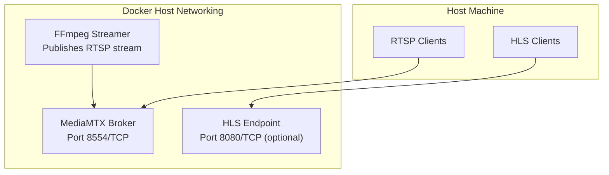
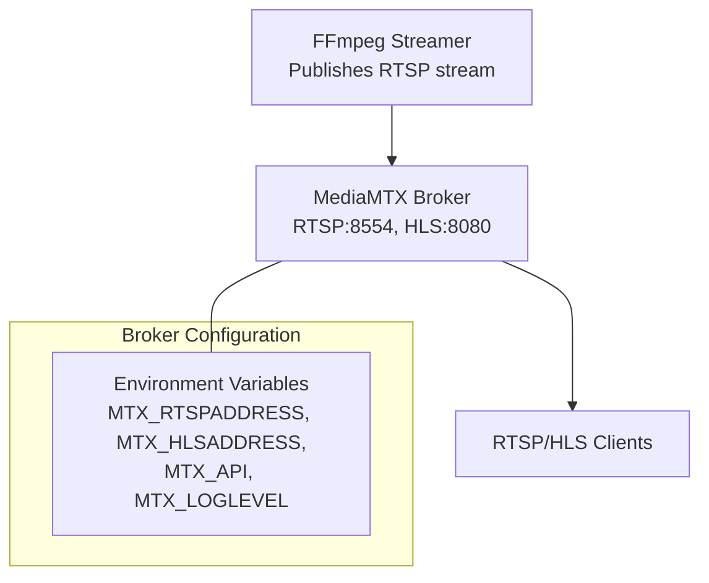
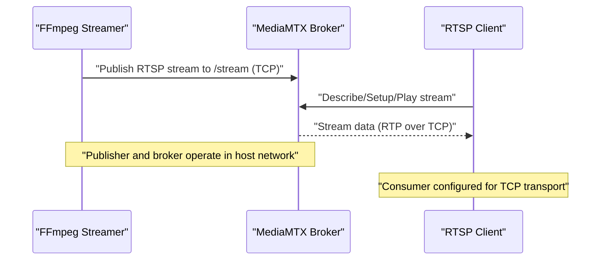
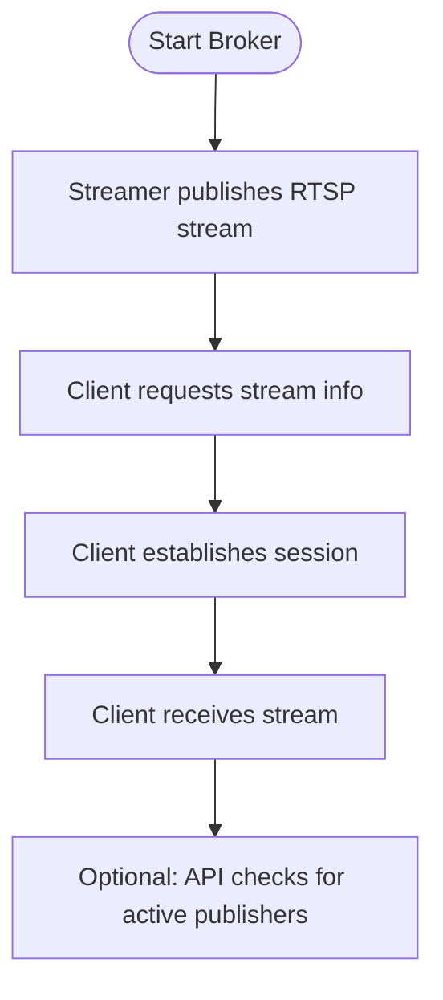
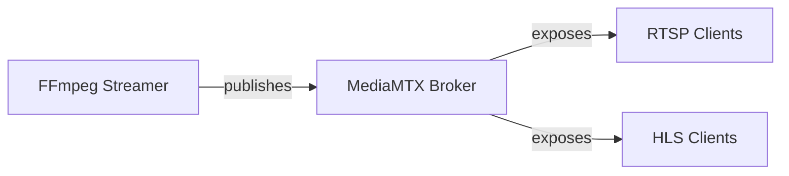

# RTSP Server Configuration

<cite>
**Referenced Files in This Document**
- [docker-compose.rtsp.yml](file://docker-compose.rtsp.yml)
- [docker-compose.yaml](file://ffmpeg_hpe/docker-compose.yaml)
- [run_experiment.sh](file://ffmpeg_hpe/run_experiment.sh)
- [README.md](file://README.md)
- [ONBOARDING.md](file://ONBOARDING.md)
- [COMPLETE_AUDIT_SUMMARY.md](file://COMPLETE_AUDIT_SUMMARY.md)
</cite>

## Table of Contents
1. [Introduction](#introduction)
2. [Project Structure](#project-structure)
3. [Core Components](#core-components)
4. [Architecture Overview](#architecture-overview)
5. [Detailed Component Analysis](#detailed-component-analysis)
6. [Dependency Analysis](#dependency-analysis)
7. [Performance Considerations](#performance-considerations)
8. [Troubleshooting Guide](#troubleshooting-guide)
9. [Conclusion](#conclusion)

## Introduction
This document explains how to configure and operate an RTSP streaming system using MediaMTX as the RTSP broker. It covers container setup, port mappings, resource limits, networking, health checks, and deployment settings. It also describes the RTSP streaming protocol implementation, stream publishing, client connections, and practical troubleshooting for common issues. Guidance is provided for adapting the configuration to different streaming scenarios, security considerations, and performance tuning across resolutions and frame rates.

## Project Structure
The RTSP configuration is primarily defined in Docker Compose files and orchestrated by a shell script. The main components are:
- MediaMTX RTSP broker container
- FFmpeg-based streamer container publishing an RTSP stream
- Optional HLS endpoint for debugging
- Optional monitoring containers (when used in full experiments)

**Diagram sources**
- [docker-compose.rtsp.yml:12](file://docker-compose.rtsp.yml#L12)
- [docker-compose.rtsp.yml:13](file://docker-compose.rtsp.yml#L13)

**Section sources**
- [docker-compose.rtsp.yml:1-37](file://docker-compose.rtsp.yml#L1-L37)
- [docker-compose.yaml:6](file://ffmpeg_hpe/docker-compose.yaml#L6-L8)

## Core Components
- MediaMTX RTSP broker
  - Exposes RTSP on port 8554 and optionally HLS on port 8080
  - Environment-driven configuration supports on-demand publishing and API exposure
  - Minimal logging level for operational visibility
- FFmpeg streamer
  - Publishes a looping video file as an RTSP stream using TCP transport
  - Encodes with hardware acceleration when available
  - Operates within the same host network namespace for simplified connectivity

Key configuration highlights:
- Ports: 8554 (RTSP), 8080 (HLS), 8888 (MediaMTX API)
- Transport: RTSP over TCP for reliability
- On-demand publishing: stream starts when a publisher connects

**Section sources**
- [docker-compose.rtsp.yml:2](file://docker-compose.rtsp.yml#L2-L17)
- [docker-compose.rtsp.yml:19](file://docker-compose.rtsp.yml#L19-L37)

## Architecture Overview
The RTSP pipeline consists of a broker that receives and forwards streams, and a producer that publishes a media file as an RTSP feed. Clients connect to the broker to receive the stream.

**Diagram sources**
- [docker-compose.rtsp.yml:12](file://docker-compose.rtsp.yml#L12)
- [docker-compose.rtsp.yml:13](file://docker-compose.rtsp.yml#L13)
- [docker-compose.rtsp.yml:9](file://docker-compose.rtsp.yml#L9-L17)

**Section sources**
- [README.md:279](file://README.md#L279-L282)
- [ONBOARDING.md:476](file://ONBOARDING.md#L476-L480)

## Detailed Component Analysis

### MediaMTX RTSP Broker
- Image and container identity
- Restart policy ensures continuity
- Host networking simplifies routing and reduces NAT overhead
- Volume mounting for media assets
- Environment variables:
  - Path source and on-demand publishing
  - RTSP and HLS listen addresses
  - API enablement and address
  - Protocol toggles and logging level

Operational notes:
- The broker listens on port 8554 for RTSP and optionally on 8080 for HLS
- API is exposed on 8888 for administrative queries
- Logging level can be adjusted for operational visibility

**Section sources**
- [docker-compose.rtsp.yml:2](file://docker-compose.rtsp.yml#L2-L17)

### FFmpeg Streamer
- Image selection for hardware-accelerated encoding
- Depends on the broker being started
- Host networking for direct access to broker
- Command-line options:
  - Looping input and real-time constraints
  - Stream copying and RTSP output
  - TCP transport for reliable delivery
  - Destination path on the broker

**Section sources**
- [docker-compose.rtsp.yml:19](file://docker-compose.rtsp.yml#L19-L37)

### Container Networking and Deployment Settings
- Host networking is used for both broker and streamer
- This eliminates Docker bridge complexity and simplifies client access
- Port mappings:
  - Broker: 8554 (RTSP), 8080 (HLS), 8888 (API)
  - Streamer: publishes to broker on 8554

Health checks:
- Broker health checks are intentionally omitted for this image due to its distroless nature
- Readiness is enforced by host-side port probing and stream availability checks

**Section sources**
- [docker-compose.rtsp.yml:6](file://docker-compose.rtsp.yml#L6)
- [docker-compose.rtsp.yml:14](file://docker-compose.rtsp.yml#L14)
- [run_experiment.sh:206](file://ffmpeg_hpe/run_experiment.sh#L206-L233)

### RTSP Streaming Protocol Implementation
- Transport: TCP for both publisher and consumer sides
- Publisher uses RTSP over TCP to ensure reliable packet delivery
- Consumer configuration enforces TCP transport to align with the publisher
- Stream path: /stream on the broker

**Diagram sources**
- [docker-compose.rtsp.yml:34](file://docker-compose.rtsp.yml#L34)
- [docker-compose.rtsp.yml:36](file://docker-compose.rtsp.yml#L36)

**Section sources**
- [docker-compose.rtsp.yml:28](file://docker-compose.rtsp.yml#L28-L36)

### Stream Publishing and Client Connections
- Stream publishing is triggered when the streamer container starts
- On-demand publishing allows the stream to appear when a publisher connects
- Client connections use RTSP over TCP to the broker’s address

**Diagram sources**
- [docker-compose.rtsp.yml:10](file://docker-compose.rtsp.yml#L10)
- [docker-compose.rtsp.yml:11](file://docker-compose.rtsp.yml#L11)

**Section sources**
- [docker-compose.rtsp.yml:10](file://docker-compose.rtsp.yml#L10-L11)
- [run_experiment.sh:268](file://ffmpeg_hpe/run_experiment.sh#L268-L296)

## Dependency Analysis
- Broker and streamer are tightly coupled:
  - Streamer depends on broker being started
  - Streamer publishes to the broker’s RTSP address
- Host networking removes inter-container DNS dependencies
- Optional HLS endpoint complements RTSP for debugging and alternative clients

**Diagram sources**
- [docker-compose.rtsp.yml:22](file://docker-compose.rtsp.yml#L22-L24)
- [docker-compose.rtsp.yml:12](file://docker-compose.rtsp.yml#L12)
- [docker-compose.rtsp.yml:13](file://docker-compose.rtsp.yml#L13)

**Section sources**
- [docker-compose.rtsp.yml:22](file://docker-compose.rtsp.yml#L22-L24)

## Performance Considerations
- Transport choice: RTSP over TCP improves reliability compared to UDP, especially under load
- Hardware acceleration: Streamer leverages GPU encoding when available
- Resource limits:
  - Broker: minimal CPU and memory footprint due to relaying without transcoding
  - Streamer: GPU-backed container with dedicated device allocation
- Throughput and latency:
  - TCP transport reduces packet loss and reordering
  - HLS endpoint can be used for debugging and alternative consumption patterns

[No sources needed since this section provides general guidance]

## Troubleshooting Guide
Common issues and remedies:

- Broker readiness
  - Symptom: Clients cannot connect immediately after startup
  - Action: Verify port 8554 is accepting connections on the host
  - Evidence: Host-side port probing confirms readiness before dependent services start

- Stream availability
  - Symptom: Broker is listening but no clients receive data
  - Action: Confirm the stream path is published and active
  - Evidence: Use ffprobe or the MediaMTX API to validate stream readiness

- Transport mismatch
  - Symptom: Intermittent playback or dropped packets
  - Action: Ensure both publisher and consumer use RTSP over TCP
  - Evidence: Review streamer and consumer transport settings

- Port conflicts
  - Symptom: Broker fails to bind to required ports
  - Action: Check for conflicting services on 8554, 8080, or 8888
  - Evidence: Validate port availability and firewall rules

- API access
  - Symptom: Cannot query broker state via API
  - Action: Confirm API is enabled and accessible on the configured port
  - Evidence: Query the MediaMTX API endpoint for active paths

**Section sources**
- [run_experiment.sh:214](file://ffmpeg_hpe/run_experiment.sh#L214-L233)
- [run_experiment.sh:268](file://ffmpeg_hpe/run_experiment.sh#L268-L296)
- [docker-compose.rtsp.yml:14](file://docker-compose.rtsp.yml#L14)

## Conclusion
The RTSP configuration using MediaMTX as the broker is designed for simplicity and reliability. Host networking, TCP transport, and on-demand publishing streamline deployment and operation. The provided health checks and readiness validations ensure robust startup sequencing. For production, adjust resource limits according to workload, enforce transport consistency, and leverage the HLS endpoint for diagnostics. The troubleshooting guidance addresses typical issues encountered during setup and operation.