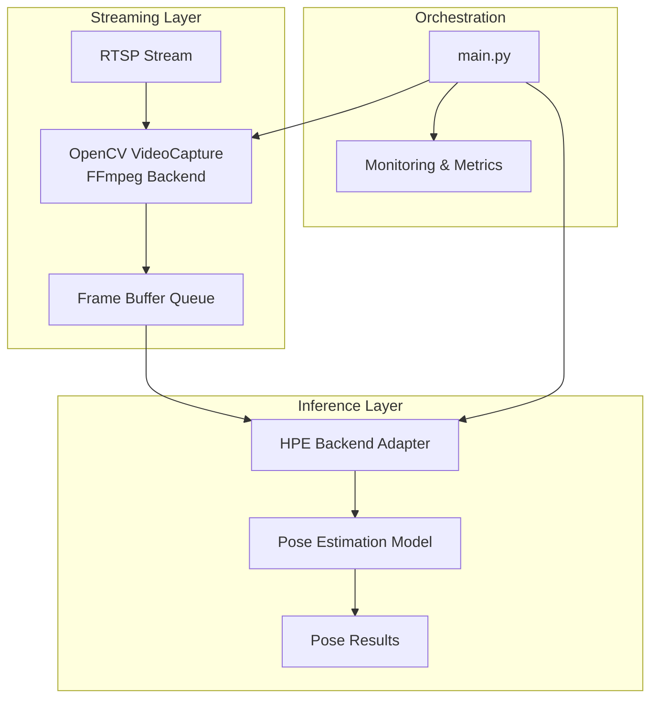
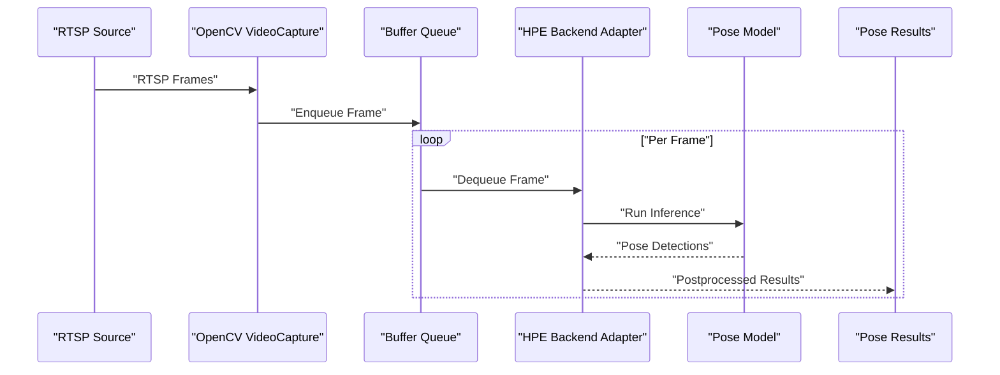
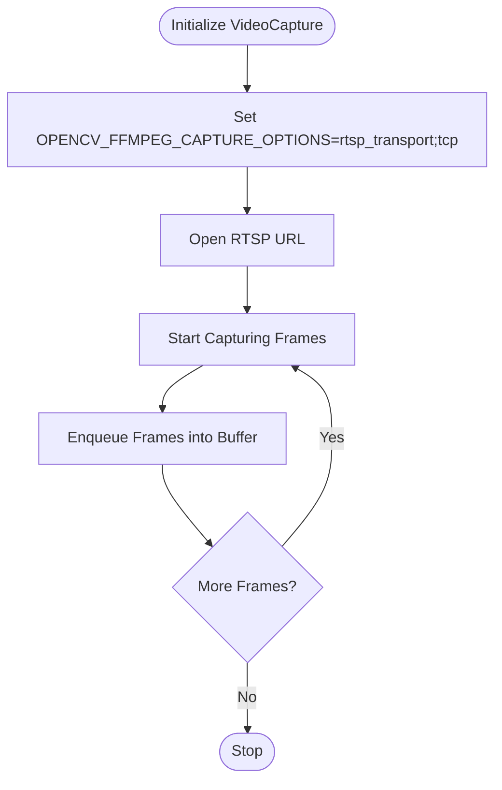
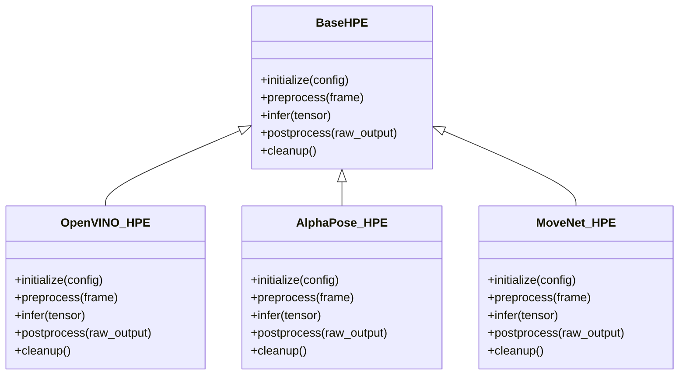
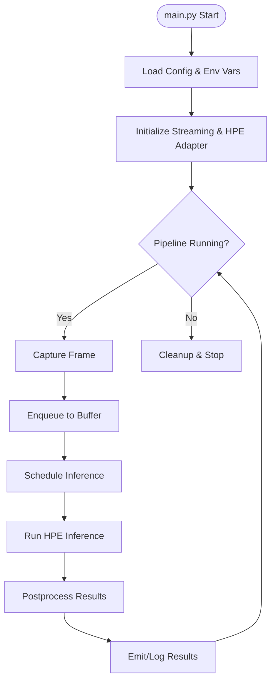
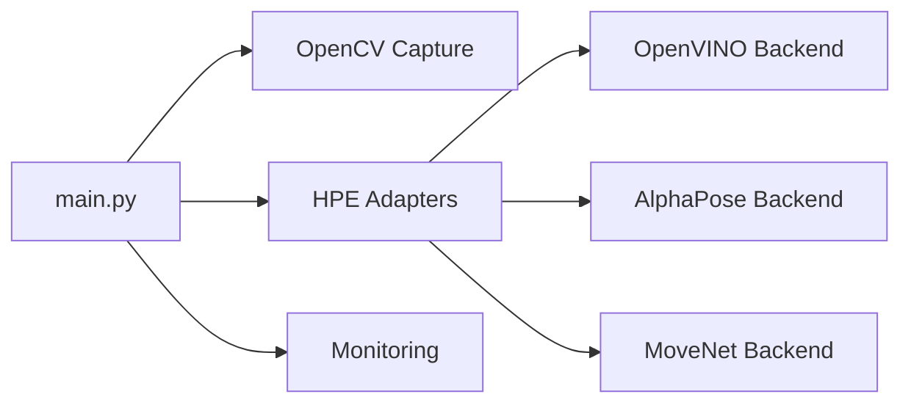

# Streaming Integration with HPE Backends

<cite>
**Referenced Files in This Document**
- [main.py](file://main.py)
- [base_hpe.py](file://base_hpe.py)
- [openvino_base_hpe.py](file://openvino_base_hpe.py)
- [alphapose_hpe.py](file://alphapose_hpe.py)
- [movenet_hpe.py](file://movenet_hpe.py)
- [docker-compose.yml](file://docker-compose.yml)
- [dev_tools/app_ffmpeg.py](file://dev_tools/app_ffmpeg.py)
- [dev_tools/stream_video_server.py](file://dev_tools/stream_video_server.py)
- [dev_tools/stream_video_server_adaptive.py](file://dev_tools/stream_video_server_adaptive.py)
- [README.md](file://README.md)
</cite>

## Table of Contents
1. [Introduction](#introduction)
2. [Project Structure](#project-structure)
3. [Core Components](#core-components)
4. [Architecture Overview](#architecture-overview)
5. [Detailed Component Analysis](#detailed-component-analysis)
6. [Dependency Analysis](#dependency-analysis)
7. [Performance Considerations](#performance-considerations)
8. [Troubleshooting Guide](#troubleshooting-guide)
9. [Conclusion](#conclusion)

## Introduction
This document explains how the streaming pipeline integrates with Human Pose Estimation (HPE) backends in the repository. It covers how an RTSP stream feeds into the HPE inference pipeline, including OpenCV FFmpeg backend configuration via the OPENCV_FFMPEG_CAPTURE_OPTIONS environment variable set to rtsp_transport;tcp. The document details the streaming-to-inference data flow, latency considerations, synchronization between streaming and processing, backend-specific configuration, input parameters, output handling, and practical guidance for optimizing streaming quality, handling interruptions, and maintaining consistent frame rates. It also provides troubleshooting advice for streaming-related inference issues, buffer management, and performance optimization for real-time pose estimation.

## Project Structure
The repository organizes streaming and HPE components across several modules:
- Streaming utilities and servers under dev_tools for testing and experimentation
- HPE backends (OpenVINO, AlphaPose, MoveNet) implemented as separate modules
- A central orchestration script that coordinates streaming and inference
- Docker Compose configurations for containerized deployment and monitoring

**Diagram sources**
- [main.py](file://main.py)
- [dev_tools/app_ffmpeg.py](file://dev_tools/app_ffmpeg.py)
- [openvino_base_hpe.py](file://openvino_base_hpe.py)
- [alphapose_hpe.py](file://alphapose_hpe.py)
- [movenet_hpe.py](file://movenet_hpe.py)

**Section sources**
- [main.py](file://main.py)
- [docker-compose.yml](file://docker-compose.yml)

## Core Components
- Streaming ingestion: Uses OpenCV VideoCapture with FFmpeg backend configured via OPENCV_FFMPEG_CAPTURE_OPTIONS=rtsp_transport;tcp to ensure reliable RTSP delivery over TCP.
- HPE backends: Separate adapter modules encapsulate inference logic for different backends (OpenVINO, AlphaPose, MoveNet).
- Orchestration: The main script coordinates capture, buffering, inference scheduling, and result handling.
- Monitoring: Containerized monitoring supports performance tracking and resource utilization during streaming and inference.

Key responsibilities:
- Streaming: Initialize capture, manage buffers, and synchronize frame timing.
- HPE: Accept preprocessed frames, run inference, and return pose detections.
- Orchestration: Manage end-to-end pipeline, handle errors, and maintain throughput.

**Section sources**
- [main.py](file://main.py)
- [base_hpe.py](file://base_hpe.py)
- [openvino_base_hpe.py](file://openvino_base_hpe.py)
- [alphapose_hpe.py](file://alphapose_hpe.py)
- [movenet_hpe.py](file://movenet_hpe.py)

## Architecture Overview
The system follows a producer-consumer pattern:
- Producer: OpenCV VideoCapture reads frames from the RTSP stream and places them into a buffer queue.
- Consumer: HPE backend adapters consume frames from the buffer, perform inference, and emit pose results.
- Synchronization: Frame timestamps and queue depth control latency and throughput balance.
- Backends: Each backend exposes a unified interface for initialization, preprocessing, inference, and postprocessing.

**Diagram sources**
- [dev_tools/app_ffmpeg.py](file://dev_tools/app_ffmpeg.py)
- [main.py](file://main.py)
- [openvino_base_hpe.py](file://openvino_base_hpe.py)
- [alphapose_hpe.py](file://alphapose_hpe.py)
- [movenet_hpe.py](file://movenet_hpe.py)

## Detailed Component Analysis

### Streaming Pipeline (OpenCV FFmpeg Backend)
- Capture configuration: OPENCV_FFMPEG_CAPTURE_OPTIONS=rtsp_transport;tcp ensures RTSP over TCP for reduced packet loss and reordering.
- Initialization: VideoCapture opens the RTSP URL and starts buffering frames.
- Buffering: A bounded queue holds recent frames to decouple capture speed from inference latency.
- Timing: Optional timestamp-based synchronization helps align inference with capture timing.

**Diagram sources**
- [dev_tools/app_ffmpeg.py](file://dev_tools/app_ffmpeg.py)

**Section sources**
- [dev_tools/app_ffmpeg.py](file://dev_tools/app_ffmpeg.py)
- [dev_tools/stream_video_server.py](file://dev_tools/stream_video_server.py)
- [dev_tools/stream_video_server_adaptive.py](file://dev_tools/stream_video_server_adaptive.py)

### HPE Backend Adapters
Each backend implements a consistent interface:
- Initialization: Load model, configure input resolution, device, and inference parameters.
- Preprocessing: Convert frames to model-specific tensors or normalized arrays.
- Inference: Execute forward pass and return raw outputs.
- Postprocessing: Convert raw outputs to pose keypoints and scores.

**Diagram sources**
- [base_hpe.py](file://base_hpe.py)
- [openvino_base_hpe.py](file://openvino_base_hpe.py)
- [alphapose_hpe.py](file://alphapose_hpe.py)
- [movenet_hpe.py](file://movenet_hpe.py)

**Section sources**
- [base_hpe.py](file://base_hpe.py)
- [openvino_base_hpe.py](file://openvino_base_hpe.py)
- [alphapose_hpe.py](file://alphapose_hpe.py)
- [movenet_hpe.py](file://movenet_hpe.py)

### Orchestration and Control Flow
The main script coordinates streaming and inference:
- Parse configuration and environment variables (including FFmpeg capture options).
- Initialize the streaming pipeline and HPE backend adapter.
- Run the capture loop, enqueue frames, and schedule inference.
- Aggregate and emit pose results with optional visualization or logging.

**Diagram sources**
- [main.py](file://main.py)

**Section sources**
- [main.py](file://main.py)

## Dependency Analysis
- Streaming depends on OpenCV and FFmpeg libraries; environment variable configuration affects transport reliability.
- HPE backends depend on their respective model frameworks (OpenVINO runtime, PyTorch/TFLite for others).
- Orchestration script depends on backend adapters and monitoring utilities.
- Docker Compose configurations enable containerized deployment and resource isolation.

**Diagram sources**
- [main.py](file://main.py)
- [openvino_base_hpe.py](file://openvino_base_hpe.py)
- [alphapose_hpe.py](file://alphapose_hpe.py)
- [movenet_hpe.py](file://movenet_hpe.py)

**Section sources**
- [docker-compose.yml](file://docker-compose.yml)

## Performance Considerations
- Transport reliability: Use OPENCV_FFMPEG_CAPTURE_OPTIONS=rtsp_transport;tcp to reduce jitter and packet loss on unstable networks.
- Buffer sizing: Tune queue depth to balance latency and memory usage; larger buffers reduce dropped frames but increase latency.
- Device selection: Prefer GPU acceleration for OpenVINO and backend-specific accelerators for AlphaPose/MoveNet.
- Resolution and frame rate: Adjust input resolution to match backend capabilities and network bandwidth; maintain a stable frame rate to avoid backlog.
- Threading and batching: Use asynchronous inference where supported; batch frames only if the backend benefits from it.
- Monitoring: Track CPU/GPU utilization, queue depth, and inference latency to identify bottlenecks.

[No sources needed since this section provides general guidance]

## Troubleshooting Guide
Common streaming and inference issues:
- Stream interruptions or timeouts:
  - Verify RTSP URL accessibility and credentials.
  - Confirm OPENCV_FFMPEG_CAPTURE_OPTIONS is set to rtsp_transport;tcp.
  - Check network stability and firewall rules.
- Frame drops and backlog:
  - Reduce input resolution or frame rate.
  - Increase buffer size cautiously; monitor memory usage.
  - Offload inference to GPU and minimize pre/postprocessing overhead.
- Inference stalls or high latency:
  - Profile inference time per frame; optimize model or batch size.
  - Ensure the backend adapter is initialized correctly and models are loaded.
  - Validate that the buffer queue is not starved or overflowing.
- Synchronization problems:
  - Use timestamp-based synchronization in the capture loop.
  - Align inference frequency with capture rate to prevent accumulation.

**Section sources**
- [dev_tools/app_ffmpeg.py](file://dev_tools/app_ffmpeg.py)
- [dev_tools/stream_video_server.py](file://dev_tools/stream_video_server.py)
- [dev_tools/stream_video_server_adaptive.py](file://dev_tools/stream_video_server_adaptive.py)
- [README.md](file://README.md)

## Conclusion
The repository implements a modular streaming-to-HPE pipeline with configurable FFmpeg transport, backend-agnostic adapters, and orchestration for real-time pose estimation. By tuning capture options, buffer management, and backend-specific parameters, the system achieves robust, low-latency performance. The provided troubleshooting guidance and monitoring support help maintain consistent frame rates and handle interruptions effectively.

[No sources needed since this section summarizes without analyzing specific files]