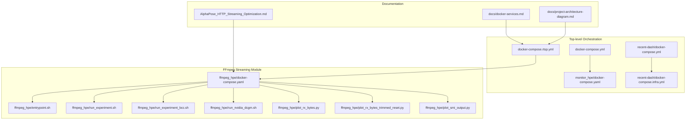
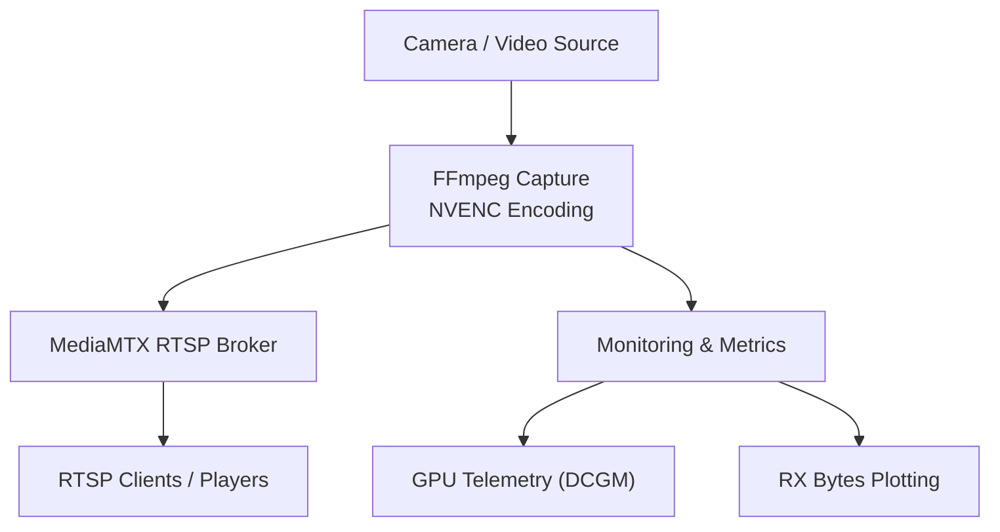
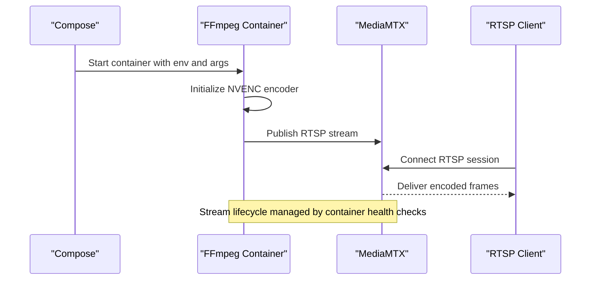
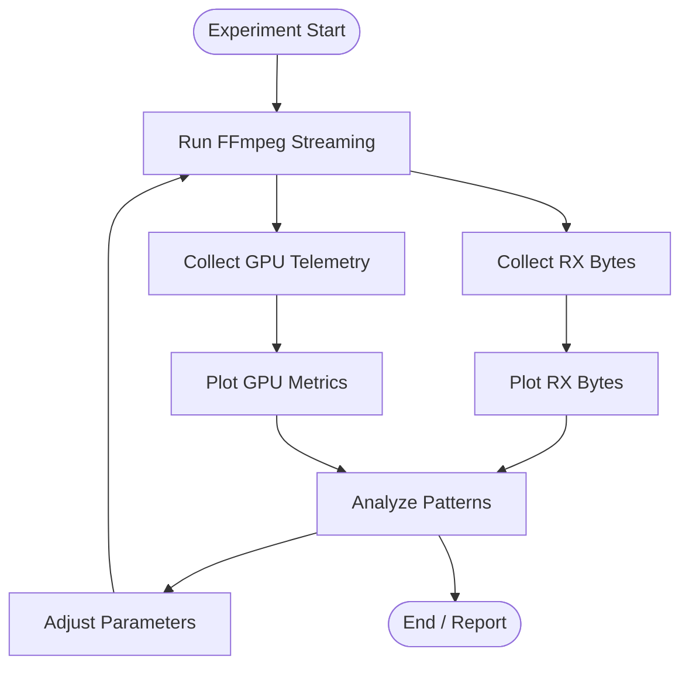
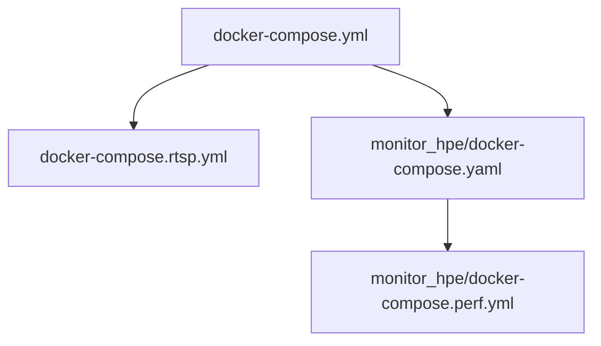
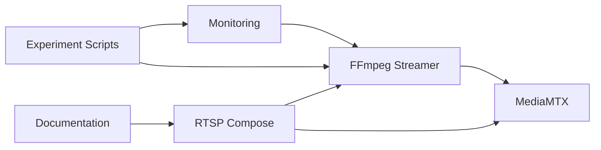

# Streaming Pipeline

<cite>
**Referenced Files in This Document**
- [docker-compose.rtsp.yml](file://docker-compose.rtsp.yml)
- [docker-compose.yml](file://docker-compose.yml)
- [ffmpeg_hpe/docker-compose.yaml](file://ffmpeg_hpe/docker-compose.yaml)
- [ffmpeg_hpe/entrypoint.sh](file://ffmpeg_hpe/entrypoint.sh)
- [ffmpeg_hpe/run_experiment.sh](file://ffmpeg_hpe/run_experiment.sh)
- [ffmpeg_hpe/run_experiment_bcc.sh](file://ffmpeg_hpe/run_experiment_bcc.sh)
- [ffmpeg_hpe/run_nvidia_dcgm.sh](file://ffmpeg_hpe/run_nvidia_dcgm.sh)
- [ffmpeg_hpe/plot_rx_bytes.py](file://ffmpeg_hpe/plot_rx_bytes.py)
- [ffmpeg_hpe/plot_rx_bytes_trimmed_reset.py](file://ffmpeg_hpe/plot_rx_bytes_trimmed_reset.py)
- [ffmpeg_hpe/plot_smi_output.py](file://ffmpeg_hpe/plot_smi_output.py)
- [ffmpeg_hpe/DYNAMIC_RESOURCE_ALLOCATION.md](file://ffmpeg_hpe/DYNAMIC_RESOURCE_ALLOCATION.md)
- [ffmpeg_hpe/FIXES_SUMMARY.md](file://ffmpeg_hpe/FIXES_SUMMARY.md)
- [ffmpeg_hpe/ISSUE_2_AND_5_ANALYSIS.md](file://ffmpeg_hpe/ISSUE_2_AND_5_ANALYSIS.md)
- [AlphaPose_HTTP_Streaming_Optimization.md](file://AlphaPose_HTTP_Streaming_Optimization.md)
- [docs/docker-services.md](file://docs/docker-services.md)
- [docs/project-architecture-diagram.md](file://docs/project-architecture-diagram.md)
- [build_ffmpeg_cuda.sh](file://build_ffmpeg_cuda.sh)
- [check_stream_compat.sh](file://check_stream_compat.sh)
- [entrypoint.sh](file://entrypoint.sh)
- [monitor_hpe/docker-compose.yaml](file://monitor_hpe/docker-compose.yaml)
- [monitor_hpe/USAGE.md](file://monitor_hpe/USAGE.md)
- [monitor_hpe/docker-compose.perf.yml](file://monitor_hpe/docker-compose.perf.yml)
- [recent-dash/docker-compose.yml](file://recent-dash/docker-compose.yml)
- [recent-dash/docker-compose.infra.yml](file://recent-dash/docker-compose.infra.yml)
</cite>

## Table of Contents
1. [Introduction](#introduction)
2. [Project Structure](#project-structure)
3. [Core Components](#core-components)
4. [Architecture Overview](#architecture-overview)
5. [Detailed Component Analysis](#detailed-component-analysis)
6. [Dependency Analysis](#dependency-analysis)
7. [Performance Considerations](#performance-considerations)
8. [Troubleshooting Guide](#troubleshooting-guide)
9. [Conclusion](#conclusion)
10. [Appendices](#appendices)

## Introduction
This document describes the RTSP streaming pipeline infrastructure used in the project. It explains the streaming architecture leveraging MediaMTX as the RTSP broker and jrottenberg/ffmpeg:4.4-nvidia as the streamer. It documents FFmpeg/NVENC encoding setup, streaming configuration options, and network optimization techniques. Container orchestration via docker-compose is covered, including service dependencies and health checks. The document also provides troubleshooting guidance for common streaming issues, bandwidth optimization strategies, quality settings, and integration points with HPE inference backends. Finally, it addresses streaming protocols, codec selection, resolution settings, latency considerations, and customization guidance for varying network conditions.

## Project Structure
The streaming pipeline spans several docker-compose configurations and supporting scripts:
- Top-level compose files define orchestrations for RTSP streaming and monitoring.
- The ffmpeg_hpe module encapsulates FFmpeg-based streaming experiments, metrics collection, and GPU profiling.
- Documentation assets describe services and architecture.

**Diagram sources**
- [docker-compose.rtsp.yml](file://docker-compose.rtsp.yml)
- [docker-compose.yml](file://docker-compose.yml)
- [ffmpeg_hpe/docker-compose.yaml](file://ffmpeg_hpe/docker-compose.yaml)
- [ffmpeg_hpe/entrypoint.sh](file://ffmpeg_hpe/entrypoint.sh)
- [ffmpeg_hpe/run_experiment.sh](file://ffmpeg_hpe/run_experiment.sh)
- [ffmpeg_hpe/run_experiment_bcc.sh](file://ffmpeg_hpe/run_experiment_bcc.sh)
- [ffmpeg_hpe/run_nvidia_dcgm.sh](file://ffmpeg_hpe/run_nvidia_dcgm.sh)
- [ffmpeg_hpe/plot_rx_bytes.py](file://ffmpeg_hpe/plot_rx_bytes.py)
- [ffmpeg_hpe/plot_rx_bytes_trimmed_reset.py](file://ffmpeg_hpe/plot_rx_bytes_trimmed_reset.py)
- [ffmpeg_hpe/plot_smi_output.py](file://ffmpeg_hpe/plot_smi_output.py)
- [docs/docker-services.md](file://docs/docker-services.md)
- [docs/project-architecture-diagram.md](file://docs/project-architecture-diagram.md)
- [AlphaPose_HTTP_Streaming_Optimization.md](file://AlphaPose_HTTP_Streaming_Optimization.md)

**Section sources**
- [docker-compose.rtsp.yml](file://docker-compose.rtsp.yml)
- [docker-compose.yml](file://docker-compose.yml)
- [ffmpeg_hpe/docker-compose.yaml](file://ffmpeg_hpe/docker-compose.yaml)
- [docs/docker-services.md](file://docs/docker-services.md)
- [docs/project-architecture-diagram.md](file://docs/project-architecture-diagram.md)

## Core Components
- MediaMTX RTSP Broker: Provides RTSP ingestion and distribution for camera feeds.
- FFmpeg Streamer (jrottenberg/ffmpeg:4.4-nvidia): Encodes video using NVENC and publishes to MediaMTX.
- Monitoring and Metrics: Collects RX bytes, GPU telemetry, and performance plots.
- Experiment Orchestration: Scripts to run streaming experiments under various conditions.
- Documentation: Guides for docker services and project architecture.

Key responsibilities:
- MediaMTX: Receives RTSP streams, manages sessions, and serves clients.
- FFmpeg: Captures input (camera/CPU source), applies NVENC encoding, and pushes to RTSP sink.
- Monitoring: Tracks network throughput and GPU utilization to inform tuning.
- Experimentation: Automates parameter sweeps and captures metrics for analysis.

**Section sources**
- [docker-compose.rtsp.yml](file://docker-compose.rtsp.yml)
- [ffmpeg_hpe/docker-compose.yaml](file://ffmpeg_hpe/docker-compose.yaml)
- [ffmpeg_hpe/run_experiment.sh](file://ffmpeg_hpe/run_experiment.sh)
- [ffmpeg_hpe/run_experiment_bcc.sh](file://ffmpeg_hpe/run_experiment_bcc.sh)
- [ffmpeg_hpe/run_nvidia_dcgm.sh](file://ffmpeg_hpe/run_nvidia_dcgm.sh)

## Architecture Overview
The streaming pipeline integrates capture, encoding, transport, and monitoring:

**Diagram sources**
- [docker-compose.rtsp.yml](file://docker-compose.rtsp.yml)
- [ffmpeg_hpe/docker-compose.yaml](file://ffmpeg_hpe/docker-compose.yaml)
- [ffmpeg_hpe/run_nvidia_dcgm.sh](file://ffmpeg_hpe/run_nvidia_dcgm.sh)
- [ffmpeg_hpe/plot_rx_bytes.py](file://ffmpeg_hpe/plot_rx_bytes.py)

## Detailed Component Analysis

### MediaMTX RTSP Broker
- Role: Accepts incoming RTSP streams and serves them to multiple clients.
- Configuration: Defined in the RTSP compose file; includes ports, mount paths, and runtime options.
- Health checks: Compose file defines readiness/liveness probes to ensure the broker is operational before dependent services start.

Operational flow:
- FFmpeg streamer pushes encoded RTSP frames to MediaMTX.
- Clients connect to MediaMTX to receive the stream.

**Section sources**
- [docker-compose.rtsp.yml](file://docker-compose.rtsp.yml)

### FFmpeg Streamer (jrottenberg/ffmpeg:4.4-nvidia)
- Image: Uses NVIDIA CUDA-enabled FFmpeg for hardware-accelerated encoding.
- Entrypoint: Initializes environment and starts FFmpeg with configured parameters.
- Experiments: Dedicated scripts run parameter sweeps and collect metrics.

**Diagram sources**
- [docker-compose.rtsp.yml](file://docker-compose.rtsp.yml)
- [ffmpeg_hpe/entrypoint.sh](file://ffmpeg_hpe/entrypoint.sh)

**Section sources**
- [ffmpeg_hpe/docker-compose.yaml](file://ffmpeg_hpe/docker-compose.yaml)
- [ffmpeg_hpe/entrypoint.sh](file://ffmpeg_hpe/entrypoint.sh)

### Monitoring and Metrics
- RX Bytes Tracking: Plots observed RX bytes over time to analyze throughput and anomalies.
- GPU Telemetry: Runs DCGM to gather GPU metrics during streaming experiments.
- Trimmed Reset Plots: Analyzes RX curves with reset windows for stability assessment.

**Diagram sources**
- [ffmpeg_hpe/run_experiment.sh](file://ffmpeg_hpe/run_experiment.sh)
- [ffmpeg_hpe/run_nvidia_dcgm.sh](file://ffmpeg_hpe/run_nvidia_dcgm.sh)
- [ffmpeg_hpe/plot_rx_bytes.py](file://ffmpeg_hpe/plot_rx_bytes.py)
- [ffmpeg_hpe/plot_rx_bytes_trimmed_reset.py](file://ffmpeg_hpe/plot_rx_bytes_trimmed_reset.py)
- [ffmpeg_hpe/plot_smi_output.py](file://ffmpeg_hpe/plot_smi_output.py)

**Section sources**
- [ffmpeg_hpe/run_experiment.sh](file://ffmpeg_hpe/run_experiment.sh)
- [ffmpeg_hpe/run_experiment_bcc.sh](file://ffmpeg_hpe/run_experiment_bcc.sh)
- [ffmpeg_hpe/run_nvidia_dcgm.sh](file://ffmpeg_hpe/run_nvidia_dcgm.sh)
- [ffmpeg_hpe/plot_rx_bytes.py](file://ffmpeg_hpe/plot_rx_bytes.py)
- [ffmpeg_hpe/plot_rx_bytes_trimmed_reset.py](file://ffmpeg_hpe/plot_rx_bytes_trimmed_reset.py)
- [ffmpeg_hpe/plot_smi_output.py](file://ffmpeg_hpe/plot_smi_output.py)

### Container Orchestration and Dependencies
- Top-level compose files coordinate services and enforce startup order.
- Health checks ensure MediaMTX is ready before FFmpeg attempts to publish.
- Monitoring compose files manage auxiliary services for performance dashboards.

**Diagram sources**
- [docker-compose.yml](file://docker-compose.yml)
- [docker-compose.rtsp.yml](file://docker-compose.rtsp.yml)
- [monitor_hpe/docker-compose.yaml](file://monitor_hpe/docker-compose.yaml)
- [monitor_hpe/docker-compose.perf.yml](file://monitor_hpe/docker-compose.perf.yml)

**Section sources**
- [docker-compose.yml](file://docker-compose.yml)
- [docker-compose.rtsp.yml](file://docker-compose.rtsp.yml)
- [monitor_hpe/docker-compose.yaml](file://monitor_hpe/docker-compose.yaml)
- [monitor_hpe/docker-compose.perf.yml](file://monitor_hpe/docker-compose.perf.yml)

### FFmpeg/NVENC Encoding Setup and Streaming Options
- Hardware Acceleration: NVENC is leveraged for efficient H.264/H.265 encoding.
- Resolution and Frame Rate: Tunable via FFmpeg parameters in the compose entrypoint.
- Bitrate Control: Configurable CRF or bitrate targets to balance quality and bandwidth.
- Latency Considerations: GOP size, keyframe interval, and encoder preset impact latency vs. quality trade-offs.
- Codec Selection: H.264 or H.265 depending on client compatibility and performance needs.

Integration points:
- MediaMTX RTSP sink endpoint and stream name are configured in the FFmpeg command.
- Environment variables propagate encoding parameters from compose to the container entrypoint.

**Section sources**
- [ffmpeg_hpe/docker-compose.yaml](file://ffmpeg_hpe/docker-compose.yaml)
- [ffmpeg_hpe/entrypoint.sh](file://ffmpeg_hpe/entrypoint.sh)

### Network Optimization Techniques
- RX Byte Monitoring: Continuous measurement helps detect congestion and optimize bitrate.
- Trimmed Reset Analysis: Identifies stable periods and resets to assess transient effects.
- GPU Telemetry Correlation: Links CPU/GPU load to network throughput for holistic optimization.

**Section sources**
- [ffmpeg_hpe/plot_rx_bytes.py](file://ffmpeg_hpe/plot_rx_bytes.py)
- [ffmpeg_hpe/plot_rx_bytes_trimmed_reset.py](file://ffmpeg_hpe/plot_rx_bytes_trimmed_reset.py)
- [ffmpeg_hpe/run_nvidia_dcgm.sh](file://ffmpeg_hpe/run_nvidia_dcgm.sh)

### Integration with HPE Inference Backends
- Streaming as Input: RTSP stream can feed HPE inference pipelines for pose estimation.
- Throughput Awareness: Monitoring ensures streaming does not starve inference resources.
- Experimentation: Scripts enable controlled experiments combining streaming and inference workloads.

**Section sources**
- [docker-compose.rtsp.yml](file://docker-compose.rtsp.yml)
- [monitor_hpe/USAGE.md](file://monitor_hpe/USAGE.md)

## Dependency Analysis
The streaming pipeline exhibits clear dependency chains:
- FFmpeg depends on MediaMTX being healthy before publishing.
- Monitoring depends on FFmpeg running to collect RX bytes and GPU telemetry.
- Experiment scripts depend on environment variables and compose configurations.

**Diagram sources**
- [docker-compose.rtsp.yml](file://docker-compose.rtsp.yml)
- [ffmpeg_hpe/docker-compose.yaml](file://ffmpeg_hpe/docker-compose.yaml)
- [ffmpeg_hpe/run_experiment.sh](file://ffmpeg_hpe/run_experiment.sh)
- [ffmpeg_hpe/run_nvidia_dcgm.sh](file://ffmpeg_hpe/run_nvidia_dcgm.sh)

**Section sources**
- [docker-compose.rtsp.yml](file://docker-compose.rtsp.yml)
- [ffmpeg_hpe/docker-compose.yaml](file://ffmpeg_hpe/docker-compose.yaml)
- [ffmpeg_hpe/run_experiment.sh](file://ffmpeg_hpe/run_experiment.sh)

## Performance Considerations
- Encoder Preset: Faster presets reduce latency but may increase bandwidth variability.
- CRF vs. Bitrate: CRF maintains quality consistency; CBR targets fixed bandwidth.
- Resolution Scaling: Lower resolution reduces bandwidth and GPU load.
- GOP and Keyframes: Smaller GOP improves latency; frequent keyframes increase overhead.
- GPU Memory: Monitor utilization to avoid encoder stalls; adjust resolution or preset accordingly.
- Network Bandwidth: Align bitrate with available uplink; use RX byte plots to validate.

[No sources needed since this section provides general guidance]

## Troubleshooting Guide
Common issues and remedies:
- Stream fails to publish:
  - Verify MediaMTX health checks and port availability.
  - Confirm FFmpeg command-line arguments and credentials.
- Intermittent drops or stalls:
  - Inspect RX byte plots for spikes or resets indicating congestion.
  - Reduce bitrate or resolution; adjust encoder preset.
- High latency:
  - Decrease GOP size and keyframe interval.
  - Use faster encoder preset and lower resolution.
- GPU bottlenecks:
  - Check DCGM telemetry for utilization and temperature.
  - Lower resolution/preset or offload inference workloads.

**Section sources**
- [docker-compose.rtsp.yml](file://docker-compose.rtsp.yml)
- [ffmpeg_hpe/run_nvidia_dcgm.sh](file://ffmpeg_hpe/run_nvidia_dcgm.sh)
- [ffmpeg_hpe/plot_rx_bytes.py](file://ffmpeg_hpe/plot_rx_bytes.py)
- [ffmpeg_hpe/plot_rx_bytes_trimmed_reset.py](file://ffmpeg_hpe/plot_rx_bytes_trimmed_reset.py)

## Conclusion
The RTSP streaming pipeline combines MediaMTX for robust RTSP distribution and FFmpeg with NVENC for efficient hardware-accelerated encoding. docker-compose orchestrates services with health checks, while monitoring scripts and plots provide actionable insights for bandwidth optimization and quality tuning. The integration with HPE inference backends enables coordinated experimentation across streaming and inference workloads. By adjusting resolution, bitrate, and encoder settings, and correlating network and GPU telemetry, teams can adapt the pipeline to diverse network conditions and latency requirements.

[No sources needed since this section summarizes without analyzing specific files]

## Appendices

### Streaming Protocols, Codecs, and Resolution Settings
- Protocol: RTSP over TCP/UDP; configure per client requirements.
- Codecs: H.264/H.265; choose based on client compatibility and performance.
- Resolution: Start from 1280x720 or 1920x1080; scale down for constrained networks.
- FPS: Match camera capabilities; typical 30 fps for most scenarios.

**Section sources**
- [docker-compose.rtsp.yml](file://docker-compose.rtsp.yml)
- [ffmpeg_hpe/docker-compose.yaml](file://ffmpeg_hpe/docker-compose.yaml)

### Customization Guidance
- Parameterization: Use environment variables to control resolution, FPS, and bitrate.
- Experimentation: Leverage experiment scripts to sweep parameters and collect metrics.
- Documentation: Refer to project architecture and docker services guides for service definitions.

**Section sources**
- [ffmpeg_hpe/run_experiment.sh](file://ffmpeg_hpe/run_experiment.sh)
- [docs/project-architecture-diagram.md](file://docs/project-architecture-diagram.md)
- [docs/docker-services.md](file://docs/docker-services.md)

### Building and Compatibility
- FFmpeg Build: CUDA-enabled FFmpeg can be built using provided scripts.
- Compatibility Checks: Validate stream compatibility with target clients.

**Section sources**
- [build_ffmpeg_cuda.sh](file://build_ffmpeg_cuda.sh)
- [check_stream_compat.sh](file://check_stream_compat.sh)