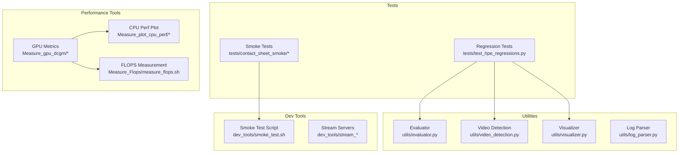
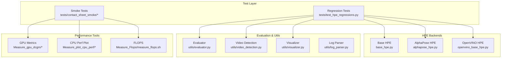
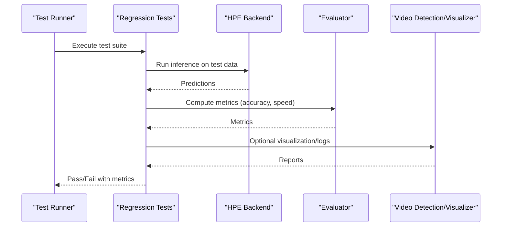
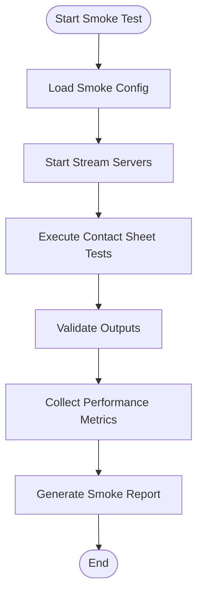
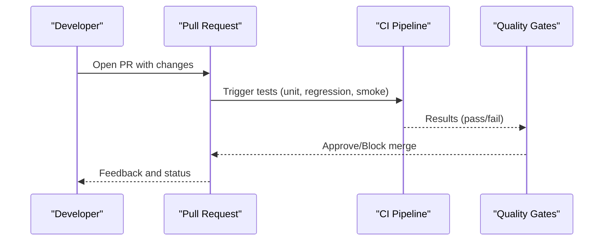
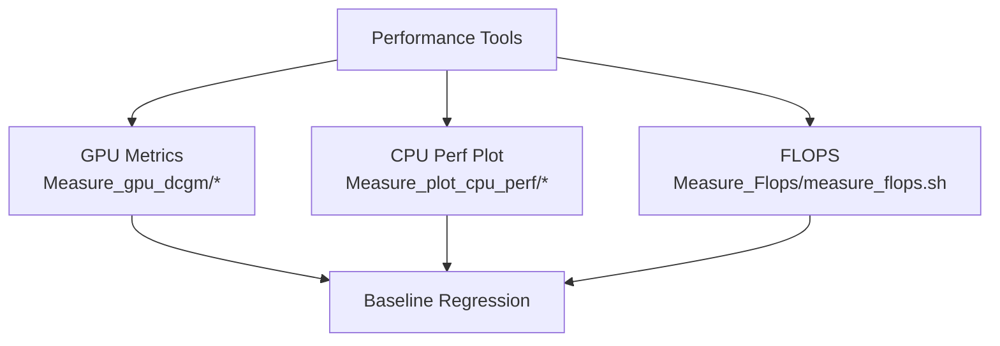
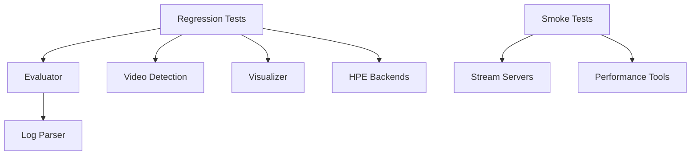

# Testing and Quality Assurance

<cite>
**Referenced Files in This Document**
- [README.md](file://README.md)
- [pull_request_template.md](file://.github/pull_request_template.md)
- [test_hpe_regressions.py](file://tests/test_hpe_regressions.py)
- [run_contact_sheet_smoke.py](file://tests/contact_sheet_smoke/run_contact_sheet_smoke.py)
- [README.md](file://tests/contact_sheet_smoke/README.md)
- [simple_test.py](file://simple_test.py)
- [alphapose_hpe.py](file://alphapose_hpe.py)
- [base_hpe.py](file://base_hpe.py)
- [openvino_base_hpe.py](file://openvino_base_hpe.py)
- [evaluator.py](file://utils/evaluator.py)
- [video_detection.py](file://utils/video_detection.py)
- [visualizer.py](file://utils/visualizer.py)
- [log_parser.py](file://utils/log_parser.py)
- [measure_flops.sh](file://Measure_Flops/measure_flops.sh)
- [run_nvidia_dcgm.sh](file://Measure_gpu_dcgm/run_nvidia_dcgm.sh)
- [plot_smi_output.py](file://Measure_gpu_dcgm/plot_smi_output.py)
- [run_perf_plot.sh](file://Measure_plot_cpu_perf/run_perf_plot.sh)
- [plot_perf_metrics.py](file://Measure_plot_cpu_perf/plot_perf_metrics.py)
- [smoke_test.sh](file://dev_tools/smoke_test.sh)
- [stream_video_server.py](file://dev_tools/stream_video_server.py)
- [stream_video_server_adaptive.py](file://dev_tools/stream_video_server_adaptive.py)
- [Dockerfile.gpu_metrics](file://Measure_gpu_dcgm/Dockerfile.gpu_metrics)
- [Dockerfile](file://Measure_plot_cpu_perf/Dockerfile)
</cite>

## Table of Contents
1. [Introduction](#introduction)
2. [Project Structure](#project-structure)
3. [Core Components](#core-components)
4. [Architecture Overview](#architecture-overview)
5. [Detailed Component Analysis](#detailed-component-analysis)
6. [Dependency Analysis](#dependency-analysis)
7. [Performance Considerations](#performance-considerations)
8. [Troubleshooting Guide](#troubleshooting-guide)
9. [Conclusion](#conclusion)
10. [Appendices](#appendices)

## Introduction
This document describes the testing and quality assurance procedures for the Human Pose Estimation (HPE) system. It covers unit testing frameworks, regression testing for backend performance and accuracy, smoke testing for rapid validation, continuous integration and quality gates, and best practices for test maintenance and reliability across environments. The content is derived from the repository’s existing test artifacts, scripts, and supporting utilities.

## Project Structure
The testing and QA surface spans several areas:
- Unit and integration tests under the tests directory
- Performance measurement tools for CPU and GPU
- Smoke testing scripts and server utilities
- Supporting evaluation and visualization utilities
- Pull request template guiding testing expectations

**Section sources**
- [README.md](file://README.md)
- [test_hpe_regressions.py](file://tests/test_hpe_regressions.py)
- [run_contact_sheet_smoke.py](file://tests/contact_sheet_smoke/run_contact_sheet_smoke.py)
- [measure_flops.sh](file://Measure_Flops/measure_flops.sh)
- [run_nvidia_dcgm.sh](file://Measure_gpu_dcgm/run_nvidia_dcgm.sh)
- [plot_smi_output.py](file://Measure_gpu_dcgm/plot_smi_output.py)
- [run_perf_plot.sh](file://Measure_plot_cpu_perf/run_perf_plot.sh)
- [plot_perf_metrics.py](file://Measure_plot_cpu_perf/plot_perf_metrics.py)
- [smoke_test.sh](file://dev_tools/smoke_test.sh)
- [stream_video_server.py](file://dev_tools/stream_video_server.py)
- [stream_video_server_adaptive.py](file://dev_tools/stream_video_server_adaptive.py)
- [evaluator.py](file://utils/evaluator.py)
- [video_detection.py](file://utils/video_detection.py)
- [visualizer.py](file://utils/visualizer.py)
- [log_parser.py](file://utils/log_parser.py)

## Core Components
- Regression tests validate backend performance and accuracy against expected baselines. They rely on evaluation utilities and test data prepared for HPE models.
- Smoke tests provide rapid validation of critical functionality using contact sheet workflows and a dedicated smoke test script.
- Performance tools capture GPU metrics, CPU performance plots, and FLOPS measurements to support regression baselines and performance gates.
- Utilities support evaluation, video detection, visualization, and log parsing to facilitate test automation and reporting.

Key responsibilities:
- tests/test_hpe_regressions.py: Defines regression test suite and assertions for HPE accuracy/performance.
- tests/contact_sheet_smoke/: Provides contact sheet smoke tests and execution script.
- utils/evaluator.py: Offers evaluation routines used by regression tests.
- utils/video_detection.py: Supports video-based detection workflows used in smoke/regression contexts.
- utils/visualizer.py: Provides visualization utilities for test outputs.
- utils/log_parser.py: Parses logs for test diagnostics and reporting.
- Measure_gpu_dcgm/*: GPU metrics collection and plotting for performance regression checks.
- Measure_plot_cpu_perf/*: CPU performance plotting for regression baselines.
- Measure_Flops/measure_flops.sh: FLOPS measurement for compute performance validation.
- dev_tools/smoke_test.sh: Orchestrates smoke testing pipeline.
- dev_tools/stream_*: Video streaming servers used in smoke and integration scenarios.

**Section sources**
- [test_hpe_regressions.py](file://tests/test_hpe_regressions.py)
- [run_contact_sheet_smoke.py](file://tests/contact_sheet_smoke/run_contact_sheet_smoke.py)
- [README.md](file://tests/contact_sheet_smoke/README.md)
- [evaluator.py](file://utils/evaluator.py)
- [video_detection.py](file://utils/video_detection.py)
- [visualizer.py](file://utils/visualizer.py)
- [log_parser.py](file://utils/log_parser.py)
- [run_nvidia_dcgm.sh](file://Measure_gpu_dcgm/run_nvidia_dcgm.sh)
- [plot_smi_output.py](file://Measure_gpu_dcgm/plot_smi_output.py)
- [run_perf_plot.sh](file://Measure_plot_cpu_perf/run_perf_plot.sh)
- [plot_perf_metrics.py](file://Measure_plot_cpu_perf/plot_perf_metrics.py)
- [measure_flops.sh](file://Measure_Flops/measure_flops.sh)
- [smoke_test.sh](file://dev_tools/smoke_test.sh)
- [stream_video_server.py](file://dev_tools/stream_video_server.py)
- [stream_video_server_adaptive.py](file://dev_tools/stream_video_server_adaptive.py)

## Architecture Overview
The testing architecture integrates unit/regression tests, smoke tests, and performance measurement tools. Tests invoke HPE backends (AlphaPose and OpenVINO) via shared interfaces and evaluate outputs using evaluation utilities. Performance tools collect metrics and produce plots for regression baselines.

**Diagram sources**
- [test_hpe_regressions.py](file://tests/test_hpe_regressions.py)
- [run_contact_sheet_smoke.py](file://tests/contact_sheet_smoke/run_contact_sheet_smoke.py)
- [base_hpe.py](file://base_hpe.py)
- [alphapose_hpe.py](file://alphapose_hpe.py)
- [openvino_base_hpe.py](file://openvino_base_hpe.py)
- [evaluator.py](file://utils/evaluator.py)
- [video_detection.py](file://utils/video_detection.py)
- [visualizer.py](file://utils/visualizer.py)
- [log_parser.py](file://utils/log_parser.py)
- [run_nvidia_dcgm.sh](file://Measure_gpu_dcgm/run_nvidia_dcgm.sh)
- [plot_smi_output.py](file://Measure_gpu_dcgm/plot_smi_output.py)
- [run_perf_plot.sh](file://Measure_plot_cpu_perf/run_perf_plot.sh)
- [plot_perf_metrics.py](file://Measure_plot_cpu_perf/plot_perf_metrics.py)
- [measure_flops.sh](file://Measure_Flops/measure_flops.sh)

## Detailed Component Analysis

### Regression Testing System
The regression testing system validates HPE backend performance and accuracy against expected baselines. It leverages evaluation utilities and test data to assert correctness and performance thresholds.

Key aspects:
- Test organization: Centralized in tests/test_hpe_regressions.py with structured test cases covering accuracy and performance.
- Assertion patterns: Assertions compare computed metrics against baseline thresholds using evaluation utilities.
- Test data management: Test data is prepared for HPE models and referenced by regression tests.
- Backend coverage: Tests exercise base HPE, AlphaPose, and OpenVINO backends through shared interfaces.

**Diagram sources**
- [test_hpe_regressions.py](file://tests/test_hpe_regressions.py)
- [evaluator.py](file://utils/evaluator.py)
- [video_detection.py](file://utils/video_detection.py)
- [visualizer.py](file://utils/visualizer.py)
- [base_hpe.py](file://base_hpe.py)
- [alphapose_hpe.py](file://alphapose_hpe.py)
- [openvino_base_hpe.py](file://openvino_base_hpe.py)

**Section sources**
- [test_hpe_regressions.py](file://tests/test_hpe_regressions.py)
- [evaluator.py](file://utils/evaluator.py)
- [video_detection.py](file://utils/video_detection.py)
- [visualizer.py](file://utils/visualizer.py)
- [base_hpe.py](file://base_hpe.py)
- [alphapose_hpe.py](file://alphapose_hpe.py)
- [openvino_base_hpe.py](file://openvino_base_hpe.py)

### Smoke Testing Procedures
Smoke tests provide rapid validation of critical functionality using contact sheet workflows and a dedicated smoke test script. They validate end-to-end pipelines without requiring extensive datasets.

Key aspects:
- Contact sheet smoke tests: Automated execution via tests/contact_sheet_smoke/run_contact_sheet_smoke.py.
- Smoke test orchestration: dev_tools/smoke_test.sh coordinates smoke test steps.
- Streaming servers: dev_tools/stream_video_server.py and dev_tools/stream_video_server_adaptive.py support smoke scenarios.
- Rapid feedback: Smoke tests focus on high-risk paths to quickly detect regressions.

**Diagram sources**
- [run_contact_sheet_smoke.py](file://tests/contact_sheet_smoke/run_contact_sheet_smoke.py)
- [README.md](file://tests/contact_sheet_smoke/README.md)
- [smoke_test.sh](file://dev_tools/smoke_test.sh)
- [stream_video_server.py](file://dev_tools/stream_video_server.py)
- [stream_video_server_adaptive.py](file://dev_tools/stream_video_server_adaptive.py)

**Section sources**
- [run_contact_sheet_smoke.py](file://tests/contact_sheet_smoke/run_contact_sheet_smoke.py)
- [README.md](file://tests/contact_sheet_smoke/README.md)
- [smoke_test.sh](file://dev_tools/smoke_test.sh)
- [stream_video_server.py](file://dev_tools/stream_video_server.py)
- [stream_video_server_adaptive.py](file://dev_tools/stream_video_server_adaptive.py)

### Continuous Integration Workflow and Quality Gates
While the repository does not include GitHub Actions workflows, the pull request template outlines expectations for testing and quality gates. The template requires:
- Passing unit and regression tests
- Smoke test validation
- Performance benchmarks where applicable
- Code review and approval

Quality gates:
- All tests must pass before merging
- Performance metrics must meet thresholds defined by regression baselines
- Smoke tests must validate critical paths

**Section sources**
- [pull_request_template.md](file://.github/pull_request_template.md)

### Performance Benchmarking
Performance benchmarking integrates GPU metrics, CPU performance plots, and FLOPS measurements to establish baselines and detect regressions.

- GPU metrics: Measure_gpu_dcgm/* collects and plots GPU utilization and power metrics.
- CPU performance: Measure_plot_cpu_perf/* generates performance plots for CPU-bound workloads.
- FLOPS measurement: Measure_Flops/measure_flops.sh quantifies computational throughput.

**Diagram sources**
- [run_nvidia_dcgm.sh](file://Measure_gpu_dcgm/run_nvidia_dcgm.sh)
- [plot_smi_output.py](file://Measure_gpu_dcgm/plot_smi_output.py)
- [run_perf_plot.sh](file://Measure_plot_cpu_perf/run_perf_plot.sh)
- [plot_perf_metrics.py](file://Measure_plot_cpu_perf/plot_perf_metrics.py)
- [measure_flops.sh](file://Measure_Flops/measure_flops.sh)

**Section sources**
- [run_nvidia_dcgm.sh](file://Measure_gpu_dcgm/run_nvidia_dcgm.sh)
- [plot_smi_output.py](file://Measure_gpu_dcgm/plot_smi_output.py)
- [run_perf_plot.sh](file://Measure_plot_cpu_perf/run_perf_plot.sh)
- [plot_perf_metrics.py](file://Measure_plot_cpu_perf/plot_perf_metrics.py)
- [measure_flops.sh](file://Measure_Flops/measure_flops.sh)

### Test Data Management
Test data management ensures reproducibility and consistency across environments:
- Test datasets: Prepared for HPE models and referenced by regression tests.
- Evaluation utilities: Provide standardized metrics computation for consistent comparisons.
- Logging and visualization: Support diagnostics and reporting for test runs.

**Section sources**
- [test_hpe_regressions.py](file://tests/test_hpe_regressions.py)
- [evaluator.py](file://utils/evaluator.py)
- [log_parser.py](file://utils/log_parser.py)
- [visualizer.py](file://utils/visualizer.py)

### Writing Effective Tests
Guidance for writing effective tests:
- Isolation: Keep tests independent and deterministic.
- Coverage: Target critical paths and failure modes.
- Assertions: Use meaningful assertions with clear pass/fail criteria.
- Data: Manage test data carefully and keep fixtures minimal but representative.
- Performance: Include performance assertions aligned with regression baselines.

[No sources needed since this section provides general guidance]

### Pull Request Testing Requirements and Code Review Processes
- Testing requirements: Unit, regression, and smoke tests must pass; performance baselines must be met.
- Code review: Changes require reviewer approval; ensure tests accompany new features or fixes.
- Quality metrics: Track pass rates, flakiness, and performance trends.

**Section sources**
- [pull_request_template.md](file://.github/pull_request_template.md)

## Dependency Analysis
The testing system exhibits clear module boundaries and low coupling:
- Regression tests depend on evaluation utilities and HPE backends.
- Smoke tests depend on streaming servers and performance tools.
- Utilities provide shared functionality for evaluation, visualization, and logging.

**Diagram sources**
- [test_hpe_regressions.py](file://tests/test_hpe_regressions.py)
- [evaluator.py](file://utils/evaluator.py)
- [video_detection.py](file://utils/video_detection.py)
- [visualizer.py](file://utils/visualizer.py)
- [log_parser.py](file://utils/log_parser.py)
- [run_contact_sheet_smoke.py](file://tests/contact_sheet_smoke/run_contact_sheet_smoke.py)
- [stream_video_server.py](file://dev_tools/stream_video_server.py)
- [stream_video_server_adaptive.py](file://dev_tools/stream_video_server_adaptive.py)
- [run_nvidia_dcgm.sh](file://Measure_gpu_dcgm/run_nvidia_dcgm.sh)
- [run_perf_plot.sh](file://Measure_plot_cpu_perf/run_perf_plot.sh)

**Section sources**
- [test_hpe_regressions.py](file://tests/test_hpe_regressions.py)
- [evaluator.py](file://utils/evaluator.py)
- [video_detection.py](file://utils/video_detection.py)
- [visualizer.py](file://utils/visualizer.py)
- [log_parser.py](file://utils/log_parser.py)
- [run_contact_sheet_smoke.py](file://tests/contact_sheet_smoke/run_contact_sheet_smoke.py)
- [stream_video_server.py](file://dev_tools/stream_video_server.py)
- [stream_video_server_adaptive.py](file://dev_tools/stream_video_server_adaptive.py)
- [run_nvidia_dcgm.sh](file://Measure_gpu_dcgm/run_nvidia_dcgm.sh)
- [run_perf_plot.sh](file://Measure_plot_cpu_perf/run_perf_plot.sh)

## Performance Considerations
- Establish baselines: Use GPU metrics, CPU performance plots, and FLOPS measurements to define acceptable performance ranges.
- Monitor regressions: Compare current runs against historical baselines; alert on deviations exceeding thresholds.
- Optimize test scope: Prefer focused tests that exercise critical paths to reduce runtime while maintaining coverage.

[No sources needed since this section provides general guidance]

## Troubleshooting Guide
Common issues and resolutions:
- Test failures due to missing test data: Verify dataset paths and fixture availability.
- Evaluation errors: Confirm evaluator configuration and metric computation parameters.
- Performance anomalies: Cross-check GPU/CPU metrics and ensure consistent hardware/environment.
- Smoke test failures: Validate streaming servers and network connectivity.

Supporting utilities:
- Log parser: Parse logs for actionable diagnostics.
- Visualizer: Inspect outputs and intermediate results for debugging.

**Section sources**
- [log_parser.py](file://utils/log_parser.py)
- [visualizer.py](file://utils/visualizer.py)

## Conclusion
The repository provides a robust foundation for testing and quality assurance, with regression tests, smoke tests, and performance measurement tools. By adhering to the outlined practices, maintaining clear quality gates, and leveraging shared utilities, teams can ensure reliable and repeatable validation across environments.

[No sources needed since this section summarizes without analyzing specific files]

## Appendices
- Test execution tips: Run regression tests with defined datasets; execute smoke tests with streaming servers; collect performance metrics before and after changes.
- Environment consistency: Use Docker configurations for GPU metrics and CPU performance tools to minimize environment variance.

[No sources needed since this section provides general guidance]