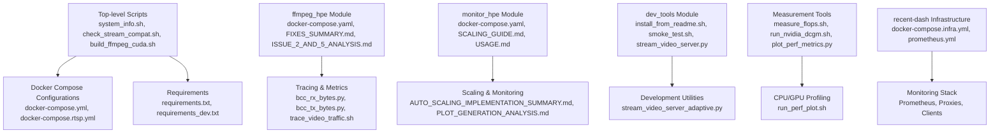
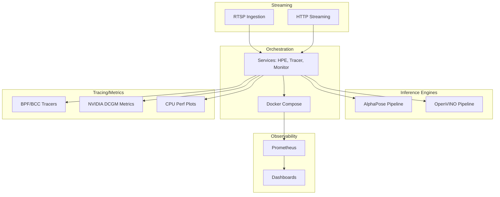
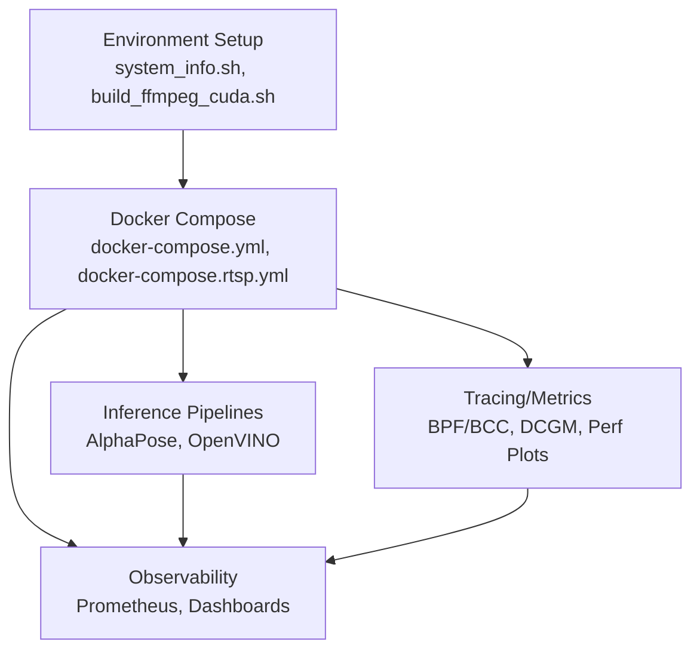

# Troubleshooting and FAQ

<cite>
**Referenced Files in This Document**
- [README.md](file://README.md)
- [ONBOARDING.md](file://ONBOARDING.md)
- [ISSUE_D_ANALYSIS.md](file://ISSUE_D_ANALYSIS.md)
- [REMAINING_ISSUES_ANALYSIS.md](file://REMAINING_ISSUES_ANALYSIS.md)
- [ffmpeg_hpe/FIXES_SUMMARY.md](file://ffmpeg_hpe/FIXES_SUMMARY.md)
- [ffmpeg_hpe/ISSUE_2_AND_5_ANALYSIS.md](file://ffmpeg_hpe/ISSUE_2_AND_5_ANALYSIS.md)
- [monitor_hpe/AUTO_SCALING_IMPLEMENTATION_SUMMARY.md](file://monitor_hpe/AUTO_SCALING_IMPLEMENTATION_SUMMARY.md)
- [monitor_hpe/SCALING_GUIDE.md](file://monitor_hpe/SCALING_GUIDE.md)
- [monitor_hpe/PLOT_GENERATION_ANALYSIS.md](file://monitor_hpe/PLOT_GENERATION_ANALYSIS.md)
- [monitor_hpe/USAGE.md](file://monitor_hpe/USAGE.md)
- [dev_tools/README.md](file://dev_tools/README.md)
- [dev_tools/install_from_readme.sh](file://dev_tools/install_from_readme.sh)
- [dev_tools/smoke_test.sh](file://dev_tools/smoke_test.sh)
- [dev_tools/stream_video_server.py](file://dev_tools/stream_video_server.py)
- [dev_tools/stream_video_server_adaptive.py](file://dev_tools/stream_video_server_adaptive.py)
- [build_ffmpeg_cuda.sh](file://build_ffmpeg_cuda.sh)
- [upgrade_cuda.sh](file://upgrade_cuda.sh)
- [check_stream_compat.sh](file://check_stream_compat.sh)
- [system_info.sh](file://system_info.sh)
- [docker-compose.yml](file://docker-compose.yml)
- [docker-compose.rtsp.yml](file://docker-compose.rtsp.yml)
- [ffmpeg_hpe/docker-compose.yaml](file://ffmpeg_hpe/docker-compose.yaml)
- [monitor_hpe/docker-compose.yaml](file://monitor_hpe/docker-compose.yaml)
- [recent-dash/docker-compose.yml](file://recent-dash/docker-compose.yml)
- [recent-dash/docker-compose.infra.yml](file://recent-dash/docker-compose.infra.yml)
- [prometheus.yml](file://prometheus.yml)
- [requirements.txt](file://requirements.txt)
- [requirements_dev.txt](file://requirements_dev.txt)
- [measure_flops.sh](file://Measure_Flops/measure_flops.sh)
- [run_nvidia_dcgm.sh](file://Measure_gpu_dcgm/run_nvidia_dcgm.sh)
- [plot_perf_metrics.py](file://Measure_plot_cpu_perf/plot_perf_metrics.py)
- [run_perf_plot.sh](file://Measure_plot_cpu_perf/run_perf_plot.sh)
- [bcc_rx_bytes.py](file://ffmpeg_hpe/bpftrace-tracer/bcc_rx_bytes.py)
- [bcc_tx_bytes.py](file://ffmpeg_hpe/bpftrace-tracer/bcc_tx_bytes.py)
- [trace_video_traffic.sh](file://ffmpeg_hpe/bpftrace-tracer/trace_video_traffic.sh)
- [trace_video_traffic_tcpdump.sh](file://ffmpeg_hpe/bpftrace-tracer/trace_video_traffic_tcpdump.sh)
- [windsurf_tracer.sh](file://ffmpeg_hpe/bpftrace-tracer/windsurf_tracer.sh)
- [entrypoint.sh](file://entrypoint.sh)
</cite>

## Table of Contents
1. [Introduction](#introduction)
2. [Project Structure](#project-structure)
3. [Core Components](#core-components)
4. [Architecture Overview](#architecture-overview)
5. [Detailed Component Analysis](#detailed-component-analysis)
6. [Dependency Analysis](#dependency-analysis)
7. [Performance Considerations](#performance-considerations)
8. [Troubleshooting Guide](#troubleshooting-guide)
9. [Conclusion](#conclusion)
10. [Appendices](#appendices)

## Introduction
This document provides a comprehensive troubleshooting guide for the Human Pose Estimation (HPE) system. It focuses on diagnosing and resolving common installation, configuration, and operational issues across GPU drivers, CUDA compatibility, Docker networking, and performance bottlenecks. It also covers debugging inference accuracy, streaming quality, and monitoring failures, along with known issues, workarounds, diagnostics, optimization tips, and escalation resources.

## Project Structure
The repository organizes troubleshooting-relevant assets across several areas:
- Top-level operational and configuration files for environment setup and diagnostics
- ffmpeg_hpe module containing tracing, metrics, and experiment scripts
- monitor_hpe module for scaling, plotting, and resource monitoring
- dev_tools for development and smoke testing utilities
- recent-dash for infrastructure dashboards and proxies
- Measurement utilities for CPU/GPU performance and throughput analysis
- Model implementations for AlphaPose and OpenVINO pipelines

**Section sources**
- [README.md](file://README.md)
- [docker-compose.yml](file://docker-compose.yml)
- [ffmpeg_hpe/docker-compose.yaml](file://ffmpeg_hpe/docker-compose.yaml)
- [monitor_hpe/docker-compose.yaml](file://monitor_hpe/docker-compose.yaml)
- [recent-dash/docker-compose.infra.yml](file://recent-dash/docker-compose.infra.yml)

## Core Components
Key components involved in troubleshooting:
- Environment and diagnostics scripts for system checks and compatibility verification
- Docker configurations orchestrating HPE services, RTSP ingestion, and monitoring
- Tracing utilities for network and packet-level visibility
- Scaling and monitoring guides for auto-scaling and plotting
- Development tools for smoke testing and adaptive streaming
- Measurement tools for GPU/CPU performance and throughput

**Section sources**
- [system_info.sh](file://system_info.sh)
- [check_stream_compat.sh](file://check_stream_compat.sh)
- [docker-compose.yml](file://docker-compose.yml)
- [docker-compose.rtsp.yml](file://docker-compose.rtsp.yml)
- [ffmpeg_hpe/docker-compose.yaml](file://ffmpeg_hpe/docker-compose.yaml)
- [monitor_hpe/docker-compose.yaml](file://monitor_hpe/docker-compose.yaml)
- [dev_tools/install_from_readme.sh](file://dev_tools/install_from_readme.sh)
- [dev_tools/smoke_test.sh](file://dev_tools/smoke_test.sh)
- [dev_tools/stream_video_server.py](file://dev_tools/stream_video_server.py)
- [dev_tools/stream_video_server_adaptive.py](file://dev_tools/stream_video_server_adaptive.py)
- [measure_flops.sh](file://Measure_Flops/measure_flops.sh)
- [run_nvidia_dcgm.sh](file://Measure_gpu_dcgm/run_nvidia_dcgm.sh)
- [plot_perf_metrics.py](file://Measure_plot_cpu_perf/plot_perf_metrics.py)
- [run_perf_plot.sh](file://Measure_plot_cpu_perf/run_perf_plot.sh)

## Architecture Overview
The HPE system integrates multiple subsystems:
- Inference engines (AlphaPose and OpenVINO)
- Streaming ingestion via RTSP and HTTP
- Containerized orchestration with Docker Compose
- Observability stack with Prometheus and custom dashboards
- Tracing and metrics collection for network and hardware utilization

**Diagram sources**
- [docker-compose.yml](file://docker-compose.yml)
- [docker-compose.rtsp.yml](file://docker-compose.rtsp.yml)
- [ffmpeg_hpe/docker-compose.yaml](file://ffmpeg_hpe/docker-compose.yaml)
- [monitor_hpe/docker-compose.yaml](file://monitor_hpe/docker-compose.yaml)
- [recent-dash/docker-compose.infra.yml](file://recent-dash/docker-compose.infra.yml)
- [prometheus.yml](file://prometheus.yml)

## Detailed Component Analysis

### Installation and Environment Setup
Common issues:
- Missing Python dependencies or incompatible versions
- CUDA toolkit and driver mismatches
- FFmpeg build with CUDA support
- Docker daemon and compose plugin availability

Recommended steps:
- Verify Python environment and install dependencies from requirements files
- Confirm CUDA toolkit and driver versions match supported ranges
- Rebuild FFmpeg with CUDA support using provided script
- Ensure Docker and Compose are installed and running

**Section sources**
- [requirements.txt](file://requirements.txt)
- [requirements_dev.txt](file://requirements_dev.txt)
- [build_ffmpeg_cuda.sh](file://build_ffmpeg_cuda.sh)
- [system_info.sh](file://system_info.sh)

### GPU Driver and CUDA Compatibility
Symptoms:
- Inference fails with CUDA errors
- Poor GPU utilization or timeouts
- DCGM metric collection failures

Diagnosis and fixes:
- Validate CUDA runtime and driver versions
- Reinstall or upgrade CUDA toolkit and drivers
- Rebuild FFmpeg with matching CUDA version
- Collect GPU metrics using DCGM and analyze utilization trends

**Section sources**
- [upgrade_cuda.sh](file://upgrade_cuda.sh)
- [build_ffmpeg_cuda.sh](file://build_ffmpeg_cuda.sh)
- [run_nvidia_dcgm.sh](file://Measure_gpu_dcgm/run_nvidia_dcgm.sh)

### Docker Networking Challenges
Symptoms:
- Containers cannot reach external streams or services
- Port conflicts or service discovery failures
- RTSP ingestion not reaching HPE pipeline

Diagnosis and fixes:
- Inspect container networks and port mappings
- Adjust docker-compose network settings and expose ports
- Validate RTSP URLs and firewall rules
- Use tracing scripts to capture packet-level insights

**Section sources**
- [docker-compose.yml](file://docker-compose.yml)
- [docker-compose.rtsp.yml](file://docker-compose.rtsp.yml)
- [trace_video_traffic.sh](file://ffmpeg_hpe/bpftrace-tracer/trace_video_traffic.sh)
- [bcc_rx_bytes.py](file://ffmpeg_hpe/bpftrace-tracer/bcc_rx_bytes.py)
- [bcc_tx_bytes.py](file://ffmpeg_hpe/bpftrace-tracer/bcc_tx_bytes.py)

### Performance Bottlenecks
Symptoms:
- Low FPS during inference
- High CPU usage with GPU underutilized
- Memory pressure or OOM events

Diagnosis and fixes:
- Profile CPU and GPU metrics using provided scripts
- Analyze throughput plots and DCGM telemetry
- Optimize batch sizes and model precision
- Enable adaptive streaming and adjust buffer sizes

**Section sources**
- [measure_flops.sh](file://Measure_Flops/measure_flops.sh)
- [run_perf_plot.sh](file://Measure_plot_cpu_perf/run_perf_plot.sh)
- [plot_perf_metrics.py](file://Measure_plot_cpu_perf/plot_perf_metrics.py)
- [dev_tools/stream_video_server_adaptive.py](file://dev_tools/stream_video_server_adaptive.py)

### Inference Accuracy and Streaming Quality Issues
Symptoms:
- Missed detections or false positives
- Stuttering or dropped frames
- Misalignment between detected poses and input video

Diagnosis and fixes:
- Run smoke tests to validate end-to-end pipeline
- Compare model outputs against ground truth
- Adjust camera exposure, lighting, and framing
- Use tracing to correlate network latency with inference timing

**Section sources**
- [dev_tools/smoke_test.sh](file://dev_tools/smoke_test.sh)
- [dev_tools/stream_video_server.py](file://dev_tools/stream_video_server.py)
- [trace_video_traffic_tcpdump.sh](file://ffmpeg_hpe/bpftrace-tracer/trace_video_traffic_tcpdump.sh)

### Monitoring Failures
Symptoms:
- Missing metrics in Prometheus
- Dashboards not rendering data
- Auto-scaling not triggering

Diagnosis and fixes:
- Review Prometheus configuration and scrape targets
- Validate monitoring service health and logs
- Confirm scaling policies and thresholds align with workload
- Regenerate plots and re-run monitoring experiments

**Section sources**
- [prometheus.yml](file://prometheus.yml)
- [monitor_hpe/USAGE.md](file://monitor_hpe/USAGE.md)
- [monitor_hpe/SCALING_GUIDE.md](file://monitor_hpe/SCALING_GUIDE.md)
- [monitor_hpe/AUTO_SCALING_IMPLEMENTATION_SUMMARY.md](file://monitor_hpe/AUTO_SCALING_IMPLEMENTATION_SUMMARY.md)
- [monitor_hpe/PLOT_GENERATION_ANALYSIS.md](file://monitor_hpe/PLOT_GENERATION_ANALYSIS.md)

### Known Issues and Workarounds
- Issue D: Documented analysis and mitigation steps
- Issues 2 and 5: Root cause analysis and resolutions
- Remaining issues: Active items and mitigation strategies

Actions:
- Apply workarounds documented in issue analyses
- Track progress using remaining issues summary
- Escalate unresolved items per escalation procedures

**Section sources**
- [ISSUE_D_ANALYSIS.md](file://ISSUE_D_ANALYSIS.md)
- [ffmpeg_hpe/ISSUE_2_AND_5_ANALYSIS.md](file://ffmpeg_hpe/ISSUE_2_AND_5_ANALYSIS.md)
- [REMAINING_ISSUES_ANALYSIS.md](file://REMAINING_ISSUES_ANALYSIS.md)

### Diagnostic Tools and Techniques
- System info collection for environment baseline
- Stream compatibility checker for ingestion validation
- Packet-level tracing for network visibility
- Hardware metrics collection for GPU/CPU profiling
- Plot generation for trend analysis

**Section sources**
- [system_info.sh](file://system_info.sh)
- [check_stream_compat.sh](file://check_stream_compat.sh)
- [trace_video_traffic.sh](file://ffmpeg_hpe/bpftrace-tracer/trace_video_traffic.sh)
- [windsurf_tracer.sh](file://ffmpeg_hpe/bpftrace-tracer/windsurf_tracer.sh)
- [run_nvidia_dcgm.sh](file://Measure_gpu_dcgm/run_nvidia_dcgm.sh)
- [run_perf_plot.sh](file://Measure_plot_cpu_perf/run_perf_plot.sh)

### Performance Optimization Tips and System Tuning
- Tune batch sizes and threading for inference engines
- Prefer FP16 or INT8 models where applicable
- Optimize video resolution and frame rates
- Configure adaptive streaming parameters
- Use hardware-specific optimizations (e.g., CUDA, AVX)

**Section sources**
- [dev_tools/stream_video_server_adaptive.py](file://dev_tools/stream_video_server_adaptive.py)
- [monitor_hpe/SCALING_GUIDE.md](file://monitor_hpe/SCALING_GUIDE.md)

### Preventive Maintenance Procedures
- Regularly validate CUDA and driver versions
- Periodic smoke tests to catch regressions early
- Monitor resource utilization and alert thresholds
- Keep tracing and metrics pipelines healthy
- Maintain up-to-date Docker images and dependencies

**Section sources**
- [dev_tools/smoke_test.sh](file://dev_tools/smoke_test.sh)
- [system_info.sh](file://system_info.sh)
- [monitor_hpe/USAGE.md](file://monitor_hpe/USAGE.md)

### Community Resources, Support Channels, and Escalation
- Reference project README for general guidance
- Consult issue analyses for known limitations and workarounds
- Use GitHub workflows and PR templates for contribution and reporting
- Engage via documented support channels outlined in project materials

**Section sources**
- [README.md](file://README.md)
- [ONBOARDING.md](file://ONBOARDING.md)

## Dependency Analysis
The system’s troubleshooting relies on coordinated dependencies among environment setup, Docker orchestration, inference engines, and observability stacks.

**Diagram sources**
- [docker-compose.yml](file://docker-compose.yml)
- [docker-compose.rtsp.yml](file://docker-compose.rtsp.yml)
- [prometheus.yml](file://prometheus.yml)

**Section sources**
- [docker-compose.yml](file://docker-compose.yml)
- [docker-compose.rtsp.yml](file://docker-compose.rtsp.yml)
- [prometheus.yml](file://prometheus.yml)

## Performance Considerations
- Select appropriate model precisions and batch sizes
- Align video ingestion rates with inference capabilities
- Monitor GPU memory and CPU load to prevent saturation
- Use adaptive streaming to stabilize throughput
- Leverage hardware-specific acceleration paths

[No sources needed since this section provides general guidance]

## Troubleshooting Guide

### Step-by-Step: GPU Driver and CUDA Issues
1. Verify CUDA runtime and driver versions using system info script.
2. Upgrade CUDA toolkit and drivers if mismatched.
3. Rebuild FFmpeg with CUDA support using the provided script.
4. Collect GPU metrics with DCGM and inspect utilization trends.
5. If inference still fails, confirm model compatibility and reinstall dependencies.

**Section sources**
- [system_info.sh](file://system_info.sh)
- [upgrade_cuda.sh](file://upgrade_cuda.sh)
- [build_ffmpeg_cuda.sh](file://build_ffmpeg_cuda.sh)
- [run_nvidia_dcgm.sh](file://Measure_gpu_dcgm/run_nvidia_dcgm.sh)

### Step-by-Step: Docker Networking Problems
1. Inspect Docker networks and port mappings.
2. Adjust docker-compose network settings and expose required ports.
3. Validate RTSP URLs and firewall rules.
4. Capture packet traces to identify ingress/egress anomalies.
5. Confirm service health and logs for routing errors.

**Section sources**
- [docker-compose.yml](file://docker-compose.yml)
- [docker-compose.rtsp.yml](file://docker-compose.rtsp.yml)
- [trace_video_traffic.sh](file://ffmpeg_hpe/bpftrace-tracer/trace_video_traffic.sh)
- [bcc_rx_bytes.py](file://ffmpeg_hpe/bpftrace-tracer/bcc_rx_bytes.py)

### Step-by-Step: Performance Bottlenecks
1. Run CPU and GPU profiling using measurement scripts.
2. Analyze throughput plots and DCGM telemetry.
3. Reduce batch sizes or switch to lower precision models.
4. Enable adaptive streaming and tune buffer parameters.
5. Re-run smoke tests to validate improvements.

**Section sources**
- [measure_flops.sh](file://Measure_Flops/measure_flops.sh)
- [run_perf_plot.sh](file://Measure_plot_cpu_perf/run_perf_plot.sh)
- [plot_perf_metrics.py](file://Measure_plot_cpu_perf/plot_perf_metrics.py)
- [dev_tools/smoke_test.sh](file://dev_tools/smoke_test.sh)

### Step-by-Step: Inference Accuracy and Streaming Quality
1. Execute smoke tests to validate end-to-end pipeline.
2. Compare outputs against ground truth and adjust preprocessing.
3. Improve camera setup and reduce motion blur.
4. Correlate network latency with inference timing using tracing.
5. Iterate on model selection and post-processing.

**Section sources**
- [dev_tools/smoke_test.sh](file://dev_tools/smoke_test.sh)
- [dev_tools/stream_video_server.py](file://dev_tools/stream_video_server.py)
- [trace_video_traffic_tcpdump.sh](file://ffmpeg_hpe/bpftrace-tracer/trace_video_traffic_tcpdump.sh)

### Step-by-Step: Monitoring Failures
1. Review Prometheus configuration and scrape targets.
2. Validate monitoring service health and logs.
3. Confirm scaling policies and thresholds.
4. Regenerate plots and rerun monitoring experiments.
5. Reconfigure dashboards if data is missing.

**Section sources**
- [prometheus.yml](file://prometheus.yml)
- [monitor_hpe/USAGE.md](file://monitor_hpe/USAGE.md)
- [monitor_hpe/SCALING_GUIDE.md](file://monitor_hpe/SCALING_GUIDE.md)
- [monitor_hpe/PLOT_GENERATION_ANALYSIS.md](file://monitor_hpe/PLOT_GENERATION_ANALYSIS.md)

### Known Issues and Workarounds
- Apply mitigations documented in Issue D analysis.
- Follow resolutions for Issues 2 and 5.
- Track remaining issues and apply temporary workarounds until permanent fixes are integrated.

**Section sources**
- [ISSUE_D_ANALYSIS.md](file://ISSUE_D_ANALYSIS.md)
- [ffmpeg_hpe/ISSUE_2_AND_5_ANALYSIS.md](file://ffmpeg_hpe/ISSUE_2_AND_5_ANALYSIS.md)
- [REMAINING_ISSUES_ANALYSIS.md](file://REMAINING_ISSUES_ANALYSIS.md)

### Diagnostic Tools and Techniques
- Use system info script to establish environment baseline.
- Validate stream compatibility before deployment.
- Employ packet-level tracing for network visibility.
- Collect hardware metrics for CPU/GPU profiling.
- Generate plots to identify trends and anomalies.

**Section sources**
- [system_info.sh](file://system_info.sh)
- [check_stream_compat.sh](file://check_stream_compat.sh)
- [trace_video_traffic.sh](file://ffmpeg_hpe/bpftrace-tracer/trace_video_traffic.sh)
- [windsurf_tracer.sh](file://ffmpeg_hpe/bpftrace-tracer/windsurf_tracer.sh)
- [run_nvidia_dcgm.sh](file://Measure_gpu_dcgm/run_nvidia_dcgm.sh)
- [run_perf_plot.sh](file://Measure_plot_cpu_perf/run_perf_plot.sh)

### Performance Optimization and System Tuning
- Tune batch sizes and threading for inference engines.
- Prefer FP16 or INT8 models where applicable.
- Optimize video resolution and frame rates.
- Configure adaptive streaming parameters.
- Use hardware-specific optimizations (e.g., CUDA, AVX).

**Section sources**
- [dev_tools/stream_video_server_adaptive.py](file://dev_tools/stream_video_server_adaptive.py)
- [monitor_hpe/SCALING_GUIDE.md](file://monitor_hpe/SCALING_GUIDE.md)

### Preventive Maintenance
- Regularly validate CUDA and driver versions.
- Schedule periodic smoke tests to catch regressions.
- Monitor resource utilization and set alert thresholds.
- Keep tracing and metrics pipelines healthy.
- Maintain up-to-date Docker images and dependencies.

**Section sources**
- [dev_tools/smoke_test.sh](file://dev_tools/smoke_test.sh)
- [system_info.sh](file://system_info.sh)
- [monitor_hpe/USAGE.md](file://monitor_hpe/USAGE.md)

### Community Resources, Support Channels, and Escalation
- Refer to the project README for general guidance.
- Consult issue analyses for known limitations and workarounds.
- Use GitHub workflows and PR templates for contributions and reporting.
- Engage via documented support channels outlined in project materials.

**Section sources**
- [README.md](file://README.md)
- [ONBOARDING.md](file://ONBOARDING.md)

## Conclusion
This guide consolidates actionable troubleshooting procedures for the HPE system across installation, configuration, and operations. By leveraging the provided scripts, Docker configurations, tracing tools, and monitoring stack, most issues can be diagnosed and resolved efficiently. For persistent or complex problems, escalate using documented support channels and track progress via remaining issues summaries.

[No sources needed since this section summarizes without analyzing specific files]

## Appendices

### Appendix A: Quick Reference Diagnostics
- Environment: [system_info.sh](file://system_info.sh)
- Streams: [check_stream_compat.sh](file://check_stream_compat.sh)
- Docker: [docker-compose.yml](file://docker-compose.yml), [docker-compose.rtsp.yml](file://docker-compose.rtsp.yml)
- Tracing: [trace_video_traffic.sh](file://ffmpeg_hpe/bpftrace-tracer/trace_video_traffic.sh), [bcc_rx_bytes.py](file://ffmpeg_hpe/bpftrace-tracer/bcc_rx_bytes.py), [bcc_tx_bytes.py](file://ffmpeg_hpe/bpftrace-tracer/bcc_tx_bytes.py)
- Metrics: [run_nvidia_dcgm.sh](file://Measure_gpu_dcgm/run_nvidia_dcgm.sh), [run_perf_plot.sh](file://Measure_plot_cpu_perf/run_perf_plot.sh)
- Smoke Tests: [dev_tools/smoke_test.sh](file://dev_tools/smoke_test.sh)

**Section sources**
- [system_info.sh](file://system_info.sh)
- [check_stream_compat.sh](file://check_stream_compat.sh)
- [docker-compose.yml](file://docker-compose.yml)
- [docker-compose.rtsp.yml](file://docker-compose.rtsp.yml)
- [trace_video_traffic.sh](file://ffmpeg_hpe/bpftrace-tracer/trace_video_traffic.sh)
- [bcc_rx_bytes.py](file://ffmpeg_hpe/bpftrace-tracer/bcc_rx_bytes.py)
- [bcc_tx_bytes.py](file://ffmpeg_hpe/bpftrace-tracer/bcc_tx_bytes.py)
- [run_nvidia_dcgm.sh](file://Measure_gpu_dcgm/run_nvidia_dcgm.sh)
- [run_perf_plot.sh](file://Measure_plot_cpu_perf/run_perf_plot.sh)
- [dev_tools/smoke_test.sh](file://dev_tools/smoke_test.sh)