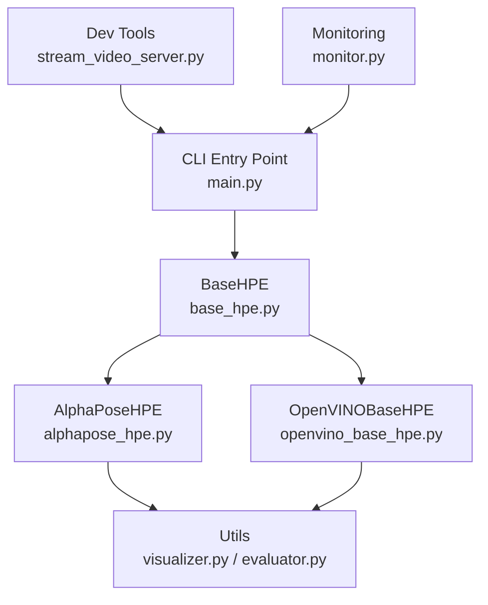
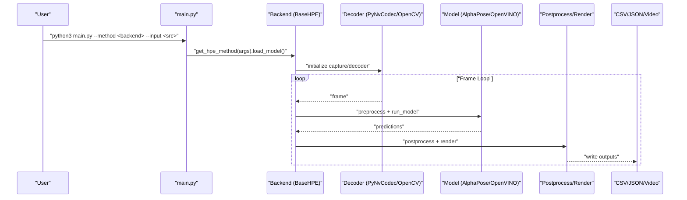
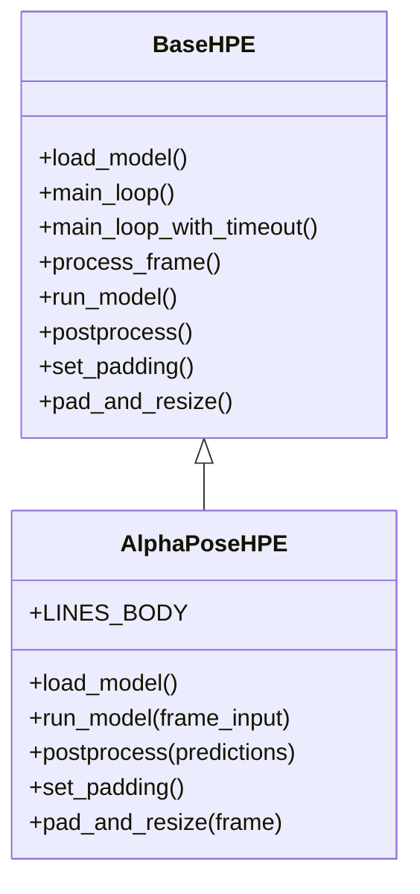
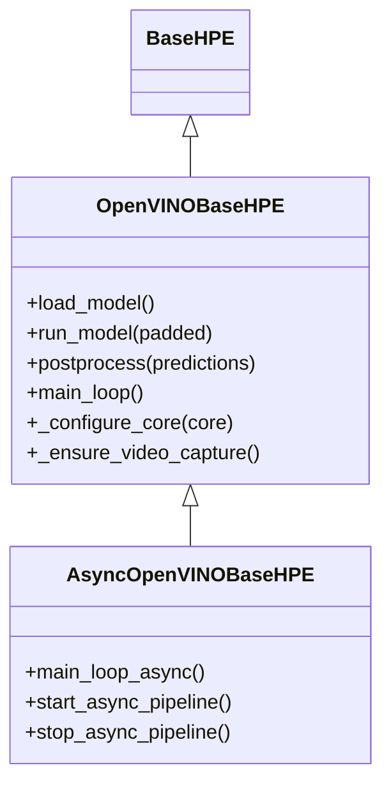
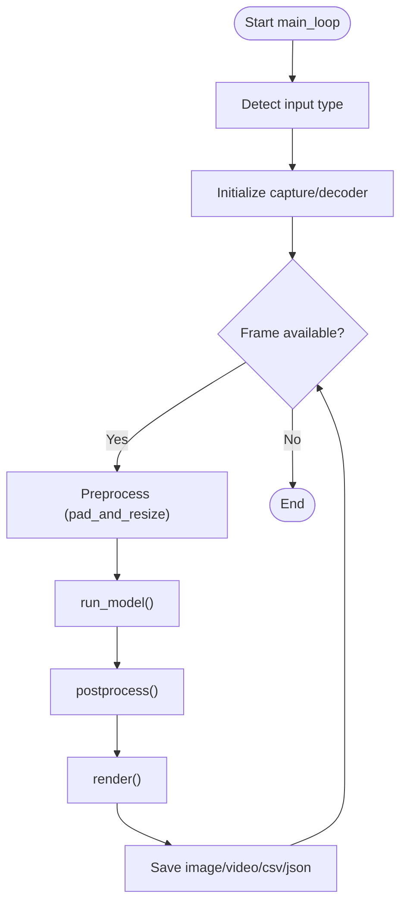
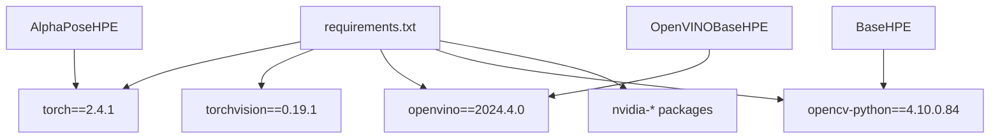
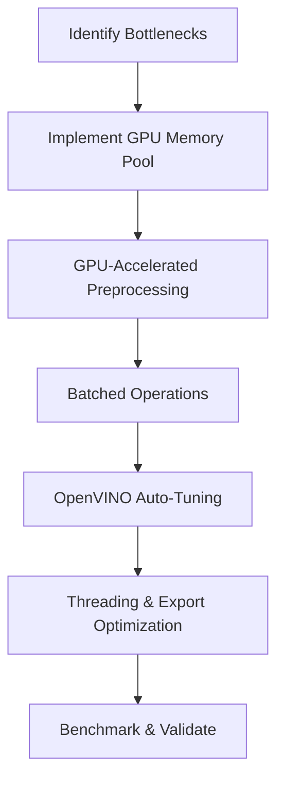
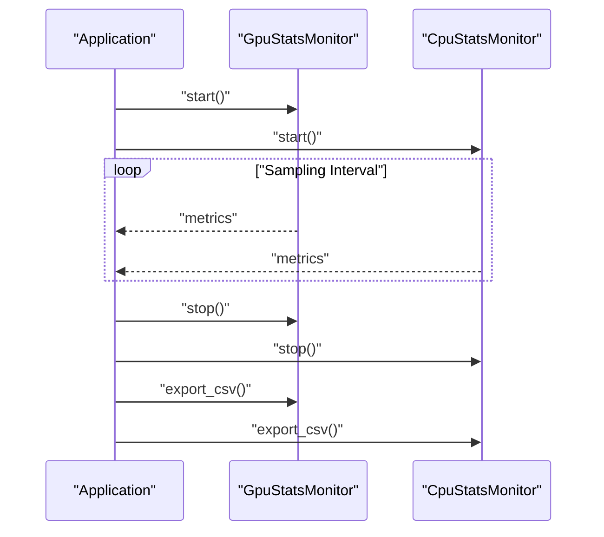

# Troubleshooting and Maintenance

<cite>
**Referenced Files in This Document**
- [README.md](file://README.md)
- [OPTIMIZATION_PLAN.md](file://OPTIMIZATION_PLAN.md)
- [bug.md](file://bug.md)
- [main.py](file://main.py)
- [base_hpe.py](file://base_hpe.py)
- [alphapose_hpe.py](file://alphapose_hpe.py)
- [openvino_base_hpe.py](file://openvino_base_hpe.py)
- [requirements.txt](file://requirements.txt)
- [utils/visualizer.py](file://utils/visualizer.py)
- [utils/evaluator.py](file://utils/evaluator.py)
- [dev_tools/stream_video_server.py](file://dev_tools/stream_video_server.py)
- [monitor.py](file://monitor.py)
</cite>

## Table of Contents
1. [Introduction](#introduction)
2. [Project Structure](#project-structure)
3. [Core Components](#core-components)
4. [Architecture Overview](#architecture-overview)
5. [Detailed Component Analysis](#detailed-component-analysis)
6. [Dependency Analysis](#dependency-analysis)
7. [Performance Considerations](#performance-considerations)
8. [Troubleshooting Guide](#troubleshooting-guide)
9. [Maintenance Procedures](#maintenance-procedures)
10. [Optimization Plan](#optimization-plan)
11. [System Health Monitoring](#system-health-monitoring)
12. [Conclusion](#conclusion)

## Introduction
This document provides comprehensive troubleshooting and maintenance guidance for the Human Pose Estimation framework. It covers installation issues, model loading pitfalls, runtime diagnostics, performance tuning, memory optimization, hardware compatibility, and system monitoring. The goal is to equip operators and developers with practical workflows to identify, isolate, and resolve framework issues across diverse deployment environments.

## Project Structure
The framework comprises:
- A unified CLI entry point orchestrating multiple HPE backends (AlphaPose, OpenVINO-based models, MoveNet).
- Backend-specific implementations encapsulated in dedicated classes inheriting from a shared base.
- Utility modules for visualization, evaluation, and monitoring.
- Development tools for local streaming and testing.
- Requirements and environment specifications.

**Diagram sources**
- [main.py:22-99](file://main.py#L22-L99)
- [base_hpe.py:36-546](file://base_hpe.py#L36-L546)
- [alphapose_hpe.py:33-334](file://alphapose_hpe.py#L33-L334)
- [openvino_base_hpe.py:55-653](file://openvino_base_hpe.py#L55-L653)
- [utils/visualizer.py:4-49](file://utils/visualizer.py#L4-L49)
- [utils/evaluator.py:11-114](file://utils/evaluator.py#L11-L114)
- [dev_tools/stream_video_server.py:173-228](file://dev_tools/stream_video_server.py#L173-L228)
- [monitor.py:32-171](file://monitor.py#L32-L171)

**Section sources**
- [main.py:22-99](file://main.py#L22-L99)
- [base_hpe.py:36-546](file://base_hpe.py#L36-L546)
- [alphapose_hpe.py:33-334](file://alphapose_hpe.py#L33-L334)
- [openvino_base_hpe.py:55-653](file://openvino_base_hpe.py#L55-L653)
- [utils/visualizer.py:4-49](file://utils/visualizer.py#L4-L49)
- [utils/evaluator.py:11-114](file://utils/evaluator.py#L11-L114)
- [dev_tools/stream_video_server.py:173-228](file://dev_tools/stream_video_server.py#L173-L228)
- [monitor.py:32-171](file://monitor.py#L32-L171)

## Core Components
- CLI and argument parsing: Selects backend, input source, device, and output options.
- BaseHPE: Shared pipeline for video decoding, preprocessing, inference, postprocessing, rendering, and saving outputs.
- AlphaPoseHPE: GPU-accelerated detection and pose estimation with PyNvCodec and custom preprocessing.
- OpenVINOBaseHPE: OpenVINO model loading, CPU/GPU tuning, and async variants for improved throughput.
- Utilities: Visualization and evaluation for COCO-format outputs and throughput metrics.
- Monitoring: NVML-based GPU and psutil-based CPU sampling with CSV export.

**Section sources**
- [main.py:47-99](file://main.py#L47-L99)
- [base_hpe.py:207-546](file://base_hpe.py#L207-L546)
- [alphapose_hpe.py:69-294](file://alphapose_hpe.py#L69-L294)
- [openvino_base_hpe.py:183-277](file://openvino_base_hpe.py#L183-L277)
- [utils/visualizer.py:4-49](file://utils/visualizer.py#L4-L49)
- [utils/evaluator.py:35-114](file://utils/evaluator.py#L35-L114)
- [monitor.py:109-171](file://monitor.py#L109-L171)

## Architecture Overview
The runtime architecture routes inputs through a backend-specific pipeline, leveraging hardware acceleration where available.

**Diagram sources**
- [main.py:22-99](file://main.py#L22-L99)
- [base_hpe.py:207-404](file://base_hpe.py#L207-L404)
- [alphapose_hpe.py:126-294](file://alphapose_hpe.py#L126-L294)
- [openvino_base_hpe.py:262-314](file://openvino_base_hpe.py#L262-L314)
- [utils/visualizer.py:4-49](file://utils/visualizer.py#L4-L49)
- [utils/evaluator.py:86-114](file://utils/evaluator.py#L86-L114)

## Detailed Component Analysis

### AlphaPoseHPE Analysis
- GPU-centric pipeline with PyNvCodec for hardware-accelerated decoding and GPU tensors for preprocessing.
- Detection and pose estimation integrated with batching and GPU-side operations.
- Known issues: HTTP stream initialization and potential infinite loops in detection loader.

**Diagram sources**
- [base_hpe.py:36-546](file://base_hpe.py#L36-L546)
- [alphapose_hpe.py:33-334](file://alphapose_hpe.py#L33-L334)

**Section sources**
- [alphapose_hpe.py:69-294](file://alphapose_hpe.py#L69-L294)
- [base_hpe.py:207-546](file://base_hpe.py#L207-L546)
- [bug.md:13-95](file://bug.md#L13-L95)

### OpenVINOBaseHPE Analysis
- Centralized model loading with OpenVINO core configuration for CPU/GPU devices.
- Environment-driven tuning for threads, streams, CPU pinning, and hyper-threading.
- Async variant for frame buffering and parallel processing.

**Diagram sources**
- [openvino_base_hpe.py:55-653](file://openvino_base_hpe.py#L55-L653)

**Section sources**
- [openvino_base_hpe.py:183-314](file://openvino_base_hpe.py#L183-L314)
- [openvino_base_hpe.py:396-653](file://openvino_base_hpe.py#L396-L653)

### BaseHPE Processing Flow
- Input detection (image, directory, video, webcam, HTTP stream).
- Decoder selection (PyNvCodec or OpenCV fallback).
- Preprocessing and padding.
- Inference invocation and postprocessing.
- Rendering and output persistence.

**Diagram sources**
- [base_hpe.py:207-404](file://base_hpe.py#L207-L404)

**Section sources**
- [base_hpe.py:207-404](file://base_hpe.py#L207-L404)

## Dependency Analysis
- Python environment pinned to specific versions for reproducibility.
- CUDA and cuDNN versions aligned with PyTorch and OpenVINO requirements.
- Backend libraries include OpenCV, PyTorch, OpenVINO, and optional PyNvCodec.

**Diagram sources**
- [requirements.txt:1-100](file://requirements.txt#L1-L100)
- [alphapose_hpe.py:12-22](file://alphapose_hpe.py#L12-L22)
- [openvino_base_hpe.py:15-20](file://openvino_base_hpe.py#L15-L20)
- [base_hpe.py:10-18](file://base_hpe.py#L10-L18)

**Section sources**
- [requirements.txt:1-100](file://requirements.txt#L1-L100)
- [README.md:5-16](file://README.md#L5-L16)

## Performance Considerations
- GPU-CPU transfer bottlenecks: Minimize host-device copies; keep tensors on GPU for preprocessing and rendering.
- Memory pooling: Reduce allocation overhead and fragmentation.
- Batched operations: Process multiple persons and frames efficiently.
- Threading: Tune OpenCV and OpenVINO threads; avoid contention.
- Serialization: Prefer binary or batched formats for reduced IO overhead.

**Section sources**
- [OPTIMIZATION_PLAN.md:9-78](file://OPTIMIZATION_PLAN.md#L9-L78)
- [OPTIMIZATION_PLAN.md:117-244](file://OPTIMIZATION_PLAN.md#L117-L244)
- [OPTIMIZATION_PLAN.md:216-322](file://OPTIMIZATION_PLAN.md#L216-L322)

## Troubleshooting Guide

### Installation and Environment
- Verify OS and Python versions as specified.
- Ensure CUDA/cuDNN versions align with PyTorch and OpenVINO.
- Confirm required packages are installed from requirements.

**Section sources**
- [README.md:5-16](file://README.md#L5-L16)
- [requirements.txt:1-100](file://requirements.txt#L1-L100)

### Model Loading Issues
- OpenVINO models: Validate XML/weights paths and architecture compatibility.
- AlphaPose: Confirm detector and pose checkpoints exist and are readable.
- Device selection: Ensure requested device (GPU/CPU) is available and configured.

**Section sources**
- [openvino_base_hpe.py:183-277](file://openvino_base_hpe.py#L183-L277)
- [alphapose_hpe.py:69-111](file://alphapose_hpe.py#L69-L111)

### Runtime Operation Problems
- HTTP stream handling: For AlphaPose, ensure HTTP stream initialization sets datalen appropriately for continuous mode.
- Infinite loops: Add timeouts and frame counters; enforce max frame limits.
- Frame read failures: Implement retries with backoff; detect stream end conditions.
- Webcam vs file inputs: Use appropriate capture backends and buffer sizes.

**Section sources**
- [bug.md:100-156](file://bug.md#L100-L156)
- [base_hpe.py:283-398](file://base_hpe.py#L283-L398)
- [openvino_base_hpe.py:133-151](file://openvino_base_hpe.py#L133-L151)

### Performance Diagnostics
- Use built-in FPS reporting and timing buffers.
- Monitor GPU utilization and memory with NVML-based monitor.
- Profile with NVIDIA tools and OpenVINO profiling options.

**Section sources**
- [base_hpe.py:405-519](file://base_hpe.py#L405-L519)
- [monitor.py:109-171](file://monitor.py#L109-L171)
- [OPTIMIZATION_PLAN.md:323-370](file://OPTIMIZATION_PLAN.md#L323-L370)

### Memory and Resource Issues
- Reduce batch sizes and queue sizes for constrained environments.
- Enable CPU pinning and hyper-threading judiciously.
- Monitor GPU memory growth; restart sessions if fragmentation occurs.

**Section sources**
- [openvino_base_hpe.py:153-182](file://openvino_base_hpe.py#L153-L182)
- [OPTIMIZATION_PLAN.md:37-64](file://OPTIMIZATION_PLAN.md#L37-L64)

### Debugging Techniques
- Add frame counters and periodic logs in main loops.
- Capture and inspect intermediate tensors and shapes.
- Validate detection results before pose estimation.

**Section sources**
- [bug.md:13-95](file://bug.md#L13-L95)
- [alphapose_hpe.py:126-294](file://alphapose_hpe.py#L126-L294)

## Maintenance Procedures
- Regularly update dependencies per requirements and compatibility matrices.
- Validate model files integrity and checksums when upgrading.
- Maintain separate environments for development and production.
- Automate smoke tests for each backend and input type.

**Section sources**
- [requirements.txt:1-100](file://requirements.txt#L1-L100)
- [dev_tools/stream_video_server.py:173-228](file://dev_tools/stream_video_server.py#L173-L228)

## Optimization Plan
- GPU memory pooling and pooled tensor contexts to reduce allocation overhead.
- Eliminate GPU→CPU→GPU transfers; keep preprocessing on GPU.
- Batched person crop and resize operations.
- OpenVINO auto-tuning for CPU threads, streams, and performance modes.
- System-level threading redesign and efficient data export.

**Diagram sources**
- [OPTIMIZATION_PLAN.md:81-322](file://OPTIMIZATION_PLAN.md#L81-L322)

**Section sources**
- [OPTIMIZATION_PLAN.md:81-322](file://OPTIMIZATION_PLAN.md#L81-L322)

## System Health Monitoring
- NVML-based GPU monitoring with utilization and memory metrics.
- CPU monitoring via psutil for CPU percentage and RAM usage.
- Export metrics to CSV for offline analysis and dashboards.

**Diagram sources**
- [monitor.py:109-171](file://monitor.py#L109-L171)

**Section sources**
- [monitor.py:109-171](file://monitor.py#L109-L171)

## Conclusion
This guide consolidates installation, runtime, and maintenance practices for the Human Pose Estimation framework. By following structured troubleshooting workflows, applying the optimization plan, and integrating continuous monitoring, teams can maintain reliable deployments across diverse environments while achieving predictable performance and resource usage.