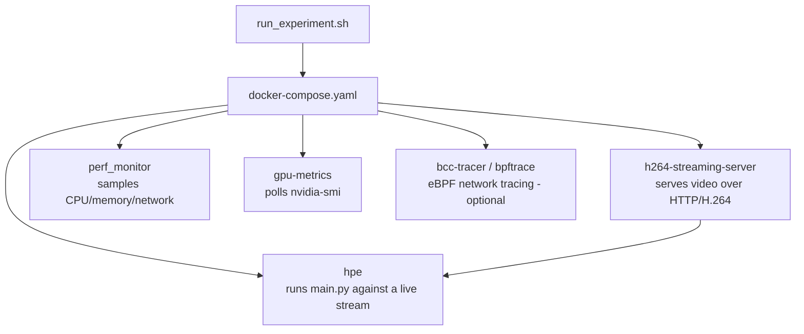

# 2D Human Pose Estimation

Baseline implementations of five 2D Human Pose Estimation methods — **AlphaPose**, **OpenPose**, **HigherHRNet**, **EfficientHRNet**, and **MoveNet** — with support for image, video, directory, webcam, and IP-stream inputs. Outputs annotated frames and keypoint data in COCO-format JSON/CSV.

---

## Requirements

| Component | Version |
|---|---|
| OS | Ubuntu 20.04 |
| Python | 3.8.10 |
| OpenVINO | 2024.2.0 |
| PyTorch | 2.4.1+cu121 |
| CUDA Toolkit | 12.6 |
| GPU | NVIDIA (any CUDA-capable) |

---

## Getting Started

### 1. Download pretrained models

Model weights are not included in the repository. Download each file and place it at the path shown.

**AlphaPose**
```bash
wget "https://drive.google.com/uc?export=download&id=1p6bi10UybpUIcq5D2XDsgQRLPJIr2RyI" \
  -O models/AlphaPose/pretrained_models/fast_res50_256x192.pth

wget "https://drive.google.com/uc?export=download&id=1k-9cUGcdH5ZFN1NcMvZrO0ApW241tboD" \
  -O models/AlphaPose/detector/yolo/data/yolov3-spp.weights
```

**MoveNet**
```bash
wget "https://drive.google.com/uc?export=download&id=15SZwY2jAh1KqHwT-YO6_UByOsQD70RSr" \
  -O models/MoveNet/movenet_multipose_lightning_256x256_FP32.bin
```

**OpenPose**
```bash
wget "https://drive.google.com/uc?export=download&id=1VNucIyIsdaiw1cYt-JGqBWloVu2TVdsm" \
  -O models/OpenVINO/pretrained_models/intel/human-pose-estimation-0001/human-pose-estimation-0001.bin
```

**HigherHRNet**
```bash
wget "https://drive.google.com/uc?export=download&id=1fko47eVczJZQb9wWA2X7eQ0TuF4PDXzs" \
  -O models/OpenVINO/pretrained_models/public/FP32/higher-hrnet-w32-human-pose-estimation.bin
```

**EfficientHRNet (3 variants)**
```bash
wget "https://drive.google.com/uc?export=download&id=1lEUFqQnWHVymQoZvaXuDFcnOyEEKsexP" \
  -O models/OpenVINO/pretrained_models/public/human-pose-estimation-0005/FP32/human-pose-estimation-0005.bin

wget "https://drive.google.com/uc?export=download&id=1d8pGQrM9vEfz_oAIey0qRr7Gxp6dS2UE" \
  -O models/OpenVINO/pretrained_models/public/human-pose-estimation-0006/FP32/human-pose-estimation-0006.bin

wget "https://drive.google.com/uc?export=download&id=1ZSdsqgD4zUO4gyHMYBfxq3m4UMyQ187j" \
  -O models/OpenVINO/pretrained_models/public/human-pose-estimation-0007/FP32/human-pose-estimation-0007.bin
```

### 2. Install dependencies

```bash
# Remove any existing AlphaPose installation
pip uninstall alphapose

# Create and activate the Conda environment
conda create -n hpe python=3.8.10 -y
conda activate hpe
conda install pytorch==2.4.1 torchvision==0.19.1 -c pytorch
conda install --file requirements.txt

# Build AlphaPose Cython extensions
bash models/AlphaPose/build_extensions.sh
```

---

## Usage

```bash
# Single image
python3 main.py --method movenet --input unit_tests/images/testImage.jpg --save_image

# Directory of images
python3 main.py --method alphapose --input unit_tests/images/ --json

# Video file
python3 main.py --method ae1 --input unit_tests/video/giphy.gif --save_video

# All options
python3 main.py --help
```

Available methods: `movenet`, `alphapose`, `openpose`, `hrnet`, `ae1`, `ae2`, `ae3`

### IP stream

To test against a local MJPEG stream, use the included Flask server:

```bash
# Terminal 1 — start the stream server
python3 dev_tools/stream_video_server.py

# Terminal 2 — run HPE against it (replace <your-ip> with output of hostname -I)
python3 main.py --method movenet --input http://<your-ip>:8080/video_feed --save_video
```

The server streams `unit_tests/video/giphy.gif` at `http://<your-ip>:8080/video_feed`.

---

## Performance Benchmarking (`perf-tuning-base` branch)

This branch extends the project into a containerised performance benchmarking platform. The goal is to measure HPE inference performance — throughput, CPU/GPU utilisation, memory, and network bandwidth — under realistic streaming conditions.

### Architecture

Each experiment rig lives in its own folder with a `run_experiment.sh` (the single entry point) and a `docker-compose.yaml` (the service definitions). The script handles the full lifecycle:

1. Clean up previous containers and CSV files
2. Start the streaming server and wait for its healthcheck
3. Start the HPE container (method and device passed as arguments)
4. Start monitoring sidecars (perf, GPU, optional eBPF tracer)
5. Poll until the HPE container exits
6. Copy all output CSVs and logs into a timestamped `results_<cpu>_<timestamp>/` directory
7. Tear everything down



### Experiment Rigs

#### `monitor_hpe/` — baseline CPU monitoring

The simplest rig. Two containers:
- `hpe` — runs MoveNet against a locally mounted video file
- `monitor` — runs `monitor_pid.sh`, sampling the HPE process's CPU/memory via `ps` into `pid_metrics.csv`

No streaming server. Video is mounted directly as a volume.

```bash
cd monitor_hpe && ./run_experiment.sh
```

#### `ffmpeg_hpe/` — H.264 stream + full monitoring stack

The main experiment rig. Five containers:
- `h264-streaming-server` (from `rtsp-ipcam/`) — Python + FFmpeg HTTP server serving a video file as a raw H.264 stream on port 8089
- `hpe` — runs `main.py --method <X> --input http://<server-ip>:8089/stream.h264`
- `perf_monitor` (from `recent-dash/perf_monitor/`) — samples CPU/memory/network
- `gpu-metrics` — polls `nvidia-smi` every 500ms
- `bcc-tracer` (optional, commented out) — eBPF/BCC kernel tracing of network traffic

```bash
cd ffmpeg_hpe && ./run_experiment.sh <method>
# e.g. ./run_experiment.sh movenet
```

#### `recent-dash/` — DASH/HTTP caching experiment

A separate experiment measuring a DASH video streaming proxy — not HPE inference. Three containers:
- `http_server` — serves MPEG-DASH segments
- `http_proxy` — caching proxy between server and client
- `http_client` — simulates a DASH player

Uses the same monitoring sidecars (`perf_monitor`, `bpftrace`). The observability infrastructure (Prometheus + Grafana + Coroot) is defined in `docker-compose.infra.yml`.

```bash
cd recent-dash && ./run_experiment.sh
```

#### `rtsp-ipcam/` — H.264 streaming server (shared component)

Not an experiment itself — the reusable streaming server consumed by `ffmpeg_hpe/`. A Python script (`direct_stream_server.py`) uses FFmpeg to transcode a video file and serve it over HTTP as a raw H.264 stream. Includes a `Makefile` and Windows PowerShell scripts (`build.ps1`, `validate.ps1`) for cross-platform use.

### Standalone Measurement Tools

| Script | What it measures | Method |
|---|---|---|
| `Measure_Flops/measure_flops.sh` | GPU FLOPS, TOPS, memory bandwidth, warp latency | NVIDIA Nsight Compute (`ncu`) + `nvidia-smi` + `ps` |
| `Measure_gpu_dcgm/run_nvidia_dcgm.sh` | GPU power, temperature, utilisation, memory | `nvidia-smi` polling loop → CSV; `plot_smi_output.py` generates PNG charts |
| `Measure_plot_cpu_perf/run_perf_plot.sh` | CPU cycles and clock | Reads PID from `/pids/dash.pid`, runs `perf stat -p`, plots with `plot_perf_metrics.py` |

### CPU Optimisations (`optimizations/`)

OpenVINO thread/stream tuning targeted at 4-vCPU AMD EPYC cloud instances:

- `cpu_performance_optimizer.py` — auto-detects CPU topology and computes optimal OpenVINO thread/stream config
- `enhanced_openvino_hpe.py` — drop-in replacement for `OpenVINOBaseHPE` with the optimisations applied
- `optimized_main.py` — CLI wrapper with `--enable-cpu-opt` and `--benchmark` flags

```bash
python3 optimizations/optimized_main.py --method openpose --input video.mp4 --device CPU --enable-cpu-opt
```

See `optimizations/README.md` and `OPTIMIZATION_PLAN.md` for configuration details and expected performance gains.

### Root-level Dockerfiles

Six Dockerfiles at the repo root represent iteration history on the HPE container image. Only `Dockerfile_base` is actively used by the experiment rigs.

| File | Purpose |
|---|---|
| `Dockerfile_base` | Current base image used by `monitor_hpe/` and `ffmpeg_hpe/` |
| `Dockerfile.hpe` | Earlier variant |
| `Dockerfile_with_opencv` | Adds a custom OpenCV build |
| `Dockerfile_cuda_ffmpeg_hpe` | CUDA + FFmpeg + HPE combined |
| `Dockerfile_combined_multistage_app` | Multi-stage build attempt |
| `Dockerfile_optimized_multistage_v4` | Latest multi-stage optimised build |

### Notes

- `run_experiment.sh` scripts are the single source of truth for how an experiment runs — they handle timing, healthchecks, log collection, and cleanup (100–200 lines each).
- Results are written to a timestamped directory (`results_<container_type>_<cpu_model>_<timestamp>/`) so runs never overwrite each other.
- The eBPF/bpftrace tracer (`bcc-tracer`) is present in both `ffmpeg_hpe/` and `recent-dash/` but is commented out — it requires a kernel with debug symbols and is fragile in practice.
- `recent-dash/` is a separate research thread (DASH caching) that shares the monitoring infrastructure but is unrelated to HPE inference.
- Several files at the root (`full_shell_history.txt`, `hist.txt`, `bug.md`, `*.bak`, `original.py`) are development artefacts that have not been cleaned up.
