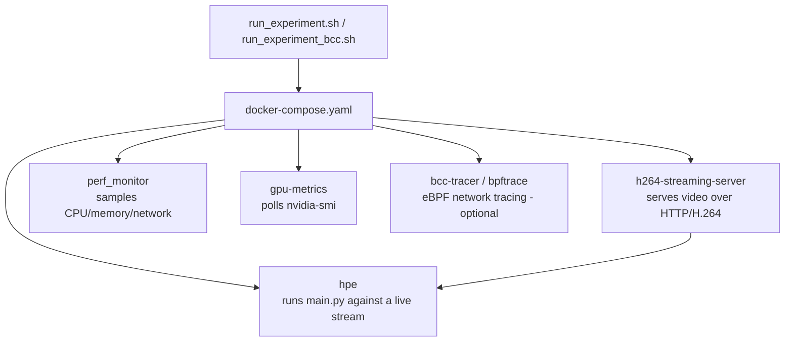

# 2D Human Pose Estimation

Baseline implementations of five 2D Human Pose Estimation methods — **AlphaPose**, **OpenPose**, **HigherHRNet**, **EfficientHRNet**, and **MoveNet** — with support for image, video, directory, webcam, and IP-stream inputs. Outputs annotated frames and keypoint data in COCO-format JSON/CSV.

---

## Requirements

| Component | Version |
|---|---|
| OS | Ubuntu 20.04 |
| Python | 3.9.13 (`perf-tuning-base` branch) |
| OpenVINO | 2024.4.0 |
| PyTorch | 2.4.1+cu121 |
| CUDA Toolkit | 12.6 |
| GPU | NVIDIA (any CUDA-capable) |

---

## Codebase Orientation

If you are new to this repository, read this section before diving into the code.

### What this repo is

Two things in one:

1. **An HPE inference library** — a unified Python interface for running five pose estimation backends (AlphaPose, MoveNet, OpenPose, HigherHRNet, EfficientHRNet) against images, videos, webcam, or HTTP streams.
2. **A performance benchmarking platform** (`perf-tuning-base` branch) — a set of Docker-based experiment rigs for measuring inference throughput, CPU/GPU utilisation, memory, and network bandwidth under realistic streaming conditions.

### Key files to read first

| File | What it is |
|---|---|
| `main.py` | CLI entry point — start here to understand how a run is configured |
| `base_hpe.py` | Abstract base class — defines the input routing, main loop, padding, and output saving that all backends share |
| `openvino_base_hpe.py` | OpenVINO backend covering OpenPose, HigherHRNet, and EfficientHRNet |
| `movenet_hpe.py` | MoveNet backend (OpenVINO runtime, CPU only) |
| `alphapose_hpe.py` | AlphaPose backend (PyTorch + YOLO detector) |
| `utils/evaluator.py` | COCO-format JSON/CSV serialisation and Tx bandwidth measurement |
| `utils/visualizer.py` | OpenCV skeleton and keypoint rendering |
| `ffmpeg_hpe/run_experiment_bcc.sh` | Main benchmarking entry point for the BCC rig — orchestrates the full experiment lifecycle |
| `ffmpeg_hpe/docker-compose.yaml` | Defines all services for the streaming benchmark rig |

### How the HPE pipeline works

```
main.py
  └── get_hpe_method()        # selects backend from --method arg
        └── BaseHPE.__init__  # detects input type (image/video/stream/webcam)
              └── load_model()          # backend-specific model loading
              └── main_loop()           # reads frames, calls process_frame()
                    └── process_frame()
                          ├── pad_and_resize()   # normalise frame to model input size
                          ├── run_model()        # backend inference → raw predictions
                          ├── postprocess()      # raw predictions → List[Body]
                          ├── render()           # draw skeleton on frame
                          └── append_COCO_format_json/csv()  # accumulate results
```

`BaseHPE` handles everything except `load_model()`, `run_model()`, and `postprocess()` — those three methods are the only ones each backend must implement.

### How the benchmarking platform works

```
run_experiment.sh
  ├── docker compose up h264-streaming-server   # serves video as H.264 HTTP stream
  ├── docker compose up hpe                     # runs main.py against the stream
  ├── docker compose up perf_monitor            # samples HPE container CPU/memory every 500ms
  ├── docker compose up gpu-metrics             # polls nvidia-smi every 500ms
  ├── docker compose up bcc-tracer              # eBPF RX byte counter (optional)
  ├── [wait for hpe container to exit]
  ├── docker cp → results_<method>_<cpu>_<timestamp>/
  │     ├── hpe_output/     ← keypoint CSVs and JSON from main.py
  │     ├── perf/           ← HPE process CPU/memory metrics
  │     ├── gpu/            ← GPU metrics
  │     ├── traces/bcc/     ← per-10ms RX byte trace
  │     └── logs/           ← per-container logs
  └── docker compose down
```

### HPE Service Resource Configuration

The `hpe` service in `ffmpeg_hpe/docker-compose.yaml` is configured with explicit resource limits:

| Setting | Value | Notes |
|---------|-------|-------|
| `cpus` | `3.0` | 4-vCPU host: hpe gets 3, streamer gets 1, tuning defaults live in `ffmpeg_hpe/.env` |
| `shm_size` | `8gb` | Required for large model inference |

**OpenVINO Threading Configuration:**

| Env Variable | Default | Tuned Value | Notes |
|-------------|---------|------------|-------|
| `OV_MODE` | `latency` | `latency` | Low-core-count default for this rig |
| `OV_STREAMS` | OpenVINO default | `1` | Single stream for consistent latency |
| `OV_THREADS` | `auto (cpus-2)` | `3` | Matches the 3-core HPE cap |
| `OMP_NUM_THREADS` | OpenMP default | `3` | Matches OV_THREADS |
| `MKL_NUM_THREADS` | MKL default | `3` | Matches OV_THREADS |
| `OPENBLAS_NUM_THREADS` | OpenBLAS default | `3` | Matches OV_THREADS |

**Auto-sizing fallback:** If `OV_THREADS` is not set, the code auto-calculates using `os.sched_getaffinity(0)` (cgroup-aware) minus 2 for headroom, defaulting to 1 minimum. Explicit env var always takes priority.
These defaults are defined in `ffmpeg_hpe/.env` and can be overridden per host without editing the compose file.

### Branch structure

| Branch | Purpose |
|---|---|
| `main` | Stable HPE inference code only |
| `perf-tuning-base` | Active development — adds benchmarking platform, Docker rigs, fixes |
| `cuda-dev` | Previous active branch — CUDA/PyNvCodec experiments, HTTP stream handling |
| `evaluation` | Evaluation framework work |
| `feat/openvino-opti-cpu` | OpenVINO CPU tuning experiments for 4-vCPU VPS |
| `recent-dash`, `hpe-benchmark`, others | Feature branches, mostly stale since Sept 2025 |

`perf-tuning-base` is the branch to use for new work.

### Output format

All HPE output follows COCO keypoint format. Each detected person produces:

```json
{
  "image_id": 42,
  "category_id": 1,
  "keypoints": [x0, y0, v0, x1, y1, v1, ...],
  "score": 0.87
}
```

17 keypoints per person (COCO layout): nose, eyes, ears, shoulders, elbows, wrists, hips, knees, ankles. Visibility flag `v`: `0` = not detected, `1` = detected.

---

## Getting Started

### 1. Download pretrained models

Model weights are not committed. Download them after installing `gdown` from
`requirements.txt`.

Create the target directories first:

```bash
mkdir -p models/AlphaPose/pretrained_models
mkdir -p models/AlphaPose/detector/yolo/data
mkdir -p models/MoveNet
mkdir -p models/OpenVINO/pretrained_models/intel/human-pose-estimation-0001
mkdir -p models/OpenVINO/pretrained_models/intel/human-pose-estimation-0005/FP32
mkdir -p models/OpenVINO/pretrained_models/intel/human-pose-estimation-0006/FP32
mkdir -p models/OpenVINO/pretrained_models/intel/human-pose-estimation-0007/FP32
mkdir -p models/OpenVINO/pretrained_models/public/FP32
```

**AlphaPose**
```bash
gdown "https://drive.google.com/uc?id=1p6bi10UybpUIcq5D2XDsgQRLPJIr2RyI" \
  -O models/AlphaPose/pretrained_models/fast_res50_256x192.pth

gdown "https://drive.google.com/uc?id=1D47msNOOiJKvPOXlnpyzdKA3k6E97NTC" \
  -O models/AlphaPose/detector/yolo/data/yolov3-spp.weights
```

**MoveNet**
```bash
gdown "https://drive.google.com/uc?id=15SZwY2jAh1KqHwT-YO6_UByOsQD70RSr" \
  -O models/MoveNet/movenet_multipose_lightning_256x256_FP32.bin
```

**OpenPose**
```bash
gdown "https://drive.google.com/uc?id=1VNucIyIsdaiw1cYt-JGqBWloVu2TVdsm" \
  -O models/OpenVINO/pretrained_models/intel/human-pose-estimation-0001/human-pose-estimation-0001.bin
```

**HigherHRNet**
```bash
gdown "https://drive.google.com/uc?id=1fko47eVczJZQb9wWA2X7eQ0TuF4PDXzs" \
  -O models/OpenVINO/pretrained_models/public/FP32/higher-hrnet-w32-human-pose-estimation.bin
```

**EfficientHRNet (3 variants)**
```bash
gdown "https://drive.google.com/uc?id=1lEUFqQnWHVymQoZvaXuDFcnOyEEKsexP" \
  -O models/OpenVINO/pretrained_models/intel/human-pose-estimation-0005/FP32/human-pose-estimation-0005.bin

gdown "https://drive.google.com/uc?id=1d8pGQrM9vEfz_oAIey0qRr7Gxp6dS2UE" \
  -O models/OpenVINO/pretrained_models/intel/human-pose-estimation-0006/FP32/human-pose-estimation-0006.bin

gdown "https://drive.google.com/uc?id=1ZSdsqgD4zUO4gyHMYBfxq3m4UMyQ187j" \
  -O models/OpenVINO/pretrained_models/intel/human-pose-estimation-0007/FP32/human-pose-estimation-0007.bin
```

If you already have the Open Model Zoo public layout, the same `.bin` files may
exist under `models/OpenVINO/pretrained_models/public/human-pose-estimation-*`.
They are compatible with the XML files used by this branch.

### 2. Install dependencies

```bash
# Remove any existing AlphaPose installation
pip uninstall alphapose

# Create and activate the Conda environment
conda create -n hpe python=3.9.13 -y
conda activate hpe
conda install pytorch==2.4.1 torchvision==0.19.1 -c pytorch
conda install --file requirements.txt

# Build AlphaPose Cython extensions
bash models/AlphaPose/build_extensions.sh
```

---

## Usage

```bash
# Single image
python3 main.py --method movenet --input unit_tests/images/testImage.jpg --save_image

# Directory of images
python3 main.py --method alphapose --input unit_tests/images/ --json

# Video file
python3 main.py --method ae1 --input unit_tests/video/giphy.gif --save_video

# All options
python3 main.py --help
```

Available methods: `movenet`, `alphapose`, `openpose`, `hrnet`, `ae1`, `ae2`, `ae3`

### IP stream

To test against a local MJPEG stream, use the included Flask server:

```bash
# Terminal 1 — start the stream server
python3 dev_tools/stream_video_server.py

# Terminal 2 — run HPE against it (replace <your-ip> with output of hostname -I)
python3 main.py --method movenet --input http://<your-ip>:8080/video_feed --save_video
```

The server streams `unit_tests/video/giphy.gif` at `http://<your-ip>:8080/video_feed`.

---

## Performance Benchmarking (`perf-tuning-base` branch)

This branch extends the project into a containerised performance benchmarking platform. The goal is to measure HPE inference performance — throughput, CPU/GPU utilisation, memory, and network bandwidth — under realistic streaming conditions.

### Architecture

Each experiment rig lives in its own folder with an entry script (`run_experiment.sh` or `run_experiment_bcc.sh`) and a `docker-compose.yaml` (the service definitions). The script handles the full lifecycle:

1. Clean up previous containers and CSV files
2. Start the streaming server and wait for its healthcheck
3. Start the HPE container (method and device passed as arguments)
4. Start monitoring sidecars (perf, GPU, optional eBPF tracer)
5. Poll until the HPE container exits
6. Copy all output CSVs and logs into a timestamped `results_<cpu>_<timestamp>/` directory
7. Tear everything down



### Experiment Rigs at a Glance

| Folder | Entry point | Input source | HPE runs? | Monitors | Purpose |
|---|---|---|---|---|---|
| `monitor_hpe/` | `run_experiment.sh` | Local video file (volume mount) | ✅ | CPU%, RSS memory | Baseline inference cost — no network |
| `ffmpeg_hpe/` | `run_experiment.sh` `run_experiment_bcc.sh` | Live H.264 HTTP stream (port 8089) | ✅ | HPE process CPU%, RSS memory, GPU, BCC RX bytes | Full streaming benchmark — main rig |
| `recent-dash/` | `run_experiment.sh` | DASH segments via HTTP proxy | ❌ | CPU%, RSS, DASH-only proxy RX/TX | HTTP caching proxy research — not HPE |
| `rtsp-ipcam/` | `start_server.sh` | — (is the server) | ❌ | — | Shared H.264 streaming server used by `ffmpeg_hpe/` |
| `Measure_Flops/` | `measure_flops.sh` | Any HPE command | ✅ | GPU FLOPS, TOPS, memory BW | One-shot Nsight Compute profiling |
| `Measure_gpu_dcgm/` | `run_nvidia_dcgm.sh` | — (sidecar) | ❌ | GPU util, temp, power | Standalone GPU telemetry collector |
| `Measure_plot_cpu_perf/` | `run_perf_plot.sh` | PID file | ❌ | CPU cycles via `perf stat` | Standalone CPU cycle counter |

### Experiment Rigs

#### `monitor_hpe/` — baseline CPU monitoring

The simplest rig. Two containers:
- `hpe` — runs MoveNet against a locally mounted video file
- `monitor` — runs `monitor_pid.sh`, sampling the HPE process's CPU/memory via `ps` into `pid_metrics.csv`

No streaming server. Video is mounted directly as a volume.

```bash
cd monitor_hpe && ./run_experiment.sh
```

#### `ffmpeg_hpe/` — H.264 stream + full monitoring stack

The main experiment rig. Five containers:
- `h264-streaming-server` (from `rtsp-ipcam/`) — Python + FFmpeg HTTP server serving a video file as a raw H.264 stream on port 8089
- `hpe` — runs `main.py --method <X> --input http://<server-ip>:8089/stream.h264`
- `perf_monitor` (from `shared/perf_monitor/`) — samples the HPE process CPU and RSS memory via host PID
- `gpu-metrics` — polls `nvidia-smi` every 500ms
- `bcc-tracer` — eBPF/BCC tracing of H.264 RX bytes into the HPE container

```bash
cd ffmpeg_hpe && ./run_experiment_bcc.sh <method>
# e.g. ./run_experiment_bcc.sh movenet
```

For benchmark-quality runs, build the images before the timed run so image
build time and first-run dependency setup do not contaminate the experiment:

```bash
cd ffmpeg_hpe
docker compose -f docker-compose.yaml build h264-streaming-server hpe perf_monitor gpu-metrics bcc-tracer
./run_experiment_bcc.sh movenet
```

Each BCC run writes `validation_report.json` and `validation_report.txt` in
the timestamped results directory. A failed validation means at least one
metric is missing, malformed, or inconsistent and the run should not be used
for paper results.

#### `recent-dash/` — DASH/HTTP caching experiment

A separate experiment measuring a DASH video streaming proxy — not HPE inference. It expects untracked DASH assets restored under `recent-dash/segments/`, including `manifest.mpd`. The rig starts three application containers plus a headless `mpv` player container by default:
- `http_server` — serves MPEG-DASH segments
- `http_proxy` — caching proxy between server and client
- `http_client` — exposes the DASH manifest URL; a DASH-capable player such as VLC or `mpv` must fetch it to generate traffic
- `mpv` — headless containerized DASH player that fetches the manifest by default

Uses `perf_monitor` from `shared/perf_monitor/` plus a DASH-specific packet tracer. The tracer writes `traces/trace.csv` with `proxy_rx_video_bytes` and `proxy_tx_video_bytes`, filtered to `server:80 -> proxy` and `proxy:80 -> client`. The observability infrastructure (Prometheus + Grafana + Coroot) is defined in `docker-compose.infra.yml`.

```bash
cd recent-dash && ./run_experiment.sh
```

#### `rtsp-ipcam/` — H.264 streaming server (shared component)

Not an experiment itself — the reusable streaming server consumed by `ffmpeg_hpe/`. A Python script (`direct_stream_server.py`) uses FFmpeg to transcode a video file and serve it over HTTP as a raw H.264 stream. Includes a `Makefile` and Windows PowerShell scripts (`build.ps1`, `validate.ps1`) for cross-platform use.

### Standalone Measurement Tools

| Script | What it measures | Method |
|---|---|---|
| `Measure_Flops/measure_flops.sh` | GPU FLOPS, TOPS, memory bandwidth, warp latency | NVIDIA Nsight Compute (`ncu`) + `nvidia-smi` + `ps` |
| `Measure_gpu_dcgm/run_nvidia_dcgm.sh` | GPU power, temperature, utilisation, memory | `nvidia-smi` polling loop → CSV; `plot_smi_output.py` generates PNG charts |
| `Measure_plot_cpu_perf/run_perf_plot.sh` | CPU cycles and clock | Reads PID from `/pids/dash.pid`, runs `perf stat -p`, plots with `plot_perf_metrics.py` |

### CPU Optimisations (`optimizations/`)

OpenVINO thread/stream tuning targeted at 4-vCPU AMD EPYC cloud instances:

- `cpu_performance_optimizer.py` — auto-detects CPU topology and computes optimal OpenVINO thread/stream config
- `enhanced_openvino_hpe.py` — drop-in replacement for `OpenVINOBaseHPE` with the optimisations applied
- `optimized_main.py` — CLI wrapper with `--enable-cpu-opt` and `--benchmark` flags

```bash
python3 optimizations/optimized_main.py --method openpose --input video.mp4 --device CPU --enable-cpu-opt
```

See `optimizations/README.md` and `OPTIMIZATION_PLAN.md` for configuration details and expected performance gains.

### Root-level Dockerfiles

Only `Dockerfile_base` remains at the repo root and is actively used by the experiment rigs. Historical Dockerfiles have been moved to `archive/dockerfiles/`.

| File | Purpose |
|---|---|
| `Dockerfile_base` | Current base image used by `monitor_hpe/` and `ffmpeg_hpe/` |
| `archive/dockerfiles/Dockerfile.hpe` | Earlier variant |
| `archive/dockerfiles/Dockerfile_with_opencv` | Adds a custom OpenCV build |
| `archive/dockerfiles/Dockerfile_cuda_ffmpeg_hpe` | CUDA + FFmpeg + HPE combined |
| `archive/dockerfiles/Dockerfile_combined_multistage_app` | Multi-stage build attempt |
| `archive/dockerfiles/Dockerfile_optimized_multistage_v4` | Latest multi-stage optimised build |

### Network Monitoring Architecture

The benchmarking platform uses two different tools to measure network traffic,
each handling one direction. They are complementary, not redundant.

| Tool | Container | Direction | Method | Works? |
|---|---|---|---|---|
| `bpftrace` in `monitor_pid.sh` | legacy PID monitor | **TX** (HPE → outside) | `sys_enter_sendto` tracepoint — fires in HPE process context, PID filter valid only when the monitored PID is host-correct | Legacy |
| `bcc_rx_bytes.py` | `bcc-tracer` | **RX** (stream → HPE) | BPF socket filter on `eth0` filtered by streamer IP + port | ✅ |
| `bpftrace netif_receive_skb` in `monitor_pid.sh` | legacy PID monitor | RX (attempted) | Fires in softirq/kernel context — PID filter never matches HPE process | ❌ always 0 |

**Why the split?**

- TX can be measured by PID because `sendto()` is a syscall made by the HPE
  process — the kernel knows which process called it.
- RX cannot be measured by PID because incoming packets are handled by the
  kernel's network stack in softirq context, before they are associated with
  any process. The only reliable way to filter is by IP address and port.

`bcc-tracer` solves this by running a BPF socket filter attached directly to
`eth0`, filtering packets from the streamer's IP and port. It runs in a
separate container that shares HPE's network namespace
(`network_mode: service:hpe`) so it sees exactly the same traffic HPE sees.

**For accurate RX measurement always use `bcc-tracer`**, not the bpftrace RX
column in `network_stats.csv` — that column is always ~0. The active
`run_experiment_bcc.sh` path uses a host-PID process monitor for CPU/memory and
`bcc-tracer` for video ingress. Files ending in `*_Tx.csv` are HPE JSON output
payload bytes produced by `utils/evaluator.py`; they are not network transmit
traffic.

### Known Issues and Gotchas

These are confirmed issues in the codebase. Fixes marked ✅ are already applied on `perf-tuning-base`.

#### Benchmarking platform

| # | File | Issue | Status |
|---|---|---|---|
| 1 | `ffmpeg_hpe/bpftrace-tracer/bcc_rx_bytes.py` | IP/port BPF filter was disabled for debugging — counted all TCP traffic instead of video stream only | ✅ Fixed |
| 2 | `ffmpeg_hpe/plot_rx_bytes*.py` | Hardcoded absolute path to old VM — unusable on any other machine | ✅ Fixed — now accepts CSV path as CLI arg |
| 3 | `ffmpeg_hpe/plot_smi_output.py` | Column names `utilization.gpu` / `temperature.gpu` didn't match `run_nvidia_dcgm.sh` output (`gpu_utilization` / `temperature`) — crashed on every run | ✅ Fixed |
| 4 | `ffmpeg_hpe/docker-compose.yaml` | Build context hardcoded to `/home/user/MeasurementsDTs` — broken on any other machine | ✅ Fixed — changed to `..` |
| 5 | `ffmpeg_hpe/run_experiment.sh` | Referenced `trace_container` service which is commented out in docker-compose — should be `bcc-tracer` | ✅ Fixed |
| 6 | `monitor_hpe/monitor_pid.sh` | `write_net_stats()` wrote each entry twice — once directly and once via flock/cat | ✅ Fixed |
| 7 | `ffmpeg_hpe/entrypoint.sh` | GPU metrics cleanup code after `exec` was unreachable — metrics process never stopped cleanly | ✅ Fixed — moved to EXIT trap |
| 8 | Both `monitor_pid.sh` files | `ps -o %cpu` reports lifetime average CPU%, not per-interval | ✅ Fixed — replaced with `/proc/$PID/stat` delta at 500ms cadence |
| 9 | `ffmpeg_hpe/run_experiment.sh` | `perf_monitor` output filename was `aggregated_metrics.csv` — actual file is `perf_metrics.csv` / `pid_metrics.csv` | ✅ Fixed |
| 10 | `ffmpeg_hpe/run_experiment.sh` | BCC tracer output was `trace.csv` — actual file is `hpe_video_rx.csv` | ✅ Fixed |
| 11 | `ffmpeg_hpe/run_experiment.sh` | HPE container output (keypoint CSVs/JSON) was listed but never copied to results directory | ✅ Fixed |
| 12 | `ffmpeg_hpe/monitor_pid.sh` | `netif_receive_skb` bpftrace PID filter fires in softirq context — PID never matches HPE process, RX bytes always ~0 | ⚠️ Known — use `bcc-tracer` for accurate RX measurement |
| 13 | `monitor_hpe/plot_graph.py` | Calls `plt.show()` — blocks indefinitely in headless containers | ⚠️ Open |
| 14 | `ffmpeg_hpe/plot_graph.py` | Headless-safe CPU/memory plot helper for `perf_metrics.csv` and legacy `pid_metrics.csv` | ✅ Implemented |
| 15 | `rtsp-ipcam/docker-compose.yml` | Volume mount hardcoded to `/home/user/MeasurementsDTs/videos/...` | ⚠️ Open |
| 16 | `ffmpeg_hpe/run_experiment_bcc.sh` + `shared/perf_monitor/` | Host-PID monitor consumed a container-namespace PID, producing near-zero CPU and tiny memory for active HPE runs | ✅ Fixed — BCC rig now writes the host PID from `docker inspect` and measures the HPE process directly |

#### HPE inference code

| File | Issue |
|---|---|
| `movenet_hpe.py` | Keypoint-level score filtering not applied to body score (marked `# TODO`) |
| `alphapose_hpe.py` | Bounding box derived from keypoints, not from the YOLO detector output |
| `openvino_base_hpe.py` → `run_model()` | `results` variable may be unbound if `raw_result` is falsy — guard exists but worth verifying |
| `export_pose_results.py` | Global accumulator never reset between runs — `reset_results()` exists but is never called |
| `visualizer.py` | Keypoint colouring logic only verified correct for MoveNet (marked `# TODO`) |

### Notes

- `run_experiment*.sh` scripts are the single source of truth for how an experiment runs — they handle timing, healthchecks, log collection, and cleanup.
- Results are written to a timestamped directory (`results_<container_type>_<cpu_model>_<timestamp>/`) so runs never overwrite each other.
- The eBPF/bpftrace tracer (`bcc-tracer`) requires a kernel with BPF support (`CONFIG_BPF=y`, kernel ≥ 4.4) and debug symbols. It is present in `ffmpeg_hpe/` but commented out in docker-compose by default.
- `recent-dash/` is a separate research thread (DASH caching) that shares the monitoring infrastructure but is unrelated to HPE inference.
- Several files at the root (`full_shell_history.txt`, `hist.txt`, `bug.md`, `*.bak`, `original.py`) are development artefacts that have not been cleaned up.
