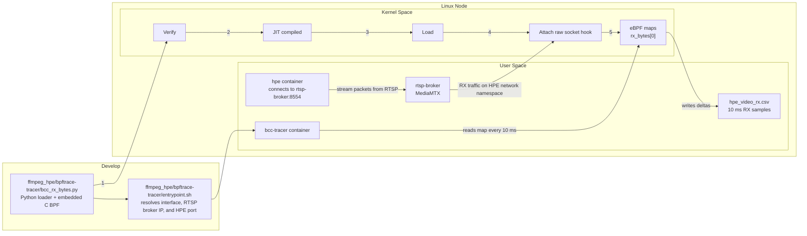

# eBPF Tracing Diagram

This diagram mirrors the structure of your reference image, but it is customized for the RX tracing path in this repository.

## How to read it

- `bcc_rx_bytes.py` builds the embedded BPF program and loads it through BCC.
- `entrypoint.sh` discovers the interface and the active RTSP/HPE ports before launching the tracer.
- The kernel validates the program, JIT-compiles it, loads it, and attaches it to the raw socket hook.
- The `bcc-tracer` container samples the `rx_bytes` map every 10 ms and writes the RX bandwidth trace to `hpe_video_rx.csv`.

> If you want the TX side too, the separate `perf_monitor` path uses `monitor_hpe/monitor_pid.sh` and a `sys_enter_sendto` bpftrace hook. That is a different diagram from this RX flow.
