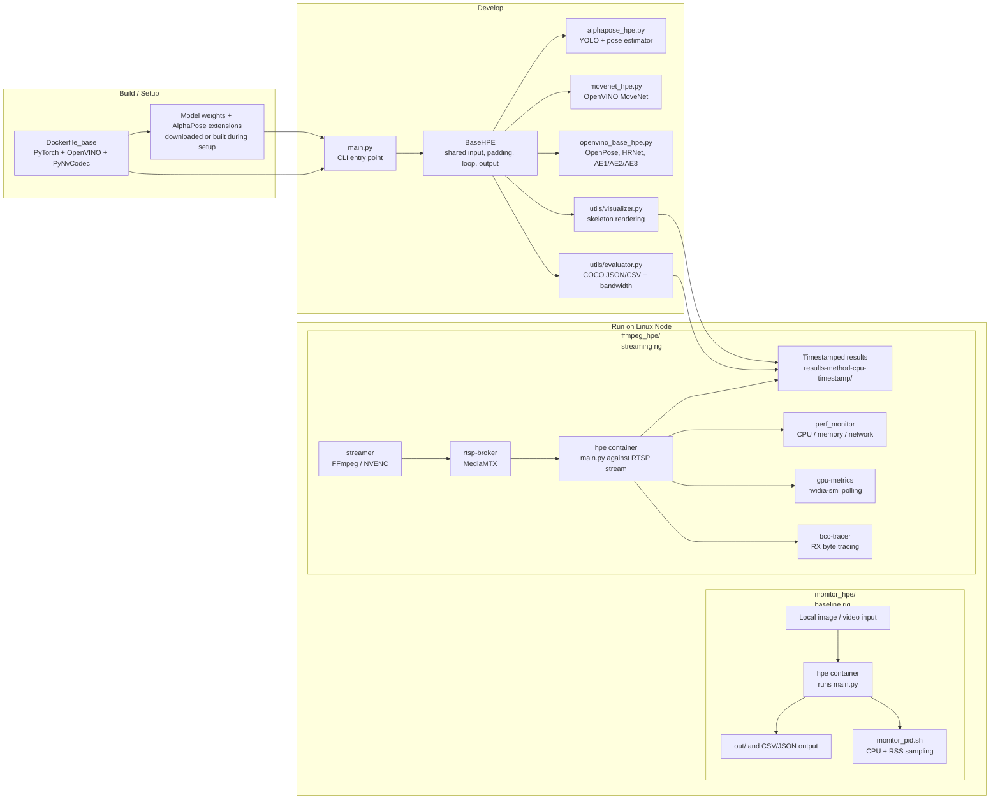

# Project Architecture Diagram

This diagram shows the two main halves of the repository:

1. The HPE inference library (`main.py` + backend implementations)
2. The benchmarking rigs (`monitor_hpe/` and `ffmpeg_hpe/`)

## Reading the diagram

- `main.py` chooses the backend and feeds frames through `BaseHPE`.
- The backend classes implement model loading, inference, and postprocessing.
- `monitor_hpe/` is the simple local-file benchmark path.
- `ffmpeg_hpe/` is the full streaming benchmark path with RTSP, CPU/GPU monitoring, and optional BCC tracing.
- Results are written into timestamped folders so runs never overwrite each other.
